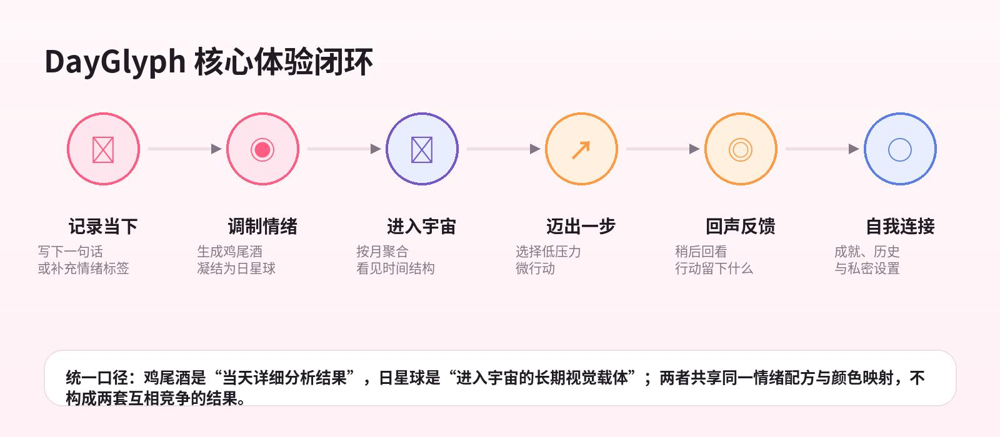
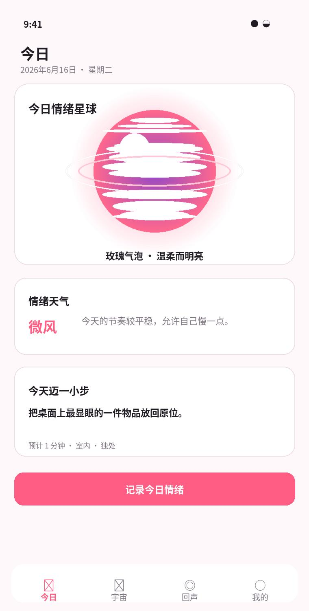
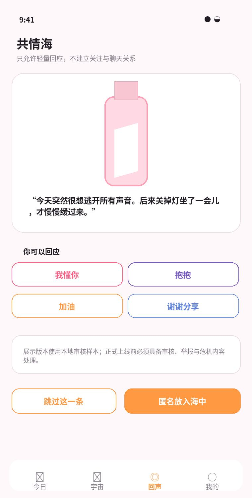
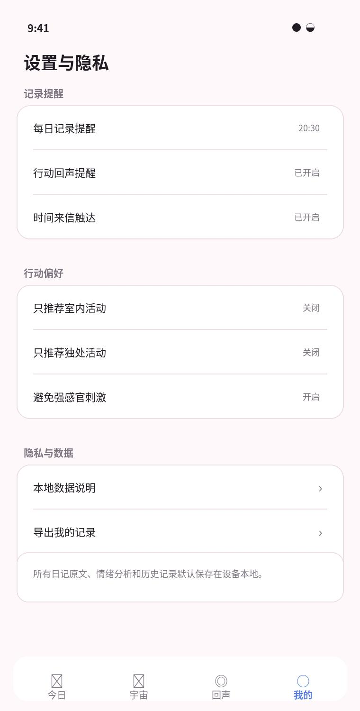

# DayGlyph

> 把难以描述的感受，调制成一杯情绪鸡尾酒，凝结为一颗属于今天的星球。

DayGlyph 是一款**本地优先、非医疗化**的 iOS 情绪记录与自我观察应用。用户只需写下一句话，应用便会理解这一天的情绪结构，生成可收藏的情绪鸡尾酒与日星球，并通过低压力微行动、延迟回声和长期回顾，让感受变得可见、可做、可回看。

**当前版本：DayGlyph v2 Release Candidate**<br>
核心产品闭环与四个一级模块均已进入 `main`，当前版本可以完整运行和演示，并将继续进行体验打磨、真机验证与发布准备。



## 为什么是 DayGlyph

很多情绪记录工具要求用户先准确命名感受、完成量表或坚持打卡。DayGlyph 选择另一条路径：

- **降低表达门槛**：一句话即可开始，不要求掌握心理学术语。
- **拒绝给情绪打分**：结果描述当下的构成，不评判情绪好坏。
- **让记录值得回看**：鸡尾酒呈现当天细节，星球承载长期记忆。
- **记录之后仍有回应**：微行动足够小，也允许跳过、没有变化或觉得困难。
- **把控制权留给用户**：日记、分析、行动与回声默认保存在本机。

## 核心体验

```text
记录当下 → 调制情绪 → 凝结星球 → 迈出一小步 → 留下回声 → 回顾长期变化
```

### 今日：看见这一刻

写下一句话或选择情绪标签，通过统一分析入口获得稳定的情绪结构。结果以“情绪鸡尾酒”呈现配方、色彩、关键词与情绪天气，同时生成当天的日星球。

### 宇宙：看见时间中的自己

日星球按月份聚合为情绪宇宙。用户可以探索月星球、日期光点与记录摘要，查看月、季、年趋势，并导出静态统计图片。RealityKit 体验提供减少动态与二维可访问降级路径。

### 回声：记录行动之后发生了什么

微行动完成后，用户可以稍后选择“轻松了一点”“没什么变化”“比想象中困难”或“有别的感受”。当同类样本足够时，应用只描述个人历史关联，不推断因果，也不承诺改善。

### 我的：回顾、管理与掌控

集中展示累计记录、情绪成就、历史、统计、提醒与行动偏好。用户可以导出本地记录、单独清除演示数据或通过危险确认清空全部本地数据，无需注册账号。

## 产品预览

下列图片来自 DayGlyph v2 产品设计基准，用于表达当前界面结构与视觉方向。

<p align="center">
  
  
  
</p>

## 产品原则

| 原则 | DayGlyph 的处理方式 |
| --- | --- |
| 本地优先 | 日记原文、分析结果、行动与回声默认使用 SwiftData 保存在设备本地 |
| 非医疗化 | 不诊断疾病、不做风险分级、不提供治疗建议或疗效承诺 |
| 低压力 | 不设置连续签到、排行榜、断签惩罚或强制任务 |
| 确定性 | 同一份分析结果生成稳定的配方、视觉与星球参数，历史不会随机变化 |
| 可访问 | 支持减少动态、大字体、VoiceOver 描述及图表文字替代 |
| 谨慎公开 | 共情海当前使用本地审核样本，任何可能公开的副本都需要二次确认 |

## 当前版本能力

- 三屏首次引导、本地隐私说明与显式通知授权
- 每日情绪记录、标签辅助、草稿与保存状态
- 设备端统一情绪分析入口与确定性本地降级
- 情绪配方、鸡尾酒视觉、情绪天气和日星球生成
- 微行动推荐、偏好过滤、开始、完成、取消与无压力跳过
- 时间来信、天气与引言、共情海本地演示闭环
- RealityKit 月星球、日期光点、月详情和二维可访问列表
- 月、季、年趋势，文字表格替代与静态图片导出
- 行动回声、四种中性反馈、备注和个人发现聚合
- 情绪成就、历史搜索、统计、昵称与本地数据管理
- 每日记录、行动回声和时间来信统一通知调度
- App Intents / Shortcuts 快速记录入口
- 简体中文产品文案与关键交互无障碍支持

## 工程架构

DayGlyph 使用原生 Apple 平台能力构建，业务数据与界面状态均围绕可测试、可降级的本地闭环组织。

```text
SwiftUI Views
    ↓ 用户输入与交互
Feature Models / Aggregators
    ↓ 稳定业务规则
SwiftData Models + Local Services
    ↓
Unified Emotion Analyzer / Notifications / Export
    ↓
Foundation Models（可用时）或确定性本地降级
```

### 技术栈

- **SwiftUI**：四 Tab 应用结构、导航、Sheet、图表与响应式界面
- **SwiftData**：日记、行动、回声、时间来信和演示数据持久化
- **Foundation Models**：设备端情绪分析能力，通过统一服务入口隔离
- **RealityKit / RealityView**：可交互月星球与日期光点
- **Swift Charts / ImageRenderer**：趋势展示、可读替代与静态导出
- **UserNotifications**：每日记录、行动回声与时间来信触达
- **App Intents**：快捷指令与系统入口
- **Swift Testing**：模型、聚合、持久化、文案与交互策略验证

### 目录结构

```text
DayGlyph/
├── Models/          # SwiftData 模型与稳定值类型
├── Services/        # 分析、聚合、通知、导出与演示数据
├── Utilities/       # 日历、宇宙呈现与交互策略
├── Views/
│   ├── Today/       # 记录、鸡尾酒、微行动、来信与共情海
│   ├── Universe/    # 星球、日期摘要、趋势与导出
│   ├── Echo/        # 行动回声与个人发现
│   ├── Mine/        # 成就、历史、统计与个人主页
│   └── Onboarding/  # 首次使用引导
├── Intents/         # App Intents 与 Shortcuts
└── Assets.xcassets/ # 应用图标与颜色资源

DayGlyphTests/       # Swift Testing 单元与持久化测试
DayGlyphUITests/     # 启动与关键 UI 流程测试
docs/                # 设计规格、实施计划与专项测试要求
```

## 运行项目

### 环境要求

- macOS 与 Xcode 26.5
- iOS 26.5 Simulator Runtime 或兼容真机
- 推荐基准：393 pt 宽度；同时适配 375–430 pt
- 完整设备端分析路径需要 Apple Intelligence 可用且本地模型已下载

当设备端能力不可用时，DayGlyph 会通过统一分析入口使用确定性本地降级，不阻塞核心记录与演示流程。

### 启动

1. 使用 Xcode 打开 `DayGlyph.xcodeproj`。
2. 选择 `DayGlyph` Scheme。
3. 选择 iOS 26.5 模拟器或兼容真机。
4. 构建并运行。

命令行构建：

```bash
xcodebuild build \
  -project DayGlyph.xcodeproj \
  -scheme DayGlyph \
  -destination 'generic/platform=iOS Simulator'
```

## 验证

构建全部测试目标：

```bash
xcodebuild build-for-testing \
  -project DayGlyph.xcodeproj \
  -scheme DayGlyph \
  -destination 'generic/platform=iOS Simulator'
```

在已安装的模拟器上运行单元测试：

```bash
xcodebuild test \
  -project DayGlyph.xcodeproj \
  -scheme DayGlyph \
  -destination 'platform=iOS Simulator,name=iPhone 17 Pro,OS=26.5' \
  -only-testing:DayGlyphTests
```

设备端 Apple Intelligence 专项验证要求见[测试说明](docs/testing/2026-06-10-apple-intelligence-outsourcing-test-requirements.zh-CN.md)。

## 产品与研发文档

- [DayGlyph v2 详细产品、视觉与交互设计文档](产品文档.md)
- [DayGlyph v2 顺序实施路线图](设计路线图.md)
- [设计规格目录](docs/superpowers/specs/)
- [实施计划与历史记录](docs/superpowers/plans/)
- [设备端分析专项测试要求](docs/testing/2026-06-10-apple-intelligence-outsourcing-test-requirements.zh-CN.md)

## 当前版本边界

- 当前仓库代表接近正式发布的 v2 可运行版本，但仍在持续迭代，不等同于 App Store 已发布版本。
- 共情海采用本地审核样本和固定回应完成演示；正式公开服务仍需要服务端审核、举报与危机内容处理能力。
- DayGlyph 是情绪记录与自我观察工具，不提供心理疾病诊断、治疗建议或紧急援助。
- 当前仓库尚未附带开源许可证；代码授权范围以仓库所有者后续声明为准。

---

DayGlyph 希望让情绪记录不再像完成一张表，而更像为今天留下一件值得回看的东西。
