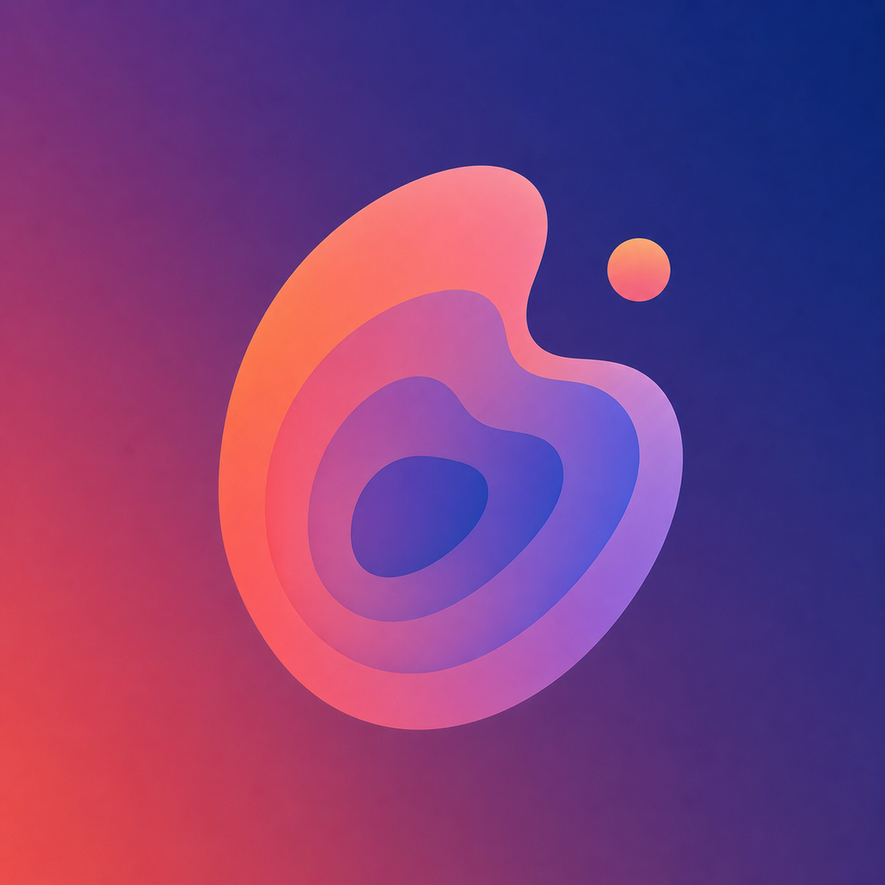
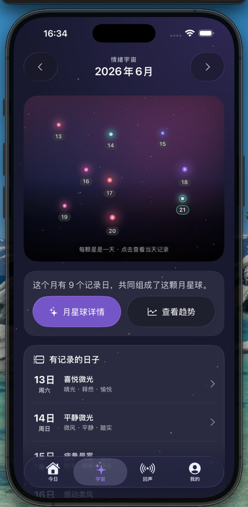
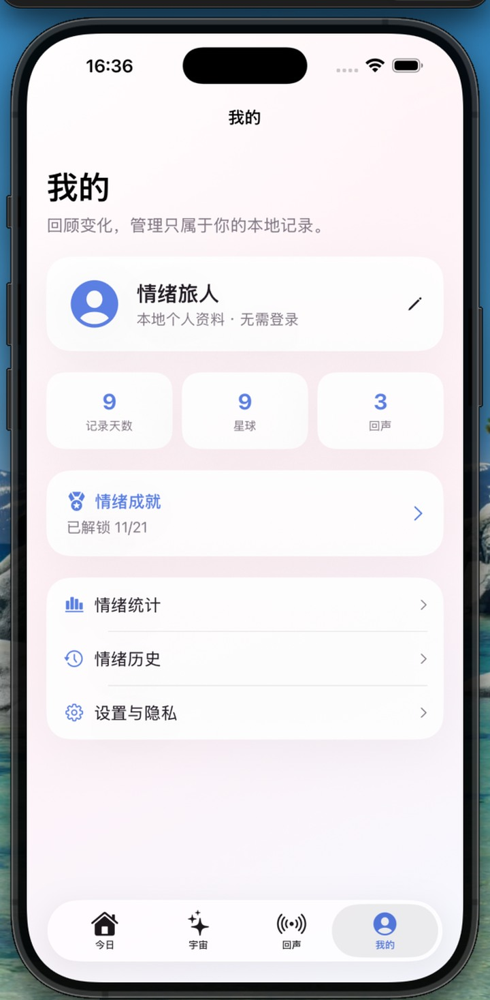
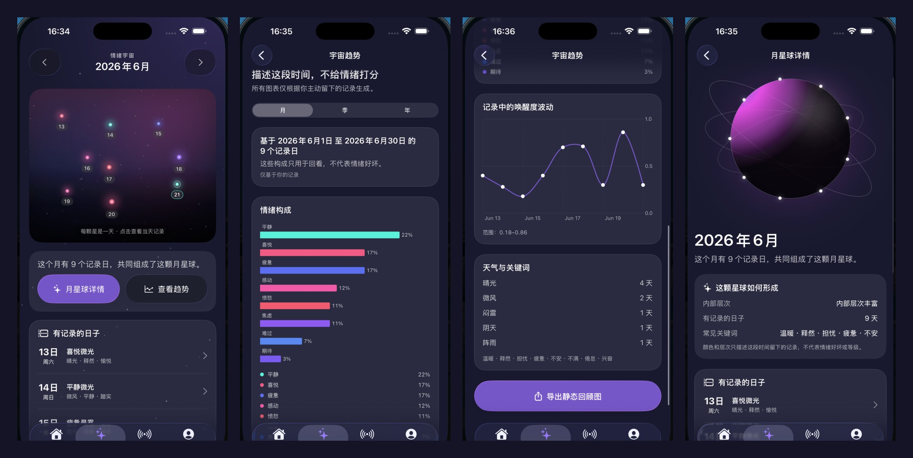
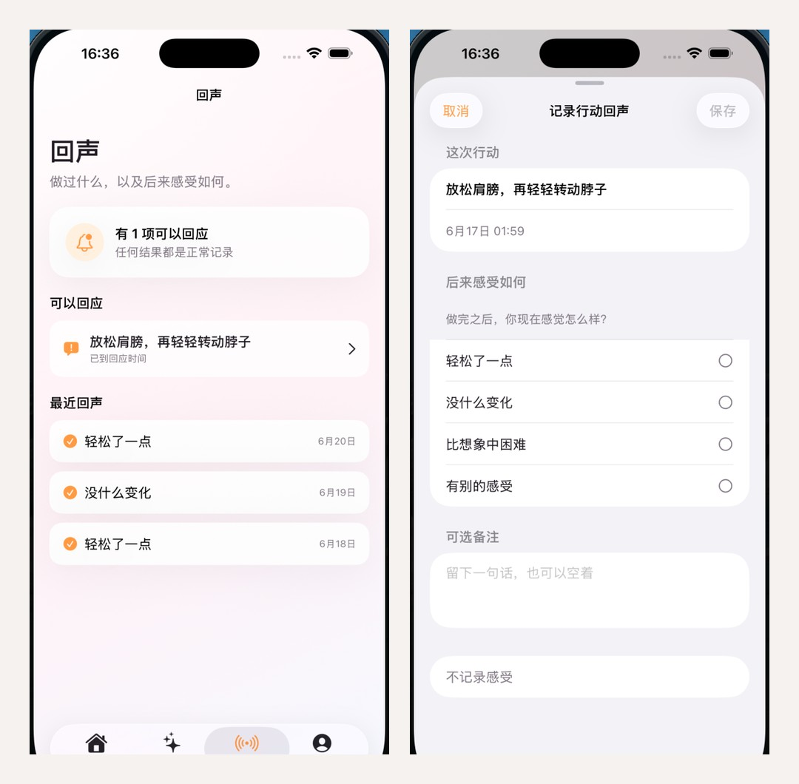
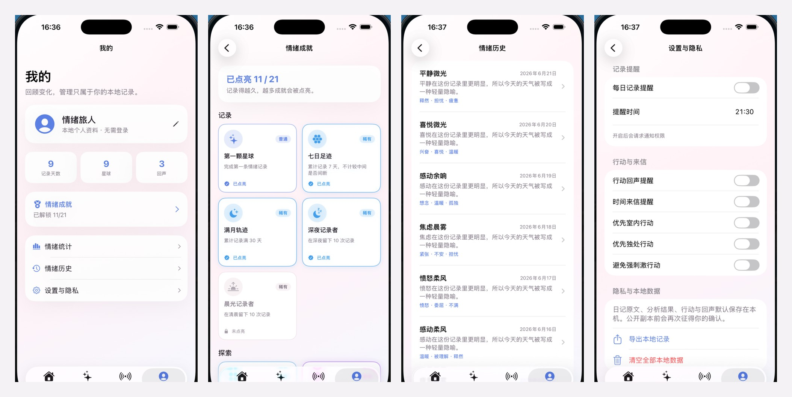

<p align="center">
  
</p>

<h1 align="center">DayGlyph</h1>

<p align="center">
  把难以描述的感受，转化为一枚可收藏的每日情绪印记。
</p>

<p align="center">
  <strong>SwiftUI · SwiftData · AI 情绪叙事 · iOS</strong>
</p>

DayGlyph 是一款本地优先、非医疗化的 iOS 情绪记录与自我观察应用。写下一句话，应用会把当下的感受整理成情绪结构，生成专属的情绪鸡尾酒与日星球，并通过微行动、延迟回声和长期趋势，让情绪变得可见、可做、可回看。

## 产品预览

<p align="center">
  
  
  
</p>

## 核心体验

```text
记录当下 → 理解情绪 → 生成印记 → 选择一小步 → 留下回声 → 回顾长期变化
```

### 今日

从一句话开始，DayGlyph 会生成结构化的情绪分析、结果叙事、情绪天气、每日寄语、三档微行动，以及相互呼应的鸡尾酒和日星球图像。生成中的文字与两张图片独立呈现，单项失败可以单独重试，不必从头开始。

<p align="center">
  
</p>

### 宇宙

每天的印记会成为个人情绪宇宙中的一颗星。用户可以按月份浏览记录光点、进入月星球详情，并查看月度、季度和年度趋势。界面同时提供减少动态、VoiceOver 与二维可访问降级路径。

<p align="center">
  
</p>

### 回声

完成微行动后，用户可以在合适的时候记录真实感受：轻松了一点、没什么变化、比想象中困难，或其他体验。当同类记录足够时，应用只总结个人历史中的关联，不推断因果，也不承诺改善。

<p align="center">
  
</p>

### 我的

集中查看记录天数、日星球、回声、情绪成就、历史与统计，并管理提醒、行动偏好和本地数据。个人资料无需注册；记录可导出，也可以按范围清除。

<p align="center">
  
</p>

## 产品特点

- **一句话开始**：不要求先准确命名情绪，也不使用量表给情绪评分。
- **生成式情绪印记**：一次文本生成组织完整叙事，再生成风格一致的鸡尾酒与日星球。
- **低压力行动**：提供轻量、标准、主动三档选择，允许跳过，也接受任何结果。
- **长期个人宇宙**：把离散记录组织成月星球、日期光点和长期趋势。
- **本地数据主权**：日记、分析、行动和回声使用 SwiftData 保存在设备本地，无需账号。
- **明确的产品边界**：不诊断、不治疗、不进行风险分级，不用连续签到制造压力。
- **系统级入口**：支持 App Intents 与 Shortcuts 快速打开或记录今天。
- **可访问设计**：包含 VoiceOver 描述、减少动态、大字体适配和图表文字替代。

## 工作方式

DayGlyph 将生成能力与本地记录分离：

```text
SwiftUI 界面
    ↓
生成编排与安全预检
    ├── 豆包 Seed 2.0 Lite：结构化情绪内容与叙事
    └── 豆包 Seedream：情绪鸡尾酒与日星球图像
    ↓
响应校验与单项降级
    ↓
SwiftData + 本地图片存储
    ↓
宇宙聚合、趋势、回声、成就与导出
```

文本响应会经过结构、情绪比例、行动选项与扩展内容校验；生成图片下载后立即保存到本地，持久化模型只记录状态和相对路径。仓库内还包含确定性的演示数据与降级素材，用于网络不可用时维持可运行体验。

## 技术栈

| 能力 | 实现 |
| --- | --- |
| 界面与导航 | SwiftUI |
| 本地持久化 | SwiftData |
| 生成式文本 | 豆包 Seed 2.0 Lite |
| 生成式图像 | 豆包 Seedream |
| 情绪宇宙 | SwiftUI Canvas、确定性星图布局 |
| 数据可视化 | Swift Charts、ImageRenderer |
| 系统集成 | UserNotifications、App Intents |
| 测试 | Swift Testing、XCTest UI Testing |

## 项目结构

```text
DayGlyph/
├── Models/              # 持久化模型与业务值类型
├── Services/            # AI 客户端、生成编排、校验、聚合、通知与导出
├── Utilities/           # 日历、宇宙呈现与交互策略
├── Views/
│   ├── Today/           # 记录、生成结果、微行动、来信与分享卡
│   ├── Universe/        # 星图、月星球、日期摘要与趋势
│   ├── Echo/            # 行动回声与个人发现
│   ├── Mine/            # 成就、历史、统计与个人主页
│   └── Onboarding/      # 首次使用引导
├── Intents/             # App Intents 与 Shortcuts
├── DemoAssets/          # 本地演示响应与生成图片
└── Assets.xcassets/     # 应用图标与颜色资源

DayGlyphTests/           # 单元、持久化与业务规则测试
DayGlyphUITests/         # 启动与关键界面流程测试
images/                  # 产品截图与 README 视觉素材
docs/                    # 设计、实施与专项测试文档
```

## 运行项目

### 环境要求

- macOS
- Xcode 26.5 或兼容版本
- iOS 26.5 Simulator Runtime 或兼容真机
- 可用的火山方舟 ARK API Key（在线生成所需）

### 配置 AI 密钥

真实密钥文件已被 `.gitignore` 排除。新建 `DayGlyph/Services/AISecrets.swift`：

```swift
import Foundation

nonisolated enum AISecrets {
    static let arkAPIKey = "PUT_YOUR_ARK_API_KEY_HERE"
}
```

不要把真实密钥提交到仓库。客户端内置密钥只适用于本地开发和演示；面向公开发行时，应改为由受控服务端代理请求。

### 构建与启动

1. 使用 Xcode 打开 `DayGlyph.xcodeproj`。
2. 选择 `DayGlyph` Scheme。
3. 选择兼容的 iOS 模拟器或真机。
4. 构建并运行。

命令行构建：

```bash
xcodebuild build \
  -project DayGlyph.xcodeproj \
  -scheme DayGlyph \
  -destination 'generic/platform=iOS Simulator'
```

## 测试

构建全部测试目标：

```bash
xcodebuild build-for-testing \
  -project DayGlyph.xcodeproj \
  -scheme DayGlyph \
  -destination 'generic/platform=iOS Simulator'
```

在已安装的模拟器上运行单元测试：

```bash
xcodebuild test \
  -project DayGlyph.xcodeproj \
  -scheme DayGlyph \
  -destination 'platform=iOS Simulator,name=iPhone 17 Pro,OS=26.5' \
  -only-testing:DayGlyphTests
```

## 隐私与安全

- 日记原文、分析结果、行动、回声和个人资料默认保存在本机。
- 在线生成会把本次输入所需内容发送至配置的火山方舟接口；这部分不是纯设备端处理。
- 共情海的匿名表达包含本地初筛、AI 去身份化改写与返回后的隐私校验，用户仍需逐字确认；当前仓库使用本地审核样本与固定回应，不包含公开社区服务。
- 高风险文本会进入安全支持路径，不生成普通情绪内容。
- DayGlyph 是情绪记录与自我观察工具，不提供心理疾病诊断、治疗建议或紧急援助。

## 参与贡献

欢迎通过 Issue 报告问题或讨论改进。提交代码前，请确保：

1. 改动保持本地优先、非医疗化与低压力原则。
2. 新增行为包含与风险相称的测试。
3. 不提交 API Key、个人记录、生成缓存或其他敏感数据。
4. Swift 代码能够通过项目现有构建与测试目标。

## 许可证

当前仓库尚未附带开源许可证。在许可证文件加入前，代码仍受默认版权保护，不应视为已获得复制、修改或分发授权。
