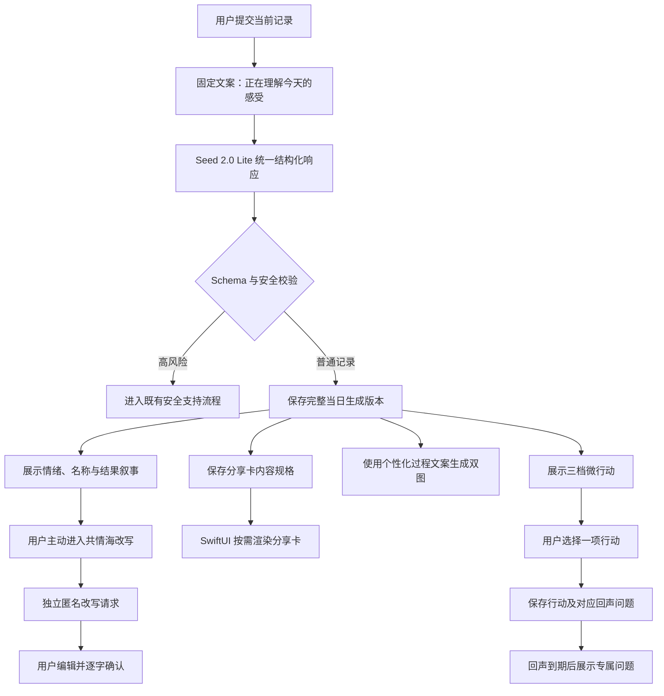

# DayGlyph 即时情境 AI 个性化扩展设计

日期：2026-06-20
状态：已确认
适用范围：比赛演示版本
依赖文档：`2026-06-20-dayglyph-doubao-ai-generation-design.zh-CN.md`

## 1. 背景与目标

上一份设计已经定义单日记录的核心 AI 链路：使用豆包 Seed 2.0 Lite 理解当前记录并生成结构化内容，使用 Seedream 并行生成鸡尾酒与日星球图片。本设计不重做该链路，而是在同一次当日生成中补齐其他可个性化内容，使产品从“固定模板搭配 AI 图片”升级为“围绕当前情绪状态的一致体验”。

DayGlyph 强调即时记录。用户每天的状态可能完全不同，因此本阶段不建立用户画像、不维护跨日记忆，也不把历史状态推断为稳定人格或偏好。个性化只基于当前用户输入、当前结构化情绪分析和用户本次主动选择。

目标链路如下：

```text
用户写下当前感受
→ AI 理解本次情绪
→ 同一次响应生成当日专属内容
→ 文本结果先展示
→ 鸡尾酒与日星球并行生成
→ 用户选择一档微行动
→ 稍后使用专属问题记录行动回声
→ 用户可生成分享卡或主动请求共情海匿名改写
```

## 2. 已确认决策

1. 不建立用户画像、`memory.md` 或其他跨日 AI 记忆。
2. 不根据历史记录推断用户当前状态、人格、长期需求或固定偏好。
3. 采用统一 JSON 扩展方案，不为结果叙事、行动和分享卡分别调用模型。
4. 首次 Seed 2.0 Lite 响应同时返回结果叙事、三档微行动、行动回声问题、双图生成阶段文案和分享卡内容规格。
5. 共情海匿名改写是用户主动触发的独立 AI 请求，改写后必须由用户确认。
6. 分享卡由 SwiftUI 渲染，AI 只提供标题、短句和结构化内容规格，不额外生成一张带文字图片。
7. 时间来信必须由用户亲自书写。AI 不生成、不润色、不续写、不提供代写草稿。
8. 成就、统计、趋势数值、通知、声音、触觉、动效和安全规则保持确定性。
9. 高风险输入沿用核心生成设计的安全短路，不生成行动、分享文案或共情海内容。
10. 所有历史内容保存生成时的版本，不因模型或提示词升级自动变化。

## 3. 范围

### 3.1 纳入 AI 个性化

- 双图生成阶段的过程文案；
- 鸡尾酒名、星球名、标题和结果叙事；
- 轻量、标准、主动三档微行动；
- 每档微行动对应的行动回声问题；
- 共情海匿名表达草稿；
- 当日分享卡标题、短句和内容规格。

### 3.2 不纳入 AI

- 用户画像和跨日记忆；
- 时间来信的任何内容创作；
- 独立的即时安抚模块；
- 通知文案与通知时机；
- 声音、触觉和动效参数；
- 成就解锁、统计与趋势计算；
- 风险短路、数据删除和隐私授权；
- SwiftUI 分享卡最终排版；
- 自动公开或自动发送任何用户内容。

## 4. 总体架构

本设计复用现有统一生成架构，不建立第二套日常内容生成系统。



首个 AI 响应返回前，客户端无法获得 AI 生成的过程文案，因此分析阶段继续显示固定的中性文案。个性化过程文案只用于结构化文本已返回、鸡尾酒和星球仍在生成的阶段，不使用额外预请求，也不伪造流式进度。

## 5. 统一响应扩展

在上一份设计的 `DayGenerationResponse` 顶层结构中新增以下字段：

```json
{
  "experience_copy": {
    "image_generation_title": "正在让余温沉入杯底",
    "cocktail_progress": "把克制与疲惫调成清晰的层次",
    "planet_progress": "正在凝结一颗需要喘息的星球"
  },
  "result_narrative": {
    "cocktail_name": "迟潮余温",
    "planet_name": "缓慢回声",
    "headline": "今天的你，像是在坚持与疲惫之间寻找空间",
    "explanation": "你仍在努力维持前进，同时也需要为疲惫留出一点位置。"
  },
  "action_options": [
    {
      "level": "light",
      "title": "松开肩膀",
      "instruction": "把肩膀向上抬起，再缓慢放下三次。",
      "duration_minutes": 1,
      "difficulty": 1,
      "environment": ["室内", "独处"],
      "reason": "当前记录呈现出较高的紧绷感。",
      "echo_question": "做完后，肩颈的紧绷有没有一点变化？"
    }
  ],
  "share_card": {
    "title": "迟潮余温",
    "caption": "今天不必立刻抵达平静。",
    "visual_focus": "cocktail",
    "layout_variant": "portrait_centered",
    "privacy_level": "emotion_only"
  }
}
```

### 5.1 过程文案

`experience_copy` 只描述正在进行的生成动作，不声称模型知道用户未表达的原因，也不展示虚假百分比。文案必须简短、克制，并与鸡尾酒和星球的当日视觉规格一致。

以下内容仍为客户端固定文案：

- AI 返回前的理解阶段；
- 网络重试、超时和失败提示；
- 图片下载与本地保存失败提示；
- 安全支持流程中的全部操作文案。

### 5.2 结果叙事

`result_narrative` 负责连接情绪分析与双图视觉：

- 鸡尾酒名和星球名应属于同一语义方向，但不得完全相同；
- 标题表达当下状态，不把单日状态写成稳定人格；
- 解释必须能回到当前输入或已验证情绪维度；
- 不补写事件、人物、动机、关系和因果；
- 不使用真实人物名言，也不伪装为心理诊断。

### 5.3 三档微行动

`action_options` 固定返回三项，且 `level` 必须分别为：

1. `light`：约 30 秒至 2 分钟，最低体力和准备要求；
2. `standard`：约 2 至 10 分钟，包含一个明确、容易完成的步骤；
3. `active`：约 5 至 20 分钟，需要稍多主动投入，但仍可随时停止。

三项行动必须针对同一次当日状态，在时长、体力或主动程度上有真实差异，不能只替换标题。每项行动必须：

- 使用明确指令，不使用空泛鼓励；
- 说明推荐原因，但不承诺改善；
- 标明时间、难度与环境；
- 可跳过且无惩罚；
- 不要求购买、饮酒、服药、驾驶或进入危险环境；
- 不强迫社交、外出或披露隐私；
- 附带一个仅针对该行动的 `echo_question`。

用户选择行动时，将标题、指令、原因、档位和回声问题作为快照写入 `ActionInstance`。行动回声到期后不再次调用 AI，从而避免问题与用户实际选择不一致，也保证离线可用。

### 5.4 分享卡规格

AI 只输出分享卡内容，不控制最终像素排版。`visual_focus` 和 `layout_variant` 必须来自客户端受控枚举，不能返回自由布局代码。

分享卡默认允许包含：

- 当日鸡尾酒或日星球图片；
- 当日生成名称；
- 一句当日短句；
- 日期的低精度显示；
- DayGlyph 品牌标识。

默认禁止包含：

- 日记原文；
- 情绪识别依据和置信度；
- 风险信息；
- 行动回声备注；
- 设备、账号或精确位置标识。

用户点击生成分享卡后，`ShareCardRenderer` 使用已保存图片和结构化规格渲染静态图片。只有用户再次点击系统分享按钮，才打开系统分享面板。

## 6. 共情海匿名改写

共情海改写不包含在首次统一响应中。只有用户主动进入共情海、选择记录或输入文字并点击“帮我匿名表达”后，客户端才发起独立请求。

```text
用户选中的文字
→ 本地长度与明确风险初筛
→ AI 去身份化改写
→ 客户端隐私与安全校验
→ 用户编辑并逐字确认
→ 保存为本地共情海副本
```

改写目标是保留用户原意和情绪，同时移除可识别信息。AI 不得：

- 新增用户没有表达的事实；
- 强化冲突、责备或绝望程度；
- 改变人物关系或事件因果；
- 添加诊断、建议或说教；
- 自动提交、自动公开或覆盖原始记录。

必须检查并移除姓名、手机号、邮箱、社交账号、学校、公司、精确地址、可识别单位和第三方身份细节。若无法在不改变原意的前提下安全匿名化，返回不可用状态并要求用户自行编辑，不生成看似安全的错误草稿。

确认页默认主操作是“继续编辑”。“确认此版本”作为独立操作，Demo 阶段只保存到本地模拟共情海，不连接真实公开服务。

## 7. 时间来信边界

时间来信承载的是用户对未来自己的真实表达，其意义来自“这是当时的我亲自写下的内容”。因此 AI 不得介入内容创作。

禁止能力包括：

- 一键生成来信；
- 根据今日记录自动代写；
- 润色、扩写、缩写或改变语气；
- 提供续写句、完整草稿或自动标题；
- 根据 AI 分析决定触达日期。

客户端可以继续提供非生成式能力，例如字数限制、保存、用户主动选择开启日期、本地通知和归档，但不得把其他 AI 生成文案混入来信正文。

## 8. 模块边界

- `DayGenerationOrchestrator`：继续负责首次统一响应、状态机和双图并发；
- `DayGenerationResponse`：增加过程文案、结果叙事、三档行动和分享卡规格；
- `GenerationSchemaValidator`：增加档位完整性、文案长度、隐私字段与语义约束校验；
- `ActionInstance`：保存所选行动及对应回声问题快照；
- `EmpathyRewriteService`：负责用户主动触发的匿名改写网络请求；
- `EmpathyRewriteValidator`：负责身份信息、联系方式、风险表达和长度校验；
- `ShareCardRenderer`：使用 SwiftUI、本地生成图片与受控版式渲染分享卡；
- `GenerationRepository`：保存同一生成版本的全部新增字段；
- `NotificationScheduler`：继续只消费确定性时间与用户开关，不读取 AI 情绪推断；
- `MineAggregator`、`UniverseTrendAggregator`：继续执行确定性聚合，不使用生成式结论。

## 9. 持久化与版本

1. 当日所有 AI 内容与鸡尾酒、星球使用同一个 `generationID`。
2. JSON Schema、模型、系统提示词和验证规则分别记录版本。
3. 用户选择微行动后保存完整行动快照，不只保存对统一响应数组的索引。
4. 分享卡保存内容规格；实际图片可按需重新渲染，但不得重新调用 AI 改写内容。
5. 共情海保存用户最终确认的副本，并可暂存一个 AI 草稿用于当前编辑会话。
6. AI 草稿不得写回 `DayEntry.text`。
7. 历史记录只展示当时已保存的生成结果，不在打开页面时静默重新生成。
8. 删除 `DayEntry` 时，关联生成记录、行动、分享卡缓存和未发送共情海草稿按既有规则清理。

不新增跨日画像表、长期记忆摘要或隐藏用户标签。模型每次请求只接收本次功能必需的数据。

## 10. 失败与降级

- 核心情绪分析成功但新增字段缺失：继续展示鸡尾酒与星球，缺失模块使用本地默认内容；
- 三档行动任一档缺失或非法：丢弃整组 AI 行动并回退现有 `MicroActionCatalog`，不混用残缺档位；
- 回声问题非法：使用固定中性问题“做完之后，你现在感觉怎么样？”；
- 结果名称非法：使用既有确定性命名，不阻塞图片生成；
- 过程文案非法：回退固定生成阶段文案；
- 分享卡规格非法：使用默认版式和已验证的当日名称；
- 共情海改写失败：保留用户当前编辑内容，明确提示匿名改写未完成，禁止自动发送；
- 本地分享卡渲染失败：保留规格并允许重试，不重新调用文本模型；
- 离线或 App 重启：从本地读取已保存的叙事、行动、回声问题与分享卡规格。

任一新增能力失败均不得导致时间来信、历史查看、成就、统计或既有核心生成不可用。

## 11. 安全与隐私

高风险输入继续使用核心设计的本地初筛和 AI 风险判断。当记录明确涉及自伤、自杀或即时危险时：

1. 不生成三档行动；
2. 不生成分享卡文案；
3. 不提供共情海匿名改写；
4. 不使用审美化叙事弱化风险；
5. 直接进入既有安全支持流程。

普通低落、焦虑、疲惫和关系受挫不应误触发高风险流程。微行动和结果叙事必须保持非医疗化，不诊断、不预测、不承诺疗效，不使用“你总是”“你就是”“你需要被治愈”等长期定性表达。

“鸡尾酒”只作为视觉隐喻。AI 行动和支持文案不得建议真实饮酒。

日志只记录请求 ID、模型版本、耗时、字段状态和错误码，不记录用户原文、匿名改写输入或完整生成文案。

## 12. 测试与验收

### 12.1 自动化测试

在核心设计不少于 80 条中文情绪样本的基础上，增加以下断言：

1. 三档行动完整且档位唯一；
2. 三档行动在时长、体力或主动程度上存在真实差异；
3. 每个回声问题明确对应自己的行动；
4. 结果名称、叙事、双图规格与分享卡语义一致；
5. 叙事未新增输入中不存在的人物、事件和原因；
6. 分享卡不包含原文、证据、置信度和风险字段；
7. 共情海可以识别姓名、手机号、邮箱、社交账号、学校、公司和地址；
8. 匿名改写不新增事实、不强化冲突、不改变原意；
9. 任一新增字段失败不会阻塞核心结果；
10. 旧 `ActionInstance` 和旧生成 JSON 在新增可选字段后仍可读取；
11. 时间来信模型和页面不存在 AI 生成、润色或续写入口；
12. 删除记录后不存在关联草稿或分享缓存泄漏。

### 12.2 视觉与无障碍验收

- 分享卡在 375 至 430 pt 宽度和大字体下保持可读；
- 分享卡文字由 SwiftUI 渲染，不依赖图片模型生成文字；
- VoiceOver 能读取分享卡标题、短句和主视觉描述；
- 个性化过程文案不会造成频繁跳动或虚假进度感；
- 减少动态效果开启时仍能完整读取所有状态；
- 离线状态下已保存内容可正常展示和分享。

### 12.3 比赛演示路径

```text
输入包含多种复杂情绪的当前记录
→ 查看当日专属鸡尾酒名、星球名与结果叙事
→ 查看轻量、标准、主动三档微行动并选择一项
→ 使用个性化过程文案等待双图完成
→ 生成 SwiftUI 当日分享卡
→ 打开所选行动对应的专属回声问题
→ 演示共情海匿名改写与人工确认
→ 展示时间来信仍由用户亲自书写
```

演示需准备新增字段局部失败的降级样本，证明核心结果不会因分享卡、行动或共情海失败而中断。

## 13. 分阶段实施

1. **Schema 扩展**：新增过程文案、结果叙事、三档行动、回声问题和分享卡结构，补齐验证与旧数据兼容测试。
2. **当日统一生成**：更新系统提示词和统一响应映射，把新增字段接入结果页、生成页与微行动区。
3. **行动回声**：保存所选行动和问题快照，在到期反馈页展示专属问题并保留固定四种统计答案。
4. **分享卡**：实现受控 SwiftUI 版式、隐私字段白名单、缓存与系统分享入口。
5. **共情海改写**：实现独立主动请求、匿名化校验、编辑确认和本地 Demo 提交流程。
6. **加固与演练**：覆盖安全、局部失败、离线恢复、旧数据兼容、无障碍和比赛演示路径。

## 14. 非目标

- 长期用户画像、Embedding 记忆库或跨日对话记忆；
- 根据历史记录自动推荐今日内容；
- AI 时间来信；
- AI 心理咨询、即时安抚或危机对话；
- AI 决定通知时机、声音、触觉或动效；
- AI 生成统计结论、成就或趋势数值；
- Seedream 生成带文字的分享海报；
- 共情海自动公开、真实社区后端或自动审核系统；
- 为旧记录静默补齐新增 AI 内容。
