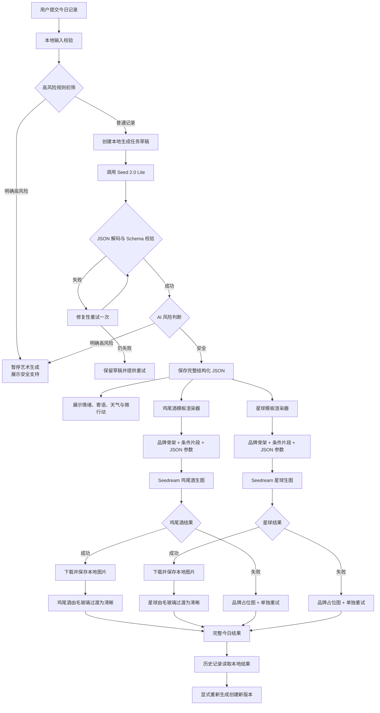

# DayGlyph 豆包全 AI 生成改造设计

日期：2026-06-20  
状态：已批准  
适用范围：比赛演示版本，不用于公开上架或大规模分发

## 1. 背景与目标

当前产品依赖 Apple Intelligence Foundation Models。中国大陆设备无法稳定使用该能力，导致情绪分析这一核心价值不可用。同时，现有规则与程序化视觉只能从少量固定情绪和参数生成鸡尾酒、星球、名言、情绪天气与微行动，既不能充分表达复杂情绪，也难以达到产品所需的视觉质量。

本次改造使用豆包 Seed 2.0 Lite 生成结构化情绪理解与内容规格，使用 Seedream 并行生成鸡尾酒和日星球图片。成就系统继续保持确定性规则，不纳入 AI 生成。

第一阶段目标是完成可独立演示的纵向闭环：

```text
用户记录
→ 识别 1～8 种复杂情绪
→ 生成情绪解释、鸡尾酒规格、星球规格、微行动、今日寄语和情绪天气
→ 并行生成鸡尾酒与日星球图片
→ 分阶段展示
→ 本地持久化并支持恢复和重新生成
```

## 2. 已确认决策

1. 比赛版本由 iOS App 直连豆包接口，不建设后端。
2. API Key 随演示包配置，接受其可被提取的风险；该方案不得直接用于正式上架版本。
3. 每次普通记录并行生成两张图：鸡尾酒与日星球。
4. 一次 Seed 2.0 Lite 调用返回统一 JSON，不拆分多个文本智能体。
5. AI 只输出结构化设计，不直接生成最终生图提示词。
6. 生图提示词由版本化固定模板、条件片段和 JSON 参数组装。
7. 品牌美术风格固定，材质、构图细节、色彩、光照和氛围高度变化。
8. 文本先展示，两张图片独立揭示；局部失败不阻塞其他结果。
9. 结果下载到本地永久保存，不依赖临时图片 URL。
10. 重新生成保留旧版本；“换一张”和“重新理解”是两个不同操作。
11. 明确高风险记录暂停艺术生图，优先展示安全支持。
12. 情绪采用大型受控心理词库、多标签输出与少量词库外补充，不再由旧 12 类控制前端。

## 3. 技术资料结论

已通过 Context7 查询火山引擎豆包资料，确认当前产品能力包含 Doubao-Seed-2.0-lite，以及 Doubao-Seedream-5.0-lite、4.5、4.0 等生图模型。Context7 当前收录内容足以确认模型与产品能力，但没有返回完整的端点字段和所有请求参数。

因此，实施第一步必须再以火山方舟控制台中实际开通模型的接口文档和在线调试结果为准，确认：

- 实际模型或接入点 ID；
- 请求 URL 与 Authorization 格式；
- JSON Schema 或结构化输出能力；
- Seedream 的尺寸、随机种子、同步或异步行为；
- 图片 URL 或 Base64 返回形式及有效期；
- 限流、审核、错误码与超时行为。

不得根据产品展示名称猜测生产请求字段。

参考：[豆包大模型官方产品页](https://www.volcengine.com/product/doubao)

## 4. 总体架构

采用客户端状态机编排。未来若改为后端代理，只替换文本和图片 Client，不改动 Schema、模板、持久化和 UI。



## 5. 统一生成契约

顶层响应至少包含以下部分：

```json
{
  "schema_version": "1.0",
  "request_id": "UUID",
  "safety": {},
  "emotion_analysis": {},
  "shared_visual_direction": {},
  "cocktail": {},
  "planet": {},
  "daily_action": {},
  "daily_message": {},
  "emotional_weather": {}
}
```

### 5.1 情绪分析

`emotion_analysis.emotions` 输出 1～8 个情绪，按显著度排序。每项包含标准心理词、内部情绪族、强度、置信度和基于原文的简短依据。强度彼此独立，不要求总和为 1。

```json
{
  "emotions": [
    {
      "term": "委屈",
      "family": "anger",
      "intensity": 0.74,
      "confidence": 0.86,
      "evidence": "自己的付出没有被理解"
    }
  ],
  "other_emotions": [],
  "dimensions": {
    "valence": -0.42,
    "arousal": 0.63,
    "dominance": -0.21,
    "energy": 0.38,
    "tension": 0.71,
    "certainty": 0.44,
    "social_connection": 0.23
  },
  "relationships": [],
  "summary": "一段克制、非诊断式解释",
  "uncertainties": []
}
```

情绪词库约 60～100 个词，覆盖喜悦与满足、悲伤与失去、恐惧与不安、愤怒与受挫、羞耻与内疚、关系与归属、低能量与耗竭、平静与恢复、希望与驱动力、困惑与认知冲突。常见情绪必须优先使用标准词；无法准确表达时才写入 `other_emotions`。

旧 12 类只作为隐藏兼容投影，为现有统计与 RealityKit 聚合服务，不再限制前端展示。

### 5.2 视觉规格

`shared_visual_direction` 负责同日双图关联，包括色板、对比度、温度、光线柔和度、空间密度、运动印象和象征元素。

`cocktail` 至少描述杯型与材质、酒液、层次、装饰、粒子、光照、镜头、背景和构图。`planet` 至少描述轮廓、表面、核心、大气层、环带、伴星、粒子、光照、镜头、背景和构图。复杂对象使用受限数组，避免无限堆叠元素。

名称和说明仅用于 UI，不进入生图提示词。

### 5.3 支持内容

- `daily_action`：标题、明确指令、时长、难度、环境和推荐原因；必须低压力、具体、可跳过。
- `daily_message`：AI 原创内容统一署名“DayGlyph 今日寄语”，不得冒用真实人物名言。
- `emotional_weather`：标题、简短解释和符号，不把情绪描述为疾病或命运判断。

## 6. 文本提示词系统

系统提示词分为四层：角色与安全规则、情绪理解方法、JSON Schema 与字段约束、当前用户输入。用户输入必须放入明确的数据边界中，不得与系统指令拼接为同一指令文本。

模型应按以下逻辑完成分析与自检：

```text
提取事实
→ 识别明确情绪
→ 区分情绪与事件、需求、人格
→ 为每种情绪寻找文本依据
→ 删除过度推断
→ 判断风险
→ 生成视觉规格与支持内容
→ 检查 JSON Schema
```

客户端确定性校验字段完整性、类型、范围、情绪数量、重复项、词库合法性、文案长度、禁止诊断词、风险与生图状态冲突，以及视觉参数合法性。非法 JSON 只允许修复性重试一次。

## 7. 生图提示词模板

最终提示词由以下部分组成：

```text
品牌风格锁
+ 主体结构锁
+ JSON 条件片段
+ 构图与镜头
+ 光照与材质
+ 背景约束
+ 质量要求
+ 禁止项
```

JSON 不提供自由生图提示词，而是选择客户端维护的高质量片段。例如：

```text
surface.material = translucent_mineral
→ 半透明矿物表面，内部可见细微晶体脉络

liquid.boundary_style = soft_diffusion
→ 颜色边界缓慢扩散，保持清晰层次，不形成浑浊混色
```

模板使用 `{{field}}`、条件块和数组块渲染。品牌风格、主体比例、画幅与禁止项固定；材质、颜色、层次、装饰、地貌、环带、粒子、光照、镜头和氛围由 JSON 控制。

稳定性规则：

- Schema、词库、片段库和模板分别版本化；
- 数值先映射到离散视觉档位；
- 同一 JSON 与模板版本产生相同提示词和哈希；
- 若实际接口支持随机种子，同版本重试可选择复用；
- 颜色在进入模板前执行品牌色域、对比度和饱和度检查；
- 渲染后执行长度、冲突、注入和禁用词检查；
- 图片中禁止文字、标志和水印。

“换一张”沿用同一 JSON，仅重新生图；“重新理解”重新调用文本模型并创建完整新版本。

## 8. 状态机与等待体验

总任务状态：

```text
draft → analyzing → validating → contentReady → generatingImages
→ partiallyReady → completed
```

任意阶段可进入 `retryableFailure`、`blockedBySafety` 或 `cancelled`。鸡尾酒和星球分别使用 `notStarted → rendering → downloading → saved` 状态。

UI 不展示虚假百分比，按真实阶段展示“正在理解今天的感受”“正在设计你的鸡尾酒与星球”“正在调配液体层次”“正在凝结星球表面”。文本完成后立即展示情绪、寄语、天气和微行动。两张固定尺寸毛玻璃卡片独立揭示，第一张完成后不等待第二张。

网络瞬断、超时、服务端 5xx 可自动重试一次；限流按接口信息等待；单图失败不影响另一张图。App 重启后读取本地任务，只补生成尚未保存的图片。

直连模式无法保证 App 被系统强制终止后网络请求继续运行。因此必须先保存 JSON 和图片参数；比赛实时演示保持 App 在前台，并准备明确标记的本地降级结果。

## 9. 安全边界

客户端使用少量明确高风险规则作第一层短路，Seed 返回结构化风险判断作第二层判断。普通低落、焦虑和疲惫不应误触发危机流程。

当记录明确包含自伤、自杀或即时危险时：

1. 暂停鸡尾酒与星球生图；
2. 保存用户记录；
3. 展示安全支持、紧急联系方式和寻求现实帮助的入口；
4. 不生成浪漫化伤害的文案或画面；
5. 不做医疗诊断、人格判断或绝对结论。

## 10. 本地数据模型

保留 `DayEntry` 作为每日索引并继续兼容旧字段，新增独立 `AIGenerationRecord`，保存 generation ID、entry ID、状态、各版本号、模型 ID、规范化 JSON、提示词哈希、双图状态、本地路径和错误信息。

图片保存到：

```text
Application Support/DayGlyphGenerated/
└── {{entryID}}/{{generationID}}/
    ├── cocktail.webp
    └── planet.webp
```

图片不直接存入 SwiftData。JSON 与图片采用原子写入。删除记录时删除全部生成版本和图片目录；图片丢失时标记为可重新生成，不允许页面崩溃。

旧记录不自动调用 AI。新记录把丰富情绪投影到旧 12 类隐藏权重，维持现有统计兼容。

## 11. 页面信息架构

AI 图片只负责复杂主视觉；文字、状态、交互和无障碍继续由 SwiftUI 实现。

生成页逐步展示完整的 1～8 个情绪词、情绪解释、双图状态、今日寄语、情绪天气和微行动。完整结果页依次展示日期与收藏、情绪详情、鸡尾酒 4:5 主视觉、日星球 1:1 主视觉、天气、寄语、微行动和版本操作。

情绪词不截断为前三项。点击词语可查看强度、置信度和识别依据。默认解释保持简短，详细依据按需展开。图片不得内嵌文字。开启减少动态效果时使用静态渐变；VoiceOver 读取图片名称、氛围和关键视觉元素。

第一阶段只将日星球图用于当天详情和历史缩略图，不删除现有 RealityKit 月星球，也不立即改变月度聚合。

## 12. 模块边界

- `AIConfiguration`：模型 ID、API 地址、超时和演示密钥；
- `SeedTextClient`：文本网络请求与响应；
- `SeedImageClient`：生图请求和图片下载；
- `DayGenerationOrchestrator`：状态机、并发、取消、重试与恢复；
- `EmotionLexicon`：标准词、情绪族与旧体系映射；
- `GenerationSchemaValidator`：解码和语义校验；
- `PromptTemplateEngine`：模板与条件片段渲染；
- `GenerationRepository`：SwiftData 版本记录；
- `GeneratedAssetStore`：图片文件生命周期；
- `GenerationProgressViewModel`：领域状态到 SwiftUI 状态的转换。

## 13. 分阶段实施

1. 接口与提示词验证：确认真实请求契约，制作 Swift 网络探针，测量延迟并收集失败样本。
2. 结构化文本核心：词库、Codable Schema、验证器、兼容映射和 Seed 文本接入；图片先用占位资产。
3. 双图与模板系统：条件片段、Seedream 并发、本地下载、版本保存和单图重试。
4. 等待体验与结果页：双毛玻璃卡片、独立揭示、丰富情绪展示和全部支持内容。
5. 安全、恢复与比赛加固：高风险短路、重启恢复、断网超时、演示降级和现场网络演练。

后续里程碑再处理 AI 时间来信、回声、共情海、月星球新映射、旧记录主动重新生成及正式后端。

## 14. 测试与验收

建立不少于 80 条中文情绪测试样本，覆盖单一情绪、4～8 种复杂情绪、冲突、否定、反讽、短输入、长段落、不同生活主题和高风险边界。复杂样本不得退化为单一宽泛情绪，所有识别必须有原文依据。

对 Schema、提示词快照、提示词注入、网络失败矩阵、状态恢复、SwiftData 兼容、图片文件丢失、日志隐私、减少动态和 VoiceOver 进行自动化测试。

生图使用固定样本集人工评价品牌一致性、情绪对应、主体完整性、材质、构图、禁止元素、每日差异度与同日双图关联感。文字、水印、畸形酒杯、多个主体星球和明显风格漂移均判定为失败，并通过片段库修正。

比赛前必须在实际演示设备连续生成至少 10 次，在相似网络环境验证接口，准备至少 3 条包含 5～8 种情绪的演示输入，并预存一套完整降级结果。整个核心流程不得依赖 Apple Intelligence。

## 15. 非目标

- 正式上架级 API Key 安全；
- 用户账号、云同步、服务端数据库或任务队列；
- 医疗诊断或心理治疗建议；
- 第一阶段重做成就、共情海、回声、时间来信和月度宇宙；
- 自动为所有旧记录补生成图片；
- 用 AI 图片替代全部 SwiftUI 界面。
