**DayGlyph**

**详细产品、视觉与交互设计文档**

面向 iOS Demo 开发交付｜从页面结构到组件尺寸、颜色、动效与状态

图 0\-1 统一后的 DayGlyph 核心体验闭环

<table><tr><td>
<strong>文档版本</strong>
</td><td>
v2.0 开发交付版
</td></tr><tr><td>
<strong>设计基准日期</strong>
</td><td>
2026-06-16
</td></tr><tr><td>
<strong>适用平台</strong>
</td><td>
iOS 26+ / SwiftUI；逻辑尺寸以 pt 为单位
</td></tr><tr><td>
<strong>设计基准画板</strong>
</td><td>
393 × 852 pt，兼容 375–430 pt 宽度
</td></tr><tr><td>
<strong>交付性质</strong>
</td><td>
产品定义 + UI 规范 + 交互状态 + 验收标准
</td></tr><tr><td>
<strong>资料范围</strong>
</td><td>
概念结构图、既有 PRD、GitHub 当前代码与仓库内下一阶段设计稿
</td></tr></table>

# **文档说明与使用方式**

本文件不是概念描述，而是可直接用于 UI 定稿、前端/客户端拆分、产品验收和答辩展示的执行级设计文档。开发人员应以本文件中的页面编号、组件尺寸、颜色令牌、交互状态和验收标准为准；概念图仅用于表达方向，不再作为尺寸依据。

**关键交付原则：设计先定死，开发再实现。任何颜色、卡片层级、按钮主次、页面入口和动效变化，必须先更新本设计文档并完成产品确认，避免开发完成后因“感觉不对”整体返工。**

<table><tr><td>
<strong>角色</strong>
</td><td>
<strong>重点阅读章节</strong>
</td><td>
<strong>交付动作</strong>
</td></tr><tr><td>
产品负责人
</td><td>
第 1–5、16、18 章
</td><td>
确认范围、术语、优先级和验收口径
</td></tr><tr><td>
UI/视觉设计
</td><td>
第 6–15 章
</td><td>
按令牌和页面规格输出最终高保真稿及资产
</td></tr><tr><td>
iOS 开发
</td><td>
第 6–18 章
</td><td>
按页面编号拆分 SwiftUI View、状态和组件
</td></tr><tr><td>
测试/验收
</td><td>
第 16–18 章
</td><td>
逐项验证正常态、异常态、无障碍与性能
</td></tr><tr><td>
答辩/演示
</td><td>
第 1、3、4、19 章
</td><td>
使用统一产品叙事与 Demo 路径
</td></tr></table>

# **目录**

0\. 资料冲突与最终统一口径

1\. 产品定义与设计目标

2\. 目标用户与典型场景

3\. 核心体验闭环与用户旅程

4\. 信息架构与导航

5\. 设计原则与内容边界

6\. 视觉设计系统

7\. 组件设计规范

8\. Today 今日模块

9\. Universe 宇宙模块

10\. Echo 回声模块

11\. Mine 我的模块

12\. 新手引导与首次使用

13\. 动效、手势与触觉

14\. 无障碍与适配

15\. 隐私、安全与非医疗化文案

16\. 与现有代码的迁移映射

17\. 全局状态与异常处理

18\. 开发验收标准与设计 QA

19\. Demo 演示脚本与答辩表达

附录 A\. CSS\-like 设计令牌

附录 B\. 页面清单与图标映射

附录 C\. 文案模板库

# **0\. 资料冲突与最终统一口径**

现有资料来自三个阶段：当前可运行代码、概念结构图/补充功能说明、仓库内下一阶段产品设计稿。三者在核心视觉、导航数量、分析方式和结果表达上存在差异。如果不先统一，设计稿会出现“同一情绪既是 Glyph、又是星球、又是鸡尾酒”的多重结果，开发也无法判断应该保留、替换还是新增。

<table><tr><td>
<strong>冲突项</strong>
</td><td>
<strong>当前代码/旧原型</strong>
</td><td>
<strong>概念图与补充文档</strong>
</td><td>
<strong>本设计最终决策</strong>
</td></tr><tr><td>
核心结果
</td><td>
Glyph 抽象图案
</td><td>
情绪星球
</td><td>
鸡尾酒负责详细结果，日星球负责长期归档；Glyph 退出用户可见界面
</td></tr><tr><td>
一级导航
</td><td>
今日、月历、设置（三项）
</td><td>
今日、宇宙、回声、我的（四项）
</td><td>
固定为四项：今日、宇宙、回声、我的
</td></tr><tr><td>
历史结构
</td><td>
月历网格
</td><td>
多星球情绪宇宙
</td><td>
主入口改为宇宙；月历仅作为无障碍/降级列表存在
</td></tr><tr><td>
情绪比例
</td><td>
当前结果显示百分比
</td><td>
补充文档一处禁止百分比
</td><td>
主页面不以百分比评判情绪；鸡尾酒配方详情可展示比例，明确是构成隐喻而非严重程度
</td></tr><tr><td>
AI 暴露
</td><td>
代码使用设备端 Foundation Models
</td><td>
补充文档要求不依赖 AI
</td><td>
UI 不显示模型品牌、不要求写提示词；设计只消费统一分析结果，Demo 可使用确定性本地数据
</td></tr><tr><td>
社交能力
</td><td>
未实现
</td><td>
漂流瓶/共情海
</td><td>
Demo 使用本地审核样本；正式版才接服务端和审核系统
</td></tr><tr><td>
视觉基调
</td><td>
纸张、玉绿色
</td><td>
暖白、粉紫橙蓝、玻璃星球
</td><td>
整体迁移至暖白四模块色；宇宙页允许深色沉浸背景
</td></tr></table>

**统一后的核心逻辑：用户写下当下 → 系统得到情绪结构 → 生成“情绪鸡尾酒”作为当天详细结果，同时生成“日星球”进入情绪宇宙 → 用户可以迈出一个小行动 → 稍后在回声中记录感受 → 在“我的”中回顾长期变化。**

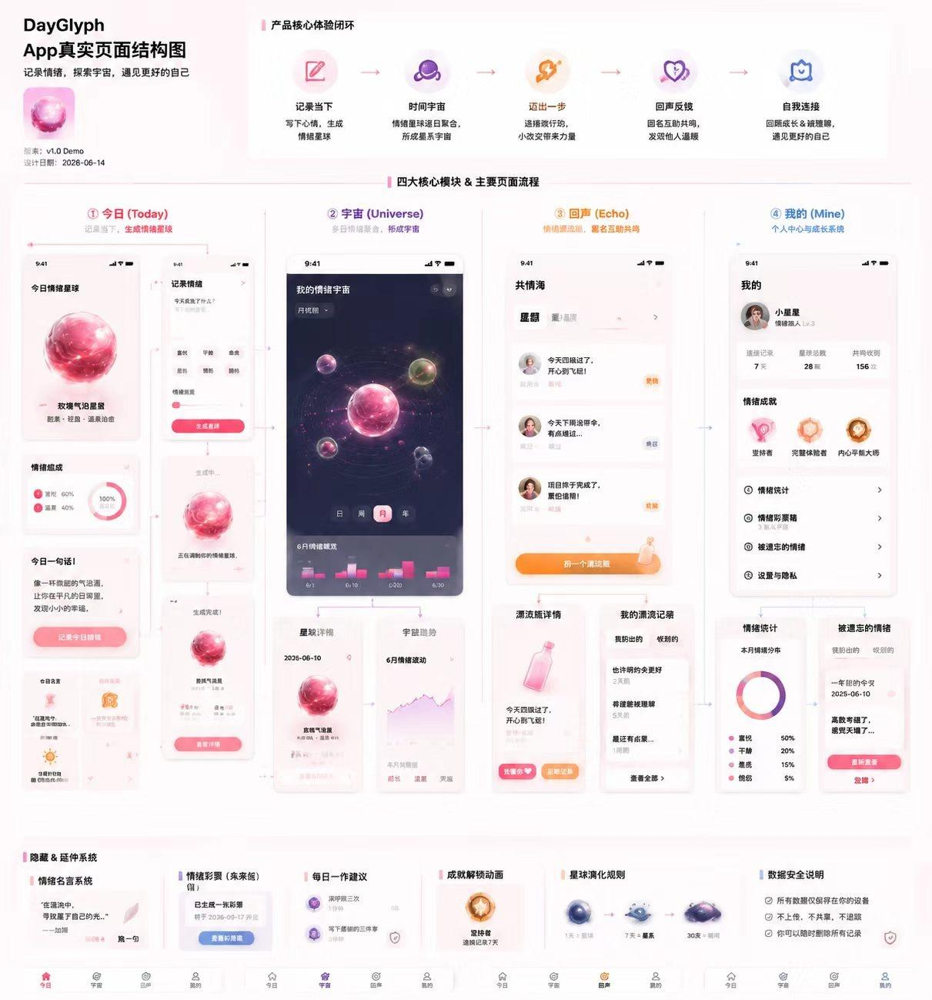

图 0\-2 原始概念结构图：用于确认模块关系与视觉方向，不作为最终尺寸稿

# **1\. 产品定义与设计目标**

## **1\.1 一句话定义**

DayGlyph 是一个本地优先、非医疗化的情绪记录与自我观察产品。它把难以描述的主观感受转化为可收藏的情绪鸡尾酒与可持续生长的情绪宇宙，并通过低压力微行动和延迟回声，帮助用户在日常生活中重新获得一点可见、可做、可回顾的掌控感。

## **1\.2 产品价值**

- 降低表达门槛：用户只需要写下一句话，不必先学会情绪分类或心理学术语。
- 提高回顾意愿：结果不是冷冰冰的分数，而是具有收藏感和审美辨识度的鸡尾酒、星球与轨道。
- 避免“记录后无事发生”：在完成记录后提供足够小的行动，但不强迫用户证明情绪改善。
- 形成时间感：单日记录进入月星球，多个星球组成宇宙，让用户看到自己不是被某一天定义。
- 保护隐私：日记原文、分析结果、行动与回声默认保存在本地，社交展示必须二次确认。

## **1\.3 本期 Demo 目标**

1. 让首次体验者在 60 秒内完成“记录—生成—查看结果”。
2. 让投资人或评委在第一眼看到差异化核心视觉，而不是普通情绪打卡表。
3. 四个一级模块都具备完整可演示路径，不出现只能点击但没有后续页面的“空入口”。
4. 所有页面都有明确尺寸、颜色、组件状态与交互反馈，能够直接转化为 SwiftUI 任务。
5. 用本地数据完成社区与历史演示，避免为了 Demo 建设不可见的服务端基础设施。

## **1\.4 非目标**

- 不进行心理疾病诊断、风险分级、治疗建议或疗效承诺。
- 不建立聊天、关注、私信、用户主页或公开社交关系。
- 不把连续签到、排名、分数或断签惩罚作为留存手段。
- 不在本设计文档中规定模型提示词、训练数据或算法实现。
- 不要求所有情绪组合实时生成一张全新的写实资产；首版以稳定资产 \+ 参数化覆盖完成。

# **2\. 目标用户与典型场景**

本产品面向“需要自我观察但不愿使用医疗化工具”的年轻用户，而不是只面向被诊断的心理障碍人群。设计应同时照顾普通情绪记录者、处于压力期的用户，以及对感官、社交和不确定性更敏感的人。

<table><tr><td>
<strong>画像</strong>
</td><td>
<strong>核心需要</strong>
</td><td>
<strong>主要障碍</strong>
</td><td>
<strong>设计响应</strong>
</td></tr><tr><td>
A. 高压学习/工作者
</td><td>
快速卸下当天情绪、看到自己完成了什么
</td><td>
没时间写长日记；讨厌被说教
</td><td>
一句话可完成；主操作始终只有一个；结果先视觉后解释
</td></tr><tr><td>
B. 表达困难者
</td><td>
不知道该如何命名感受，希望通过图像理解
</td><td>
面对空白输入框会卡住
</td><td>
提供句式引导、情绪标签可选、允许只写很短内容
</td></tr><tr><td>
C. 低动力/回避期用户
</td><td>
需要极小、具体、不需准备的行动
</td><td>
任务太大、连续打卡带来压力
</td><td>
30 秒到 10 分钟；可换更容易版本；跳过无惩罚
</td></tr><tr><td>
D. 感官或社交敏感用户
</td><td>
希望推荐可预测、低刺激、可独处的活动
</td><td>
强声音、外出、社交可能造成负担
</td><td>
设置室内/独处/避免刺激偏好；任务写法具体无隐喻
</td></tr><tr><td>
E. 审美型记录者
</td><td>
希望记录具有收藏、分享与成长感
</td><td>
普通列表缺乏吸引力
</td><td>
鸡尾酒资产、玻璃星球、海报式保存图与成就徽章
</td></tr></table>

## **2\.1 高频使用场景**

### **睡前快速记录**

用户在床上打开应用，只有一两分钟。首页应直接出现“记录今日情绪”，输入页面避免复杂问卷，生成过程控制在可感知但不拖沓的 1–2 秒内。

### **情绪突然波动后**

用户可能不想被过多动画刺激。输入框、标签和结果解释都应克制；负面情绪不使用警报色，不出现“异常”“危险”等判断。

### **周末回看**

用户进入宇宙，横向滑动月份，点击日期光点查看某一天。历史页应优先显示视觉摘要，再展开原文，避免一上来呈现大量文字。

### **完成微行动后**

用户可能没有明显好转。回声页必须允许“没什么变化”和“比想象中困难”，并把这些反馈视为正常记录。

### **想与陌生人共情**

用户在共情海中一次只看到一条内容，只能发送固定回应，不进入无限信息流，也不鼓励停留。

# **3\. 核心体验闭环与用户旅程**

图 3\-1 核心体验闭环与模块关系

## **3\.1 首次使用主路径**

<table><tr><td>
<strong>步骤</strong>
</td><td>
<strong>用户动作</strong>
</td><td>
<strong>界面反馈</strong>
</td><td>
<strong>成功标准</strong>
</td></tr><tr><td>
1. 打开今日
</td><td>
看到日期、空状态星球与主按钮
</td><td>
主按钮在首屏下半部可见，不需要滚动
</td><td>
3 秒内理解“这里可以记录情绪”
</td></tr><tr><td>
2. 输入内容
</td><td>
写一句或选择标签
</td><td>
字数、隐私提示和按钮状态同步更新
</td><td>
最短 1 字也可提交；空白不可提交
</td></tr><tr><td>
3. 调制结果
</td><td>
点击“调制今日情绪”
</td><td>
分阶段显示理解、配色、生成
</td><td>
总时长 1.2–2.0 秒；可减少动态
</td></tr><tr><td>
4. 查看结果
</td><td>
看到鸡尾酒、配方与日星球
</td><td>
结果直接完整展开，不再增加预览中间层
</td><td>
核心结果首屏可见；不需要二次点击
</td></tr><tr><td>
5. 选择行动
</td><td>
从三个微行动中选一个或跳过
</td><td>
明确耗时、室内/社交/感官标签
</td><td>
任何选择都不被惩罚
</td></tr><tr><td>
6. 回声记录
</td><td>
稍后收到本地提醒或主动进入回声
</td><td>
四个中性反馈选项
</td><td>
反馈后保存并更新个人发现
</td></tr><tr><td>
7. 历史回看
</td><td>
进入宇宙选择月份和日期
</td><td>
星球、光点、摘要和完整记录逐层展开
</td><td>
不丢失上下文，随时返回当前月
</td></tr></table>

## **3\.2 一次只突出一个主要动作**

今日页不能同时出现多个同等级高饱和按钮。首屏唯一主按钮是“记录今日情绪”或“继续查看今日结果”；微行动、时间来信和共情海入口使用卡片内次级按钮。结果页唯一主动作根据状态变化：未收藏时为“收藏配方”，已收藏后为“保存图片”；其余动作使用描边或文字按钮。

# **4\. 信息架构与导航**

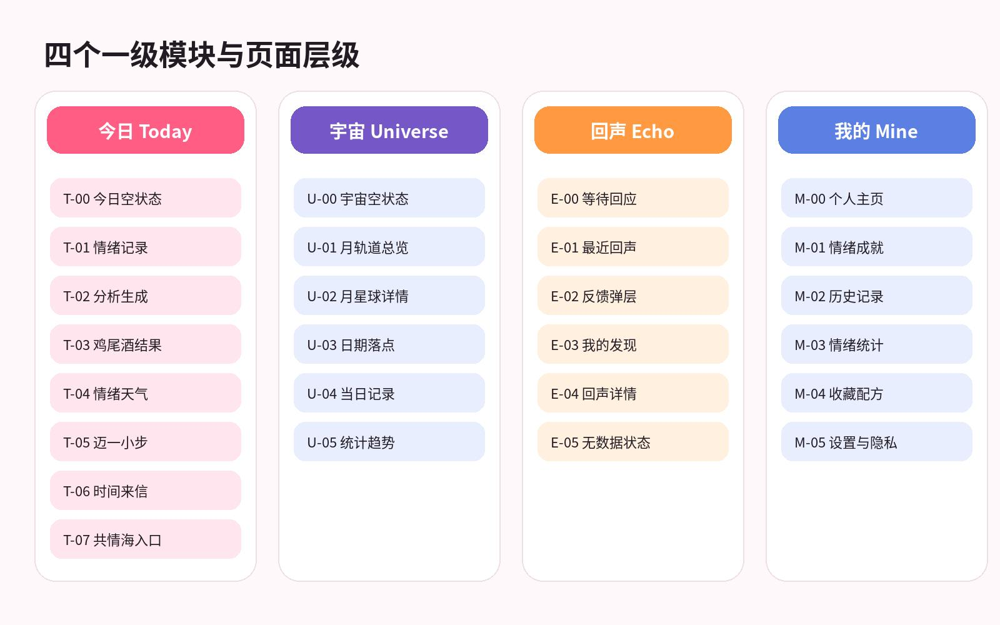

图 4\-1 四个一级模块及页面层级

## **4\.1 底部导航规范**

<table><tr><td>
<strong>项目</strong>
</td><td>
<strong>规范</strong>
</td></tr><tr><td>
数量
</td><td>
固定 4 项，不允许在 Demo 中因未完成临时隐藏某一项
</td></tr><tr><td>
名称
</td><td>
今日、宇宙、回声、我的；不使用“月历”“设置”作为一级标题
</td></tr><tr><td>
图标
</td><td>
今日 house/sparkles；宇宙 orbit/sparkles；回声 dot.radiowaves；我的 person.crop.circle
</td></tr><tr><td>
高度
</td><td>
可见区域 64 pt，底部安全区由系统自动增加，整体背景使用系统材质或统一玻璃材质
</td></tr><tr><td>
选中态
</td><td>
模块色图标 + Semibold 11–12 pt 标签；未选中为中性灰 70%
</td></tr><tr><td>
切换行为
</td><td>
保留各 Tab 的滚动位置；重复点击当前 Tab 回到顶部或回到当前月
</td></tr><tr><td>
红点
</td><td>
默认不使用情绪催促红点；仅回声到期可显示 1–9 的低刺激数字徽标
</td></tr></table>

## **4\.2 页面编号**

页面编号作为设计、开发、测试之间的共同语言。T 表示 Today，U 表示 Universe，E 表示 Echo，M 表示 Mine，O 表示 Onboarding，G 表示 Global 全局弹层。开发任务、截图文件名、测试用例和缺陷单均应携带页面编号，例如“E\-02 回声反馈弹层”。

# **5\. 设计原则与内容边界**

### **非医疗化**

所有结果都描述“这一天的感受构成”，不描述人格、疾病或治疗效果。负面情绪也使用有尊严的颜色和文案。

### **低压力**

跳过、未完成、没有变化都属于正常路径；不出现断签、归零、失败、落后等词。

### **视觉先行、解释后置**

首屏先让用户看见鸡尾酒或星球，解释放在下方卡片，避免一上来堆叠分析文本。

### **一致的隐喻**

鸡尾酒表示当日配方，星球表示时间中的凝结；颜色映射、名称和关键词必须一致。

### **本地优先**

默认本地保存，任何可能公开的内容都在独立编辑页二次确认。

### **确定性与可回顾**

同一份分析结果应生成稳定的资产、配色和名称，历史回看不能每天变化。

### **克制的玻璃效果**

透明玻璃只用于导航、浮层和核心卡片，不把每个列表项都做成高模糊玻璃，保证可读性和性能。

# **6\. 视觉设计系统**

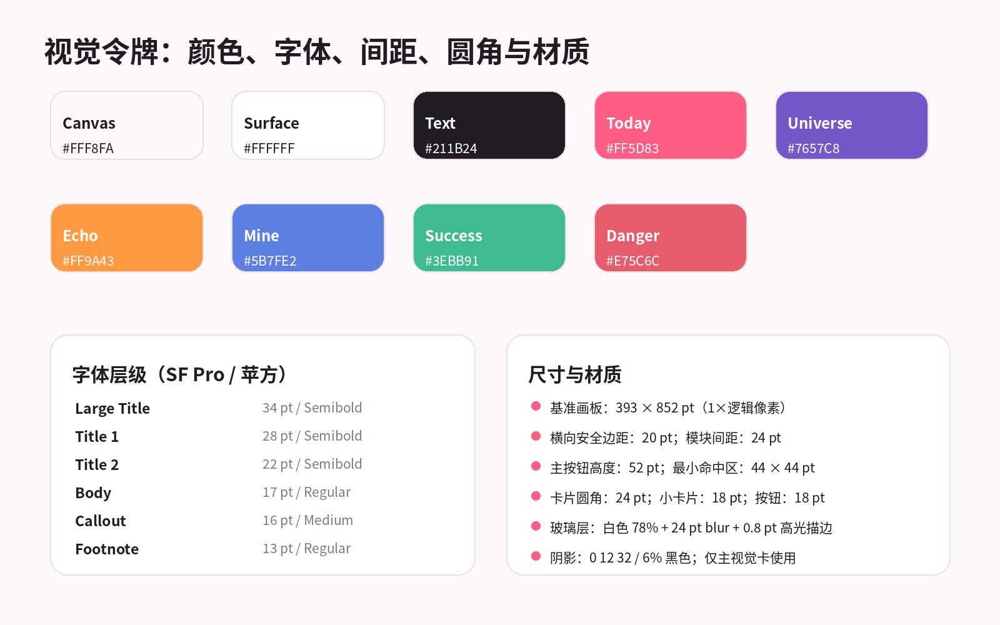

图 6\-1 核心视觉令牌

## **6\.1 逻辑像素与单位**

iOS 设计和 SwiftUI 实现使用 pt（point），不是物理 px。本文在“多少 px”的沟通语境中统一按 1× Figma 画板理解：1 逻辑 px = 1 pt。实际屏幕为 2× 或 3× 时由系统映射为 2 或 3 个物理像素。禁止开发直接把 393 pt 宽度乘 3 后写死。

<table><tr><td>
<strong>画板/区域</strong>
</td><td>
<strong>尺寸与规则</strong>
</td></tr><tr><td>
设计基准
</td><td>
393 × 852 pt；同时验证 375 × 812 与 430 × 932
</td></tr><tr><td>
顶部安全区
</td><td>
使用 safeAreaInset，不写死；基准截图通常约 59 pt
</td></tr><tr><td>
内容边距
</td><td>
标准 20 pt；沉浸宇宙可延伸至全屏，文字仍保留 20 pt
</td></tr><tr><td>
模块间距
</td><td>
大区块 24 pt；卡片内区块 16 pt；紧凑行 8–12 pt
</td></tr><tr><td>
滚动底部
</td><td>
最后一个内容与 Tab Bar 可见区域保持至少 24 pt + 安全区
</td></tr><tr><td>
网格
</td><td>
8 pt 主网格，4 pt 用于图标微调和边界对齐
</td></tr></table>

## **6\.2 颜色体系**

<table><tr><td>
<strong>Token</strong>
</td><td>
<strong>HEX</strong>
</td><td>
<strong>用途</strong>
</td><td>
<strong>禁止用法</strong>
</td></tr><tr><td>
Canvas
</td><td>
#FFF8FA
</td><td>
今日、回声、我的的全局暖白背景
</td><td>
不可用纯白充满整页
</td></tr><tr><td>
Surface
</td><td>
#FFFFFF
</td><td>
卡片与输入区域
</td><td>
不透明度低于 70% 时必须有背景对比
</td></tr><tr><td>
Text Primary
</td><td>
#211B24
</td><td>
标题、正文、关键数字
</td><td>
不可直接使用纯黑 #000000
</td></tr><tr><td>
Text Secondary
</td><td>
#817784
</td><td>
说明、时间、标签
</td><td>
正文小字号下不得低于可读对比
</td></tr><tr><td>
Today Pink
</td><td>
#FF5D83
</td><td>
今日主按钮、选中态、结果高光
</td><td>
不可作为错误色
</td></tr><tr><td>
Universe Purple
</td><td>
#7657C8
</td><td>
宇宙导航、轨道与月份强调
</td><td>
深色背景上需提高亮度或加白
</td></tr><tr><td>
Echo Orange
</td><td>
#FF9A43
</td><td>
回声按钮、到期提示
</td><td>
不可用于危机警报
</td></tr><tr><td>
Mine Blue
</td><td>
#5B7FE2
</td><td>
我的、数据与设置入口
</td><td>
不可大面积覆盖正文背景
</td></tr><tr><td>
Danger
</td><td>
#E75C6C
</td><td>
删除、清空、举报确认
</td><td>
只在用户将执行不可逆操作时使用
</td></tr></table>

## **6\.3 字体体系**

中文使用系统苹方，英文与数字使用 SF Pro；开发中优先使用 Dynamic Type 语义字号，不写死字体名称。设计交付中的字号用于基准画板，用户开启更大字体后必须允许页面重排。

<table><tr><td>
<strong>层级</strong>
</td><td>
<strong>字号/字重</strong>
</td><td>
<strong>行高</strong>
</td><td>
<strong>使用位置</strong>
</td></tr><tr><td>
Large Title
</td><td>
34 pt / Semibold
</td><td>
41 pt
</td><td>
一级页面标题，少量使用
</td></tr><tr><td>
Title 1
</td><td>
28 pt / Semibold
</td><td>
34 pt
</td><td>
鸡尾酒名、关键结果
</td></tr><tr><td>
Title 2
</td><td>
22 pt / Semibold
</td><td>
28 pt
</td><td>
卡片标题、模块标题
</td></tr><tr><td>
Headline
</td><td>
17 pt / Semibold
</td><td>
22 pt
</td><td>
按钮、列表主标题
</td></tr><tr><td>
Body
</td><td>
17 pt / Regular
</td><td>
25 pt
</td><td>
主要说明和日记正文
</td></tr><tr><td>
Callout
</td><td>
16 pt / Medium
</td><td>
22 pt
</td><td>
标签说明、提示
</td></tr><tr><td>
Subheadline
</td><td>
15 pt / Regular
</td><td>
20 pt
</td><td>
副标题、状态
</td></tr><tr><td>
Footnote
</td><td>
13 pt / Regular
</td><td>
18 pt
</td><td>
时间、来源、辅助信息
</td></tr><tr><td>
Caption
</td><td>
11–12 pt / Medium
</td><td>
16 pt
</td><td>
Tab 标签、图注；不可承载长正文
</td></tr></table>

## **6\.4 圆角、描边与阴影**

- 页面主卡片圆角 28–32 pt；普通卡片 24 pt；小卡片与标签 16–18 pt；胶囊为高度的一半。
- 浅色卡片使用 0\.8–1 pt 的白色高光描边和 1 pt 的 \#EEDFE5 外边界，不使用粗灰边。
- 主视觉卡阴影：Y=12 pt，Blur=32 pt，黑色 6%；列表项阴影应取消或降至 3%。
- 深色宇宙页使用白色 10–16% 描边，不使用黑色阴影；发光效果必须局部且不影响文字对比。

## **6\.5 毛玻璃与 Liquid Glass 使用范围**

需要玻璃效果，但不能“全页面毛玻璃”。玻璃的功能是把前景控制与内容分层，而不是单纯装饰。底部导航、顶部悬浮控制、宇宙摘要浮层、分享/筛选 Sheet 可以使用系统材质；普通文本列表、设置行、长正文卡片应使用高不透明度表面。

<table><tr><td>
<strong>组件</strong>
</td><td>
<strong>玻璃强度</strong>
</td><td>
<strong>背景透明度</strong>
</td><td>
<strong>Blur</strong>
</td><td>
<strong>说明</strong>
</td></tr><tr><td>
底部 Tab Bar
</td><td>
中
</td><td>
白色 78% / 深色 82%
</td><td>
24 pt
</td><td>
随滚动内容透出少量色彩
</td></tr><tr><td>
宇宙浮层
</td><td>
中高
</td><td>
深色 78%
</td><td>
30 pt
</td><td>
需有 1 pt 白色 12% 描边
</td></tr><tr><td>
今日主视觉卡
</td><td>
低
</td><td>
白色 88%
</td><td>
14 pt
</td><td>
强调内容而不是背景
</td></tr><tr><td>
Sheet 顶部工具区
</td><td>
系统默认
</td><td>
由系统材质决定
</td><td>
系统
</td><td>
优先使用原生 sheet 材质
</td></tr><tr><td>
设置列表
</td><td>
无
</td><td>
白色 96%
</td><td>
0
</td><td>
确保长文本清晰
</td></tr></table>

# **7\. 组件设计规范**

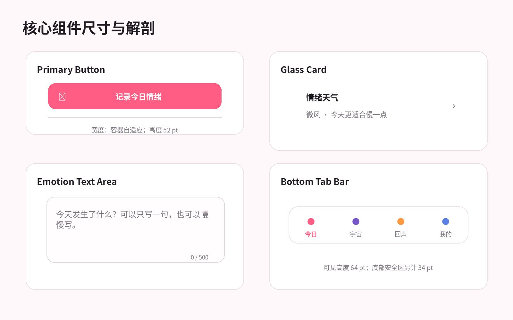

图 7\-1 核心组件尺寸和视觉解剖

## **7\.1 按钮**

<table><tr><td>
<strong>类型</strong>
</td><td>
<strong>高度</strong>
</td><td>
<strong>圆角</strong>
</td><td>
<strong>字体</strong>
</td><td>
<strong>颜色</strong>
</td><td>
<strong>使用规则</strong>
</td></tr><tr><td>
Primary
</td><td>
52 pt
</td><td>
18 pt
</td><td>
17 pt Semibold
</td><td>
模块主色 + 白字
</td><td>
每屏最多一个；承载当前最重要动作
</td></tr><tr><td>
Secondary Filled
</td><td>
48 pt
</td><td>
18 pt
</td><td>
16 pt Semibold
</td><td>
模块浅色底 + 模块色字
</td><td>
用于换一个、保存图片、跳过
</td></tr><tr><td>
Secondary Outline
</td><td>
48 pt
</td><td>
18 pt
</td><td>
16 pt Semibold
</td><td>
透明底 + 1 pt 边框
</td><td>
双按钮并列时使用
</td></tr><tr><td>
Text Button
</td><td>
44 pt 命中区
</td><td>
无
</td><td>
16 pt Medium
</td><td>
模块色
</td><td>
取消、稍后、查看全部
</td></tr><tr><td>
Destructive
</td><td>
52 pt
</td><td>
18 pt
</td><td>
17 pt Semibold
</td><td>
#E75C6C
</td><td>
只出现在二次确认弹层
</td></tr></table>

## **7\.2 卡片**

<table><tr><td>
<strong>卡片类型</strong>
</td><td>
<strong>最小高度</strong>
</td><td>
<strong>内边距</strong>
</td><td>
<strong>圆角</strong>
</td><td>
<strong>结构</strong>
</td></tr><tr><td>
Hero 主视觉
</td><td>
320 pt
</td><td>
24 pt
</td><td>
32 pt
</td><td>
标题/副标题 + 主视觉 + 摘要；允许自适应增高
</td></tr><tr><td>
Module 模块卡
</td><td>
128 pt
</td><td>
20 pt
</td><td>
24 pt
</td><td>
标题 + 一句话说明 + 入口箭头/次级按钮
</td></tr><tr><td>
List 列表项
</td><td>
88 pt
</td><td>
16/20 pt
</td><td>
20 pt
</td><td>
图标 44 + 文本 + 状态/箭头
</td></tr><tr><td>
Insight 洞察卡
</td><td>
160 pt
</td><td>
20 pt
</td><td>
24 pt
</td><td>
结论 + 数据来源说明 + 查看详情
</td></tr><tr><td>
Empty 空状态
</td><td>
240 pt
</td><td>
24 pt
</td><td>
28 pt
</td><td>
插图 + 标题 + 说明 + 主按钮
</td></tr></table>

## **7\.3 输入与标签**

- 情绪输入框高度最小 240 pt，最大随文字增长到 420 pt 后内部滚动；默认 500 字上限。
- 占位文案必须具体，例如“今天发生了什么？可以只写一句”，不使用“请输入内容”。
- 情绪标签高度 32 pt，左右内边距 12 pt，间距 8 pt；标签是辅助输入，不强迫选择。
- 输入错误不清空内容；保存失败时原文保留在页面和本地草稿中。

## **7\.4 图标**

优先使用 SF Symbols，线宽统一为 regular/medium。页面内图标基准 18–22 pt，导航图标 22–24 pt，空状态插图可自绘。禁止混用卡通线稿、写实图标和 emoji 作为核心导航图标。

# **8\. Today 今日模块**

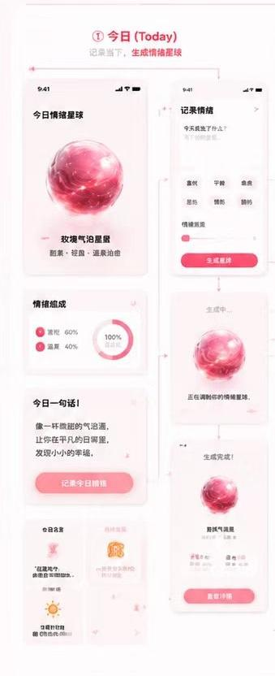

图 8\-1 概念图中的今日模块视觉方向

今日模块承担“现在发生什么、今天可以做什么”。页面顺序必须保持：记录/结果主视觉 → 天气与名言 → 今天迈一小步 → 时间来信 → 共情海轻入口。不得把成就、统计和设置塞入今日页。

图 8\-2 T\-00/T\-03 今日首页整合示意

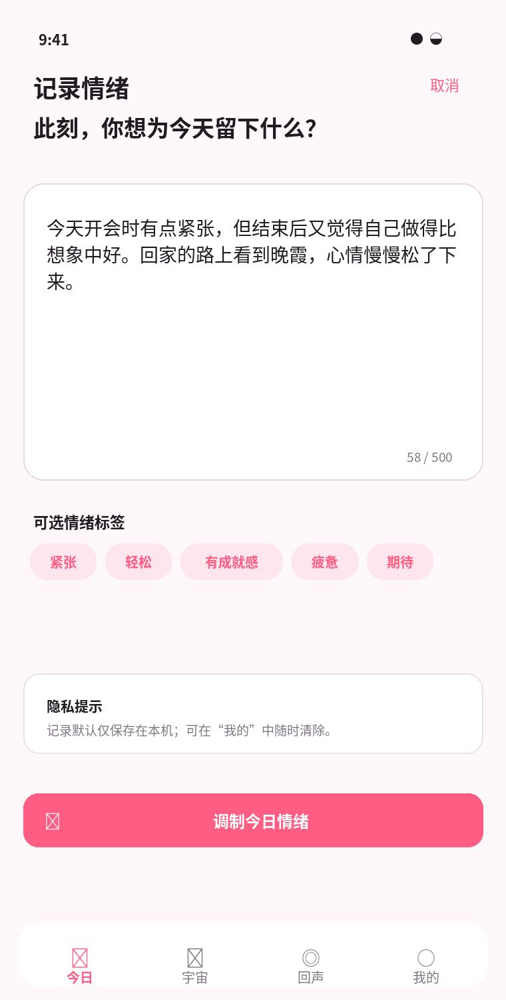

图 8\-3 T\-01 情绪记录输入示意

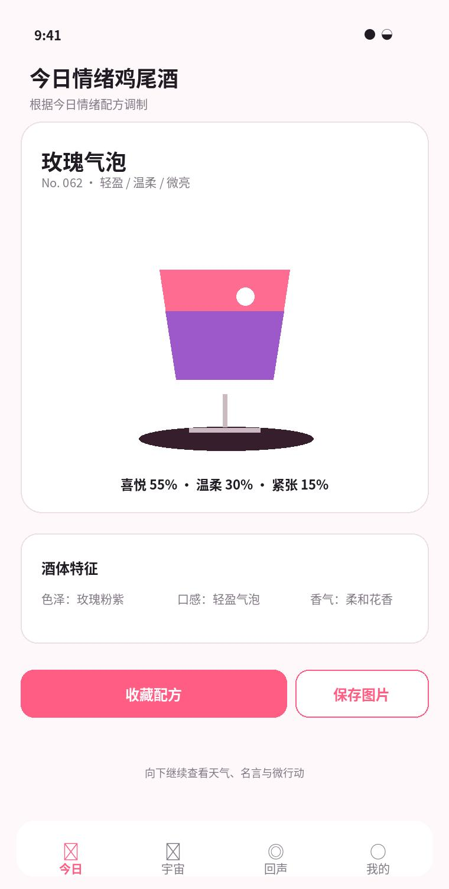

图 8\-4 T\-03 情绪鸡尾酒结果示意

## **T\-00 今日空状态**

让首次或当天未记录的用户立即理解产品并开始记录。

<table><tr><td>
<strong>项目</strong>
</td><td>
<strong>详细规范</strong>
</td></tr><tr><td>
进入条件
</td><td>
首次启动完成引导后，或当天尚无 DayEntry。
</td></tr><tr><td>
页面结构
</td><td>
顶部日期与轻量问候，高度约 70 pt；主视觉空星球卡 320–380 pt，星球使用低饱和静态玻璃体；一句解释：今天还没有留下情绪星球；主按钮“记录今日情绪”52 pt；下方保留微行动卡，不要求先记录
</td></tr><tr><td>
交互
</td><td>
点击主按钮进入 T-01；点击日期可查看过去记录，但不可在未来日期创建记录；微行动可直接进入 T-05
</td></tr><tr><td>
状态处理
</td><td>
无历史数据时不展示统计；有历史但今天为空时可显示“昨天的星球”轻入口。
</td></tr><tr><td>
无障碍
</td><td>
VoiceOver 先读“今天还没有记录”，再读主按钮；空星球标记为装饰图。
</td></tr></table>

验收重点：页面在 393 pt 宽度下无横向滚动；主按钮命中区不小于 44 pt；所有文字可在系统大字体下换行；返回后保持上一层滚动位置和未完成输入。

## **T\-01 情绪记录输入**

用最低表达成本完成记录，同时给用户充分的隐私和控制感。

<table><tr><td>
<strong>项目</strong>
</td><td>
<strong>详细规范</strong>
</td></tr><tr><td>
进入条件
</td><td>
从今日主按钮、快捷指令或历史编辑入口进入。
</td></tr><tr><td>
页面结构
</td><td>
导航栏：关闭/取消、标题、草稿状态；引导标题 28 pt，最多两行；文本区最小 240 pt，默认获得焦点；可选标签区，2–3 行自动换行；隐私提示卡与主按钮固定在内容末端
</td></tr><tr><td>
交互
</td><td>
输入非空后主按钮从 disabled 变 active；点击标签只追加结构化提示，不直接改写用户原文；取消时若有内容弹出保存草稿确认；提交进入 T-02
</td></tr><tr><td>
状态处理
</td><td>
空白、输入中、超长、草稿恢复、保存失败均有独立文案。
</td></tr><tr><td>
无障碍
</td><td>
标签提供 selected 状态；字数提示不应每输入一个字都朗读。
</td></tr></table>

验收重点：页面在 393 pt 宽度下无横向滚动；主按钮命中区不小于 44 pt；所有文字可在系统大字体下换行；返回后保持上一层滚动位置和未完成输入。

## **T\-02 分析与生成**

把等待变成可理解的生成过程，不暴露模型品牌和技术细节。

<table><tr><td>
<strong>项目</strong>
</td><td>
<strong>详细规范</strong>
</td></tr><tr><td>
进入条件
</td><td>
T-01 提交成功后。
</td></tr><tr><td>
页面结构
</td><td>
全屏或主卡中间显示聚合星球；下方分阶段文本：理解文字→调制颜色→凝结星球；进度不显示精确百分比，使用 3 个阶段点；超过 4 秒显示“仍在本机处理中”与取消按钮
</td></tr><tr><td>
交互
</td><td>
生成成功自动进入 T-03；用户点击取消返回 T-01 且保留输入；模型不可用时切换确定性本地演示数据并标注演示模式
</td></tr><tr><td>
状态处理
</td><td>
标准加载、减少动态、超时、分析不可用、本地保存失败。
</td></tr><tr><td>
无障碍
</td><td>
减少动态时用静态图标和文本阶段更新；VoiceOver 只在阶段变化时播报。
</td></tr></table>

验收重点：页面在 393 pt 宽度下无横向滚动；主按钮命中区不小于 44 pt；所有文字可在系统大字体下换行；返回后保持上一层滚动位置和未完成输入。

## **T\-03 情绪鸡尾酒结果**

在首屏交付“值得收藏”的核心视觉结果，并保持信息解释克制。

<table><tr><td>
<strong>项目</strong>
</td><td>
<strong>详细规范</strong>
</td></tr><tr><td>
进入条件
</td><td>
T-02 成功，或从历史记录进入某日详情。
</td></tr><tr><td>
页面结构
</td><td>
标题与日期 60–80 pt；Hero 卡：鸡尾酒名、编号、关键词、写实主视觉，高度 560–660 pt；配方摘要一行，详细比例折叠在下方；酒体特征卡：色泽/口感/香气；低压力小贴士卡；收藏与保存图片按钮
</td></tr><tr><td>
交互
</td><td>
点击配方展开比例和配方名称；点击日星球小图进入 U-03 对应日期；收藏后按钮变为已收藏并轻触觉反馈；保存图片生成固定海报，再调用系统分享面板
</td></tr><tr><td>
状态处理
</td><td>
低置信度时标题改为“今天可能由这些感受组成”；不显示诊断结论。
</td></tr><tr><td>
无障碍
</td><td>
鸡尾酒图片提供完整替代文本，包含名称、主要颜色和前三项配方。
</td></tr></table>

验收重点：页面在 393 pt 宽度下无横向滚动；主按钮命中区不小于 44 pt；所有文字可在系统大字体下换行；返回后保持上一层滚动位置和未完成输入。

## **T\-04 情绪天气与名言**

用轻量隐喻补充当天氛围，但不抢占核心结果。

<table><tr><td>
<strong>项目</strong>
</td><td>
<strong>详细规范</strong>
</td></tr><tr><td>
进入条件
</td><td>
T-03 下滑或今日首页模块卡。
</td></tr><tr><td>
页面结构
</td><td>
天气卡最小 140 pt，左侧天气动效/图标，右侧文本；名言卡最小 160 pt，来源与“为什么是这句话”入口；两卡不可并排，保证大字体可读
</td></tr><tr><td>
交互
</td><td>
点击天气展开天气说明 Sheet；长按或点击“7 日趋势”进入趋势页；点击名言切换同主题备选，最多 3 次/天；点击解释展示关键词匹配说明
</td></tr><tr><td>
状态处理
</td><td>
没有合适名言时显示产品自有支持文案，不伪造名人出处。
</td></tr><tr><td>
无障碍
</td><td>
天气不只依赖图标和颜色；必须有文字“微风/阵雨”等。
</td></tr></table>

验收重点：页面在 393 pt 宽度下无横向滚动；主按钮命中区不小于 44 pt；所有文字可在系统大字体下换行；返回后保持上一层滚动位置和未完成输入。

## **T\-05 今天迈一小步**

给出足够小、具体、可选择的行为，不制造签到压力。

<table><tr><td>
<strong>项目</strong>
</td><td>
<strong>详细规范</strong>
</td></tr><tr><td>
进入条件
</td><td>
今日页常驻模块、结果页下方或回声后的推荐入口。
</td></tr><tr><td>
页面结构
</td><td>
顶部说明不超过 3 行；三个行动卡纵向排列，每卡 104–140 pt；展示动作、预计耗时、外出/社交/感官标签；底部“换成更容易的”“今天先不做”
</td></tr><tr><td>
交互
</td><td>
点击行动卡进入确认或直接开始；换一个只替换当前卡，不刷新全部造成选择焦虑；开始后记录 startedAt，可在完成前取消；完成进入 G-03 完成反馈
</td></tr><tr><td>
状态处理
</td><td>
无匹配候选时放宽非关键偏好，但绝不违反用户明确禁用项。
</td></tr><tr><td>
无障碍
</td><td>
任务描述避免隐喻；状态标签用完整短语。
</td></tr></table>

验收重点：页面在 393 pt 宽度下无横向滚动；主按钮命中区不小于 44 pt；所有文字可在系统大字体下换行；返回后保持上一层滚动位置和未完成输入。

## **T\-06 时间来信**

把过去与未来的内容集中在同一卡位，形成低频惊喜而非催促。

<table><tr><td>
<strong>项目</strong>
</td><td>
<strong>详细规范</strong>
</td></tr><tr><td>
进入条件
</td><td>
今日页每日最多展示一张来信卡；用户也可主动进入。
</td></tr><tr><td>
页面结构
</td><td>
信件来源标签与日期；历史原文或未来来信正文；当时配方/星球摘要；三个操作：写写现在、先收下、今天先不看
</td></tr><tr><td>
交互
</td><td>
写给未来输入 1–500 字，最早 7 天后出现；保存后不显示准确触达日期；来自过去允许查看当时和现在，但不自动判断变好/变差
</td></tr><tr><td>
状态处理
</td><td>
无来信时显示“写给未来”的轻入口，不占据大面积。
</td></tr><tr><td>
无障碍
</td><td>
历史正文尊重动态字体；信纸纹理不可降低对比。
</td></tr></table>

验收重点：页面在 393 pt 宽度下无横向滚动；主按钮命中区不小于 44 pt；所有文字可在系统大字体下换行；返回后保持上一层滚动位置和未完成输入。

## **T\-07 共情海入口与发送**

让用户在充分知情和可编辑的前提下，匿名分享一段内容。

<table><tr><td>
<strong>项目</strong>
</td><td>
<strong>详细规范</strong>
</td></tr><tr><td>
进入条件
</td><td>
结果页次级按钮或共情海页面。
</td></tr><tr><td>
页面结构
</td><td>
独立编辑页，不直接发送原始日记；内容输入 1–300 字；公开风险提示卡；确认勾选与“匿名放入海中”主按钮
</td></tr><tr><td>
交互
</td><td>
进入时复制原文副本，用户可清空重写；检测到联系方式时仅提示，不自动修改；二次确认后进入模拟审核中；发送后原始 DayEntry 不被改动
</td></tr><tr><td>
状态处理
</td><td>
审核中、成功、失败、无网络（正式版）、演示模式。
</td></tr><tr><td>
无障碍
</td><td>
警示信息使用文本和图标，不仅用红色。
</td></tr></table>

验收重点：页面在 393 pt 宽度下无横向滚动；主按钮命中区不小于 44 pt；所有文字可在系统大字体下换行；返回后保持上一层滚动位置和未完成输入。

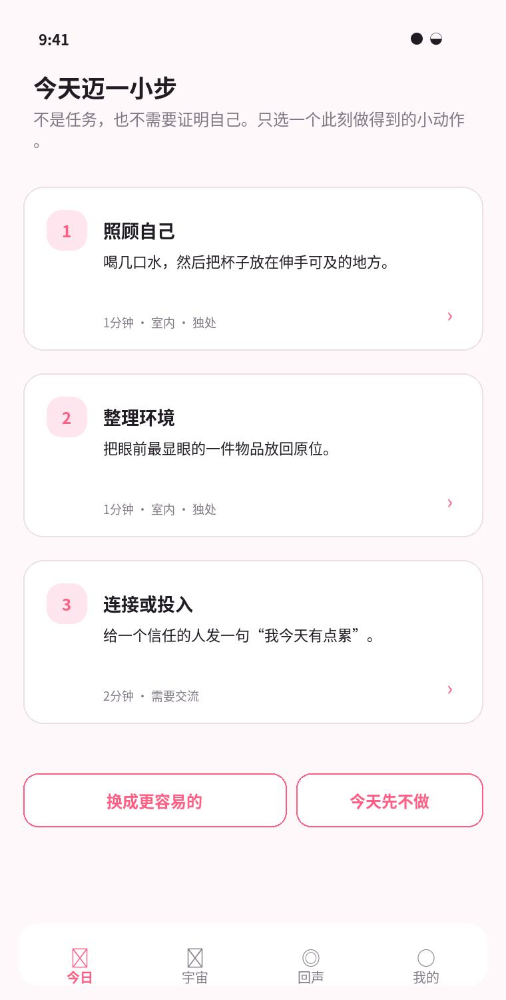

图 8\-5 T\-05 今天迈一小步页面示意

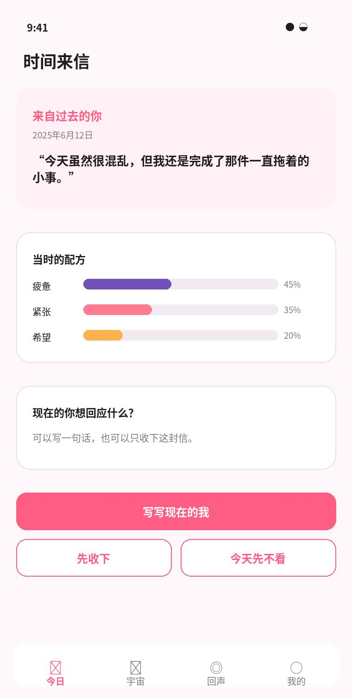

图 8\-6 T\-06 时间来信页面示意

图 8\-7 T\-07 共情海打捞与回应示意

## **8\.1 今日页纵向位置基准**

<table><tr><td>
<strong>区块</strong>
</td><td>
<strong>Y 起点（基准）</strong>
</td><td>
<strong>高度</strong>
</td><td>
<strong>左右边距</strong>
</td><td>
<strong>备注</strong>
</td></tr><tr><td>
顶部标题/日期
</td><td>
安全区后 8 pt
</td><td>
64–80 pt
</td><td>
20 pt
</td><td>
不使用大面积导航栏背景
</td></tr><tr><td>
记录或结果 Hero
</td><td>
约 116 pt
</td><td>
320–660 pt
</td><td>
20 pt
</td><td>
空态、输入态、结果态高度不同
</td></tr><tr><td>
天气/名言
</td><td>
Hero 后 24 pt
</td><td>
140–180 pt
</td><td>
20 pt
</td><td>
每张卡纵向排列
</td></tr><tr><td>
微行动
</td><td>
上一卡后 24 pt
</td><td>
可变，最小 360 pt
</td><td>
20 pt
</td><td>
三个行动可折叠为横向分页，但默认纵向
</td></tr><tr><td>
时间来信
</td><td>
后 24 pt
</td><td>
140–300 pt
</td><td>
20 pt
</td><td>
每天最多一个触达内容
</td></tr><tr><td>
共情海入口
</td><td>
后 24 pt
</td><td>
120–160 pt
</td><td>
20 pt
</td><td>
不展示信息流，只展示入口
</td></tr><tr><td>
底部留白
</td><td>
最后卡后
</td><td>
24 pt + Tab Bar
</td><td>
—
</td><td>
避免被导航遮挡
</td></tr></table>

# **9\. Universe 宇宙模块**

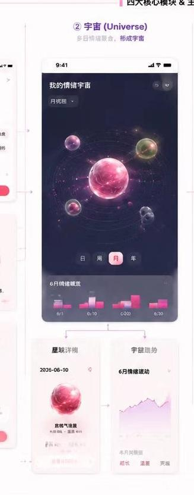

图 9\-1 概念图中的情绪宇宙方向

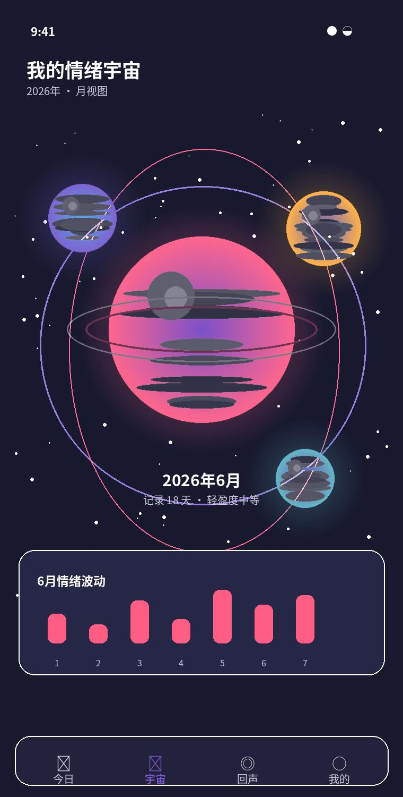

图 9\-2 U\-01 月轨道宇宙总览示意

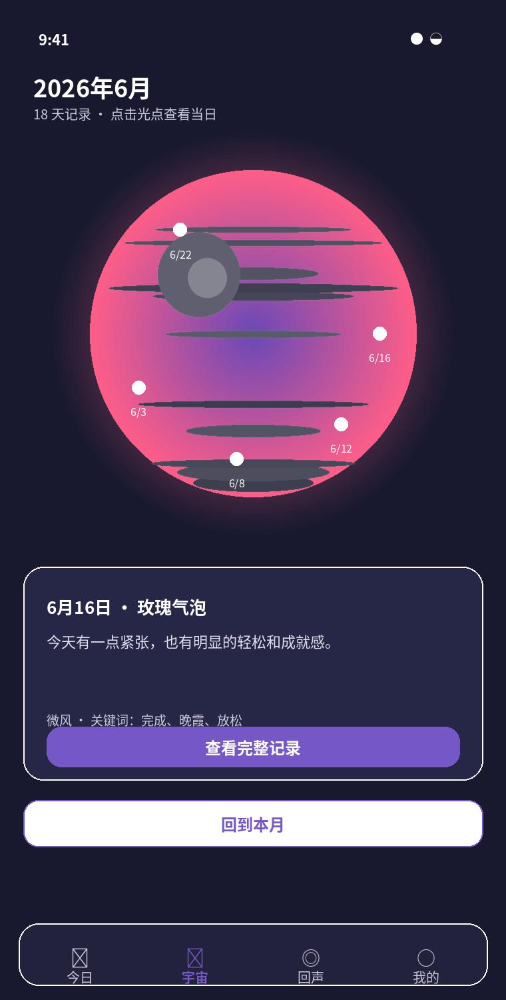

图 9\-3 U\-02/U\-03 月星球与日期摘要示意

宇宙页是唯一允许整体深色沉浸的一级页面。它不是把月历换成几个渐变圆，而是用多星球、轨道、纵深、粒子和日期落点建立“时间中的情绪空间”。当前月份必须在视觉中心，前后月份只作为空间提示，避免用户迷失。

## **U\-00 宇宙空状态**

在没有历史数据时仍传达“记录会形成宇宙”的期待。

<table><tr><td>
<strong>项目</strong>
</td><td>
<strong>详细规范</strong>
</td></tr><tr><td>
进入条件
</td><td>
没有任何有效记录。
</td></tr><tr><td>
页面结构
</td><td>
深色全屏星空背景；中心半透明未形成星球；标题“你的宇宙还在等待第一颗星球”；主按钮跳转 T-01
</td></tr><tr><td>
交互
</td><td>
点击主按钮切换今日 Tab 并打开输入；减少动态时星空完全静止
</td></tr><tr><td>
状态处理
</td><td>
不显示空白 3D 场景或加载错误。
</td></tr><tr><td>
无障碍
</td><td>
提供等价文字列表和返回今日按钮。
</td></tr></table>

## **U\-01 月轨道宇宙总览**

第一眼呈现多月份、空间纵深与成长感。

<table><tr><td>
<strong>项目</strong>
</td><td>
<strong>详细规范</strong>
</td></tr><tr><td>
进入条件
</td><td>
点击宇宙 Tab。
</td></tr><tr><td>
页面结构
</td><td>
沉浸深色背景铺满安全区；中央当前月主星球直径 220–280 pt；前后月星球 72–120 pt，沿轨道分布；顶部年月筛选与回到本月按钮；底部月度趋势玻璃卡
</td></tr><tr><td>
交互
</td><td>
横向拖动切换月份；单指拖动当前星球旋转；双指缩放查看细节；点击日期光点进入 U-03；重复点击宇宙 Tab 回到本月
</td></tr><tr><td>
状态处理
</td><td>
36 个月以上远景使用低细节；RealityKit 失败进入 U-05 2D 降级。
</td></tr><tr><td>
无障碍
</td><td>
VoiceOver 模式提供按月份排序的列表，不要求操作 3D 实体。
</td></tr></table>

## **U\-02 月星球详情**

解释月星球的颜色、内部层次和记录密度。

<table><tr><td>
<strong>项目</strong>
</td><td>
<strong>详细规范</strong>
</td></tr><tr><td>
进入条件
</td><td>
点击当前月星球或上滑月度趋势卡。
</td></tr><tr><td>
页面结构
</td><td>
大星球占上半屏；记录天数、主要配色和波动描述；日期光点图例；月度关键词和趋势折线；“查看全部日期”按钮
</td></tr><tr><td>
交互
</td><td>
点击日期光点弹出摘要；拖动旋转不改变月份；点击图例只解释映射，不对情绪好坏排序
</td></tr><tr><td>
状态处理
</td><td>
只有 1 天记录时不生成趋势结论，显示“数据还少”。
</td></tr><tr><td>
无障碍
</td><td>
星球复杂度用文字说明，不只通过纹理表达。
</td></tr></table>

## **U\-03 日期落点摘要**

在宇宙中保持空间上下文，同时快速预览某一天。

<table><tr><td>
<strong>项目</strong>
</td><td>
<strong>详细规范</strong>
</td></tr><tr><td>
进入条件
</td><td>
点击月星球上的日期光点。
</td></tr><tr><td>
页面结构
</td><td>
底部玻璃摘要卡 260–330 pt；日期、鸡尾酒名、天气、关键词；日星球缩略图与“完整记录”按钮
</td></tr><tr><td>
交互
</td><td>
左右滑动摘要切换相邻有记录日期；点击完整记录进入 T-03 历史模式；下滑关闭并回到同一旋转角度
</td></tr><tr><td>
状态处理
</td><td>
记录已删除时光点同步消失，不保留死链接。
</td></tr><tr><td>
无障碍
</td><td>
光点命中区至少 44 pt，通过扩大透明命中区域实现。
</td></tr></table>

## **U\-04 宇宙趋势与统计**

提供描述性回顾，不把情绪做成成绩。

<table><tr><td>
<strong>项目</strong>
</td><td>
<strong>详细规范</strong>
</td></tr><tr><td>
进入条件
</td><td>
U-01 底部趋势卡或我的情绪统计。
</td></tr><tr><td>
页面结构
</td><td>
月/季/年切换；情绪构成环图或堆叠柱；记录频率、波动范围、常见关键词；说明“仅基于你的记录”
</td></tr><tr><td>
交互
</td><td>
点击图例筛选但不隐藏所有数据；长按图表显示日期和构成；可导出静态图片
</td></tr><tr><td>
状态处理
</td><td>
数据不足少于 7 天时不输出规律性总结。
</td></tr><tr><td>
无障碍
</td><td>
图表必须提供可读表格替代和数值描述。
</td></tr></table>

## **9\.1 星球视觉映射**

<table><tr><td>
<strong>数据</strong>
</td><td>
<strong>视觉映射</strong>
</td><td>
<strong>限制</strong>
</td></tr><tr><td>
主情绪权重
</td><td>
决定主色和内部主要液态层
</td><td>
不把负面情绪固定为黑灰色
</td></tr><tr><td>
次情绪权重
</td><td>
决定辅助色、光晕和纹理比例
</td><td>
最多 3 种显著颜色，避免脏乱
</td></tr><tr><td>
记录天数
</td><td>
影响星球直径 0.88–1.12 倍
</td><td>
尺寸差异不可暗示严重程度
</td></tr><tr><td>
情绪离散度
</td><td>
影响内部层数、颗粒与纹理复杂度
</td><td>
复杂度有上限，确保真机性能
</td></tr><tr><td>
平均唤醒度
</td><td>
影响光晕与粒子速度
</td><td>
减少动态时只保留静态亮度
</td></tr><tr><td>
有效日期
</td><td>
生成表面/轨道光点
</td><td>
命中区扩大到 44 pt，视觉点可小于 10 pt
</td></tr><tr><td>
年月 + 聚合结果
</td><td>
生成稳定 seed
</td><td>
同一数据重复进入不改变星球
</td></tr></table>

# **10\. Echo 回声模块**

图 10\-1 概念图中的回声与共情方向

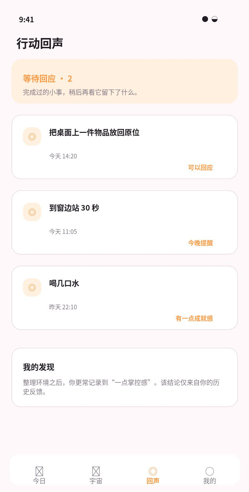

图 10\-2 E\-00 行动回声首页示意

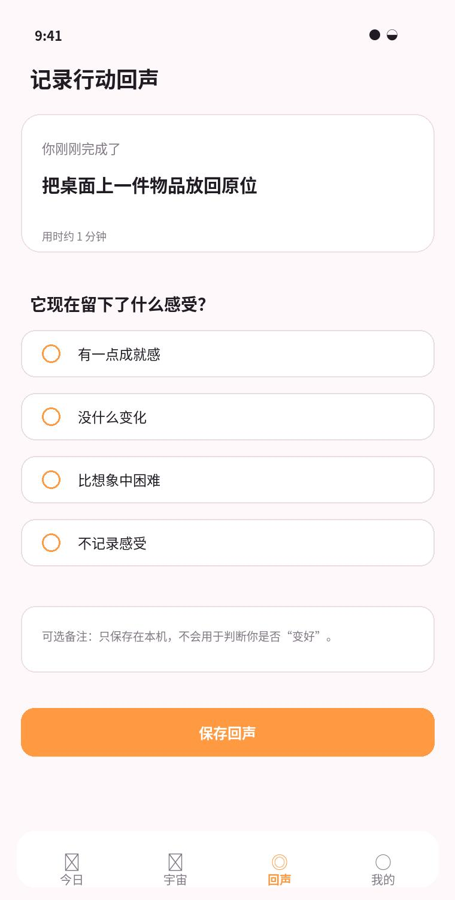

图 10\-3 E\-02 行动回声反馈示意

回声模块只负责“做过什么，以及后来感受如何”。它不再提供新任务，避免与“今天迈一小步”重复。共情海的陌生人回应也可以在回声中展示结果，但不能与个人行动回声混成同一列表，应通过分段标签明确区分。

## **E\-00 回声首页**

集中展示等待回应、最近回声与个人发现，不再推荐新任务。

<table><tr><td>
<strong>项目</strong>
</td><td>
<strong>详细规范</strong>
</td></tr><tr><td>
进入条件
</td><td>
点击回声 Tab。
</td></tr><tr><td>
页面结构
</td><td>
等待回应摘要卡；到期/即将到期行动列表；最近回声列表；累计 3 次后出现“我的发现”
</td></tr><tr><td>
交互
</td><td>
点击到期项进入 E-02；点击未到期项可改提醒或取消观察；点击历史项进入 E-04；重复点击 Tab 滚动到顶部
</td></tr><tr><td>
状态处理
</td><td>
没有回声时显示“完成一个小行动后，这里会留下回声”。
</td></tr><tr><td>
无障碍
</td><td>
到期状态同时用文字和图标，不只用橙色。
</td></tr></table>

## **E\-02 行动回声反馈弹层**

用中性选项记录结果，允许没有改善。

<table><tr><td>
<strong>项目</strong>
</td><td>
<strong>详细规范</strong>
</td></tr><tr><td>
进入条件
</td><td>
行动完成后立即反馈或提醒到期后进入。
</td></tr><tr><td>
页面结构
</td><td>
行动标题与完成时间；四个单选项；可选备注区；保存按钮
</td></tr><tr><td>
交互
</td><td>
选择后保存按钮激活；可选“不记录感受”直接保存；保存后关闭并更新列表；不得出现“心情变好了吗”二元问法
</td></tr><tr><td>
状态处理
</td><td>
保存失败保留选项和备注。
</td></tr><tr><td>
无障碍
</td><td>
单选项是标准可访问控件，选中状态可被读出。
</td></tr></table>

## **E\-03 我的发现**

在足够数据后呈现个人历史关联，不表达因果。

<table><tr><td>
<strong>项目</strong>
</td><td>
<strong>详细规范</strong>
</td></tr><tr><td>
进入条件
</td><td>
同一行动类别至少 3 次且有反馈。
</td></tr><tr><td>
页面结构
</td><td>
发现标题；一句描述性结论；样本次数和时间范围；反馈分布；相关历史列表
</td></tr><tr><td>
交互
</td><td>
点击样本进入历史回声；可隐藏某条发现；可说明生成依据
</td></tr><tr><td>
状态处理
</td><td>
样本不足时不使用占位伪结论。
</td></tr><tr><td>
无障碍
</td><td>
图表有文字摘要。
</td></tr></table>

## **10\.1 回声状态机**

<table><tr><td>
<strong>状态</strong>
</td><td>
<strong>触发</strong>
</td><td>
<strong>可执行动作</strong>
</td><td>
<strong>下一状态</strong>
</td></tr><tr><td>
未开始
</td><td>
用户选择微行动
</td><td>
开始、换一个、跳过
</td><td>
进行中/已跳过
</td></tr><tr><td>
进行中
</td><td>
记录 startedAt
</td><td>
完成、取消
</td><td>
已完成/已取消
</td></tr><tr><td>
已完成未观察
</td><td>
用户完成
</td><td>
就这样完成、稍后看看
</td><td>
已结束/等待回应
</td></tr><tr><td>
等待回应
</td><td>
设置 followUpAt
</td><td>
修改提醒、取消观察
</td><td>
到期/已结束
</td></tr><tr><td>
到期
</td><td>
当前时间到达
</td><td>
提交四选一反馈
</td><td>
已回应
</td></tr><tr><td>
已回应
</td><td>
保存 response
</td><td>
查看详情、写备注
</td><td>
已回应
</td></tr><tr><td>
保存失败
</td><td>
本地持久化失败
</td><td>
再次保存
</td><td>
原状态
</td></tr></table>

# **11\. Mine 我的模块**

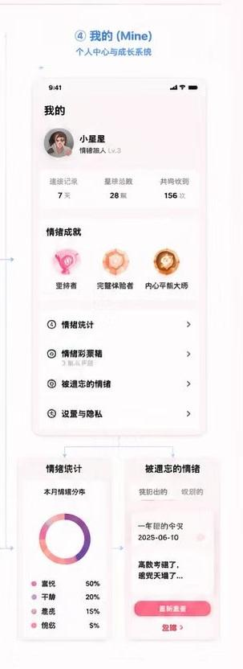

图 11\-1 概念图中的个人中心方向

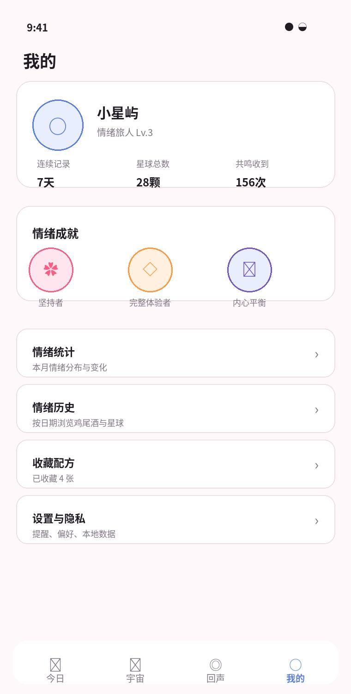

图 11\-2 M\-00 我的主页示意

图 11\-3 M\-04 设置与隐私示意

“我的”负责长期回顾、成就、收藏和管理，不承担今天的情绪记录。个人主页不要求登录，昵称、头像和等级都可以是纯本地展示。模型环境状态、演示数据和开发诊断放到设置底部，避免影响普通用户。

## **M\-00 我的主页**

展示个人成长、统计入口和设置，不突出模型状态。

<table><tr><td>
<strong>项目</strong>
</td><td>
<strong>详细规范</strong>
</td></tr><tr><td>
进入条件
</td><td>
点击我的 Tab。
</td></tr><tr><td>
页面结构
</td><td>
头像/昵称/等级可选；记录天数、星球数、收到回应；情绪成就横向卡；统计、历史、收藏、设置列表
</td></tr><tr><td>
交互
</td><td>
头像和昵称 Demo 可本地编辑；点击成就进入 M-01；点击统计/历史进入对应页；Apple Intelligence 状态放在设置二级页
</td></tr><tr><td>
状态处理
</td><td>
未设置昵称使用“情绪旅人”，不要求注册账号。
</td></tr><tr><td>
无障碍
</td><td>
成就徽章有名称和达成条件替代文本。
</td></tr></table>

## **M\-01 情绪成就**

鼓励回顾和参与，但不制造连续签到压力。

<table><tr><td>
<strong>项目</strong>
</td><td>
<strong>详细规范</strong>
</td></tr><tr><td>
进入条件
</td><td>
我的主页成就模块。
</td></tr><tr><td>
页面结构
</td><td>
已解锁、进行中两个分组；徽章 88–104 pt；名称、描述、解锁时间；对应记录或星球回放入口
</td></tr><tr><td>
交互
</td><td>
点击徽章展开详情；进行中只描述累计，不显示断签倒计时；可关闭成就提醒
</td></tr><tr><td>
状态处理
</td><td>
不使用“连续记录中断”“重新开始”等惩罚文案。
</td></tr><tr><td>
无障碍
</td><td>
徽章颜色之外必须有图形和文本差异。
</td></tr></table>

## **M\-02 情绪历史**

提供可扫描、可搜索的完整记录入口。

<table><tr><td>
<strong>项目</strong>
</td><td>
<strong>详细规范</strong>
</td></tr><tr><td>
进入条件
</td><td>
我的主页“情绪历史”或宇宙降级列表。
</td></tr><tr><td>
页面结构
</td><td>
搜索和筛选；按月分组的日星球/鸡尾酒列表；每项显示日期、名称、天气、关键词；滑动操作：收藏/删除
</td></tr><tr><td>
交互
</td><td>
点击进入 T-03 历史模式；删除必须二次确认并说明关联数据；筛选条件保留到本次会话结束
</td></tr><tr><td>
状态处理
</td><td>
搜索无结果提供清除筛选按钮。
</td></tr><tr><td>
无障碍
</td><td>
列表支持大字体并可切换紧凑/舒适密度。
</td></tr></table>

## **M\-03 情绪统计**

用可理解的方式呈现趋势，同时避免评分化。

<table><tr><td>
<strong>项目</strong>
</td><td>
<strong>详细规范</strong>
</td></tr><tr><td>
进入条件
</td><td>
我的主页或 U-04。
</td></tr><tr><td>
页面结构
</td><td>
时间范围切换；情绪构成、天气分布、记录频率；经常出现的关键词；数据使用说明
</td></tr><tr><td>
交互
</td><td>
图表可长按查看明细；允许保存统计图片；不允许公开排行榜
</td></tr><tr><td>
状态处理
</td><td>
记录不足显示具体条件，如“至少 7 天后显示趋势”。
</td></tr><tr><td>
无障碍
</td><td>
提供表格和 VoiceOver 顺序。
</td></tr></table>

## **M\-04 设置与隐私**

集中管理提醒、行动偏好、本地数据与演示数据。

<table><tr><td>
<strong>项目</strong>
</td><td>
<strong>详细规范</strong>
</td></tr><tr><td>
进入条件
</td><td>
我的主页设置入口。
</td></tr><tr><td>
页面结构
</td><td>
记录提醒；行动偏好；模块开关；隐私与本地数据；演示数据；关于与模型状态
</td></tr><tr><td>
交互
</td><td>
关闭模块后取消对应通知；清空数据进入 G-04 危险确认；导出数据先生成本地文件再分享；填充演示数据必须标记为演示
</td></tr><tr><td>
状态处理
</td><td>
通知权限拒绝时显示去系统设置入口，但不阻塞功能。
</td></tr><tr><td>
无障碍
</td><td>
Switch 使用系统控件，不自绘不可访问开关。
</td></tr></table>

## **11\.1 成就规则**

<table><tr><td>
<strong>成就</strong>
</td><td>
<strong>触发条件</strong>
</td><td>
<strong>视觉</strong>
</td><td>
<strong>文案边界</strong>
</td></tr><tr><td>
第一颗星球
</td><td>
完成第一条记录
</td><td>
粉色玻璃星球徽章
</td><td>
欢迎开始，不夸大改变
</td></tr><tr><td>
坚持者
</td><td>
累计记录 7 天，不要求连续
</td><td>
粉色花瓣环
</td><td>
用“累计”而非“连续不断”
</td></tr><tr><td>
完整体验者
</td><td>
记录覆盖 4 类情绪锚点
</td><td>
橙色四瓣徽章
</td><td>
不说“情绪更健康”
</td></tr><tr><td>
内心平衡
</td><td>
7 天内至少 4 天自评平稳
</td><td>
紫金轨道徽章
</td><td>
不作为心理稳定诊断
</td></tr><tr><td>
小步收藏家
</td><td>
累计完成 8 个微行动
</td><td>
橙粉脚印徽章
</td><td>
允许无反馈或困难反馈
</td></tr><tr><td>
倾听者
</td><td>
在共情海回应 5 次
</td><td>
蓝紫水滴徽章
</td><td>
不显示他人身份和内容摘要
</td></tr></table>

# **12\. 新手引导与首次使用**

首次引导最多 3 屏，目标是建立价值、隐私和偏好，不解释完整功能。用户可以随时跳过，跳过后仍能从设置重新查看。通知权限必须在用户明确选择开启提醒后再触发系统弹窗。

## **O\-01 价值介绍**

首次启动用一屏说明产品，不做长轮播。

<table><tr><td>
<strong>项目</strong>
</td><td>
<strong>详细规范</strong>
</td></tr><tr><td>
进入条件
</td><td>
首次安装或重置引导。
</td></tr><tr><td>
页面结构
</td><td>
核心星球/鸡尾酒视觉；标题“把今天的感受，留成一颗星球”；三点价值；继续按钮
</td></tr><tr><td>
交互
</td><td>
继续进入 O-02；允许跳过
</td></tr><tr><td>
状态处理
</td><td>
减少动态时关闭粒子。
</td></tr><tr><td>
无障碍
</td><td>
插图标记装饰。
</td></tr></table>

## **O\-02 隐私说明**

在记录前明确本地优先与共情海边界。

<table><tr><td>
<strong>项目</strong>
</td><td>
<strong>详细规范</strong>
</td></tr><tr><td>
进入条件
</td><td>
O-01 后。
</td></tr><tr><td>
页面结构
</td><td>
本地保存、公开需确认、可随时清除三项；继续按钮
</td></tr><tr><td>
交互
</td><td>
不要求勾选冗长协议；正式版隐私政策另开网页；继续进入 O-03
</td></tr><tr><td>
状态处理
</td><td>
离线可完成。
</td></tr><tr><td>
无障碍
</td><td>
正文支持大字体滚动。
</td></tr></table>

## **O\-03 提醒与偏好**

收集最少必要偏好，不阻塞进入首页。

<table><tr><td>
<strong>项目</strong>
</td><td>
<strong>详细规范</strong>
</td></tr><tr><td>
进入条件
</td><td>
O-02 后。
</td></tr><tr><td>
页面结构
</td><td>
是否开启每日提醒；室内/独处/避免强刺激三个偏好；稍后设置与完成按钮
</td></tr><tr><td>
交互
</td><td>
通知权限在用户选择开启后再请求；跳过使用默认宽松偏好
</td></tr><tr><td>
状态处理
</td><td>
权限拒绝仍进入首页。
</td></tr><tr><td>
无障碍
</td><td>
开关和说明有完整标签。
</td></tr></table>

# **13\. 动效、手势与触觉**

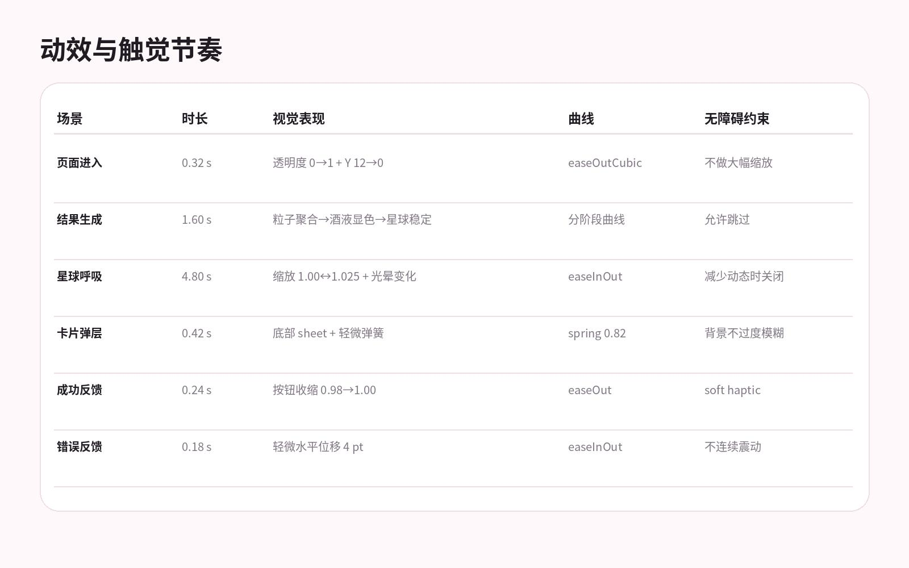

图 13\-1 动效与触觉节奏规范

## **13\.1 动效原则**

- 动效用于解释状态变化：生成、进入宇宙、展开卡片、完成操作；不做无意义的持续漂浮。
- 首页结果生成时，视觉顺序固定为“配色出现—酒液形成—星球凝结—文字淡入”，不能同时全部爆发。
- 宇宙页星球自动旋转必须慢于用户主动旋转，用户触摸后自动旋转暂停 2 秒。
- 任何持续动画都必须响应“减少动态效果”；关闭后不应影响功能理解。
- 触觉只用于成功收藏、完成行动、选择日期光点和危险确认，不在每次滚动或标签点击时震动。

## **13\.2 手势冲突处理**

<table><tr><td>
<strong>场景</strong>
</td><td>
<strong>手势</strong>
</td><td>
<strong>优先级与边界</strong>
</td></tr><tr><td>
宇宙切月
</td><td>
单指横向拖动空白区域
</td><td>
高；从星球外区域开始时切换月份
</td></tr><tr><td>
星球旋转
</td><td>
单指拖动星球实体
</td><td>
高；命中实体后不触发切月
</td></tr><tr><td>
星球缩放
</td><td>
双指捏合
</td><td>
高；缩放范围 0.85–1.35
</td></tr><tr><td>
日期光点
</td><td>
单击
</td><td>
命中区 44 pt；点击后暂停旋转
</td></tr><tr><td>
摘要关闭
</td><td>
向下拖动卡片
</td><td>
只作用于卡片，不改变星球角度
</td></tr><tr><td>
今日卡片
</td><td>
点击/滚动
</td><td>
不使用横向滑动删除，避免与页面滚动冲突
</td></tr></table>

# **14\. 无障碍与适配**

## **14\.1 基础要求**

- 所有可点击控件的实际命中区域至少 44 × 44 pt；视觉图标可以更小。
- 支持 Dynamic Type 至辅助功能大字号。双按钮并列在大字号时自动改为纵向。
- 不以颜色作为唯一信息：模块色、情绪色、状态色都必须配合文字或图形。
- 宇宙 3D 场景必须有按月份和日期排序的等价列表；RealityKit 失败不能阻塞历史查看。
- 减少动态时关闭持续旋转、粒子、视差和弹性缩放；页面切换使用短淡入。
- 增加对比度时提高玻璃卡不透明度、描边和文字对比，减少背景透出。
- VoiceOver 焦点顺序应遵循视觉阅读顺序，装饰性粒子和背景星球不进入焦点。

## **14\.2 响应式适配**

<table><tr><td>
<strong>宽度</strong>
</td><td>
<strong>布局调整</strong>
</td></tr><tr><td>
≤375 pt
</td><td>
卡片内三列信息改为纵向；双按钮改纵向；鸡尾酒主视觉缩小 10%
</td></tr><tr><td>
393–402 pt
</td><td>
使用本文基准尺寸
</td></tr><tr><td>
≥414 pt
</td><td>
不无限放大内容，横向边距增加到 24 pt；Hero 最大宽度 390 pt 居中
</td></tr><tr><td>
横屏
</td><td>
Demo 可锁定竖屏；若支持横屏，宇宙可左右分栏，其他页面保持单列
</td></tr><tr><td>
iPad
</td><td>
本期非验收范围；正式版使用最大内容宽度 620 pt，宇宙可全屏
</td></tr></table>

# **15\. 隐私、安全与非医疗化文案**

## **15\.1 数据层级**

<table><tr><td>
<strong>数据</strong>
</td><td>
<strong>默认位置</strong>
</td><td>
<strong>是否可公开</strong>
</td><td>
<strong>删除规则</strong>
</td></tr><tr><td>
日记原文
</td><td>
本机 SwiftData
</td><td>
否；只能复制副本后确认
</td><td>
删除记录时一起删除
</td></tr><tr><td>
情绪分析
</td><td>
本机
</td><td>
否
</td><td>
随记录删除
</td></tr><tr><td>
鸡尾酒/星球参数
</td><td>
本机
</td><td>
保存图片由用户主动分享
</td><td>
随记录删除
</td></tr><tr><td>
微行动与回声
</td><td>
本机
</td><td>
否
</td><td>
可单条删除或随记录关联删除
</td></tr><tr><td>
时间来信
</td><td>
本机
</td><td>
否
</td><td>
用户可归档或删除
</td></tr><tr><td>
共情海副本
</td><td>
Demo 本地模型/正式版服务端
</td><td>
是，必须二次确认
</td><td>
正式版需提供撤回/删除机制
</td></tr></table>

## **15\.2 文案词库：允许与禁止**

<table><tr><td>
<strong>场景</strong>
</td><td>
<strong>推荐写法</strong>
</td><td>
<strong>禁止写法</strong>
</td></tr><tr><td>
情绪结果
</td><td>
“今天可能由这些感受组成”
</td><td>
“你有焦虑症/抑郁倾向”
</td></tr><tr><td>
负面情绪
</td><td>
“今天的紧张感更明显”
</td><td>
“你的情绪很糟糕/异常”
</td></tr><tr><td>
微行动
</td><td>
“可以试试一个很小的动作”
</td><td>
“完成它就会好起来”
</td></tr><tr><td>
行动回声
</td><td>
“它留下了什么感受？”
</td><td>
“你的心情变好了吗？”
</td></tr><tr><td>
历史对比
</td><td>
“这两天的配方不同”
</td><td>
“你比以前更健康/更稳定”
</td></tr><tr><td>
统计
</td><td>
“在你的记录中更常出现”
</td><td>
“这证明某行动能治疗你”
</td></tr><tr><td>
共情海
</td><td>
“匿名公开，请避免可识别信息”
</td><td>
“绝对安全、完全无法追踪”
</td></tr></table>

## **15\.3 危机内容边界**

Demo 不处理真实公开内容；正式上线前必须单独设计危机内容识别、当地求助资源、人工审核、举报、删除、限流与法务流程。设计稿不得用“随机漂流瓶”掩盖这一前提。若用户在本地日记中出现危机表达，产品也不能仅靠普通鸡尾酒结果结束流程；该能力不在本期 Demo 验收范围，但需在正式产品立项时作为独立安全项目。

# **16\. 与现有代码的迁移映射**

本章只定义设计边界和页面归属，不要求设计人员编写 Swift 代码。开发可根据当前仓库结构实施，但最终用户界面必须符合本设计。

<table><tr><td>
<strong>当前文件/能力</strong>
</td><td>
<strong>现状</strong>
</td><td>
<strong>目标设计映射</strong>
</td><td>
<strong>处理建议</strong>
</td></tr><tr><td>
Views/AppRootView.swift
</td><td>
今日、月历、设置三 Tab
</td><td>
四 Tab：今日、宇宙、回声、我的
</td><td>
替换 Tab 结构；保留各 Tab NavigationStack
</td></tr><tr><td>
Views/TodayView.swift
</td><td>
输入 + Glyph 结果在同页
</td><td>
T-00～T-07；鸡尾酒结果 + 日星球
</td><td>
保留输入和分析流程，替换 Glyph 可见组件
</td></tr><tr><td>
Views/CalendarView.swift
</td><td>
月历网格 + 日期摘要
</td><td>
U-01～U-05 情绪宇宙
</td><td>
月历代码可作为 2D 降级/无障碍列表
</td></tr><tr><td>
Views/EntryDetailView.swift
</td><td>
Glyph 历史详情
</td><td>
T-03 历史模式
</td><td>
替换为鸡尾酒、天气、星球与原文
</td></tr><tr><td>
Views/SettingsView.swift
</td><td>
提醒、演示数据、环境状态
</td><td>
M-04 设置与隐私
</td><td>
迁入“我的”，模型状态降级到页面底部
</td></tr><tr><td>
Views/DayGlyphStyle.swift
</td><td>
纸张、玉绿、琥珀
</td><td>
第 6 章新视觉令牌
</td><td>
保留集中式 Token 思路，替换值与组件样式
</td></tr><tr><td>
Models/DayEntry.swift
</td><td>
文本、分析、Glyph seed
</td><td>
新增鸡尾酒、收藏、微行动关联
</td><td>
旧 Glyph 字段仅兼容旧数据，不再展示
</td></tr><tr><td>
Services/UnifiedEmotionAnalyzer
</td><td>
统一情绪分析入口
</td><td>
继续输出设计所需 EmotionAnalysisResult
</td><td>
UI 不感知 Foundation Models 或 fallback 来源
</td></tr><tr><td>
ReminderService
</td><td>
每日提醒
</td><td>
记录、回声、时间来信统一通知
</td><td>
同日最多 2 条；锁屏不展示敏感文本
</td></tr></table>

## **16\.1 推荐的设计交付目录**

Design/

00\_Foundations/

Colors\.fig

Typography\.fig

Components\.fig

01\_Today/

T\-00\_Empty\.fig

T\-01\_Record\.fig

T\-02\_Generating\.fig

T\-03\_Cocktail\.fig

02\_Universe/

03\_Echo/

04\_Mine/

05\_GlobalStates/

Assets/

Cocktails/

Planets/

Badges/

Export/

@1x @2x @3x

# **17\. 全局状态与异常处理**

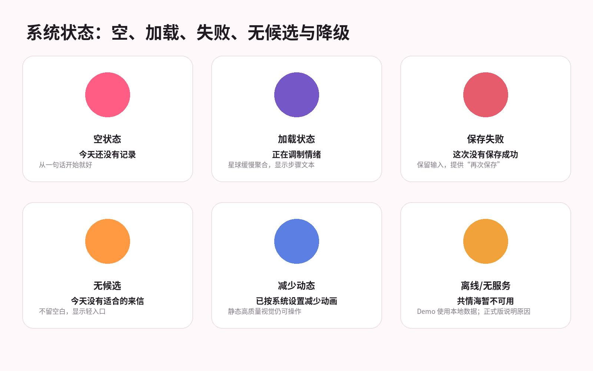

图 17\-1 全局状态视觉规范

<table><tr><td>
<strong>状态</strong>
</td><td>
<strong>视觉</strong>
</td><td>
<strong>文案</strong>
</td><td>
<strong>操作</strong>
</td></tr><tr><td>
首次空状态
</td><td>
低饱和插图 + 足量留白
</td><td>
说明这里未来会出现什么
</td><td>
一个主按钮
</td></tr><tr><td>
加载
</td><td>
局部骨架或生成动画
</td><td>
描述正在做的步骤，不显示虚假精确进度
</td><td>
超时后允许取消
</td></tr><tr><td>
无候选
</td><td>
保持模块结构，不留空白
</td><td>
说明暂时没有适合内容
</td><td>
换一个/稍后再看
</td></tr><tr><td>
保存失败
</td><td>
保留用户内容
</td><td>
“这次没有保存成功”
</td><td>
再次保存/复制内容
</td></tr><tr><td>
通知拒绝
</td><td>
中性提示
</td><td>
说明功能仍可用
</td><td>
去系统设置/稍后
</td></tr><tr><td>
减少动态
</td><td>
静态高质量图
</td><td>
不需要额外弹窗
</td><td>
自动生效
</td></tr><tr><td>
RealityKit 失败
</td><td>
高质量 2D 星球 + 日期列表
</td><td>
“已切换为简洁视图”
</td><td>
继续浏览
</td></tr><tr><td>
低功耗
</td><td>
减少粒子和远景实体
</td><td>
无需打扰用户
</td><td>
自动降级
</td></tr><tr><td>
危险删除
</td><td>
红色只用于确认按钮
</td><td>
说明会删除哪些关联数据
</td><td>
取消/确认删除
</td></tr></table>

## **17\.1 Toast、Alert 与 Sheet**

- Toast：用于“已收藏”“图片已保存”“回应已发送”，显示 1\.8 秒，不阻塞操作。
- Alert：仅用于不可逆删除、覆盖草稿、取消未保存输入等二选一决策。
- Sheet：用于配方详情、天气解释、回声反馈、筛选和分享预览；优先使用 medium/large detent。
- Full Screen Cover：只用于沉浸式宇宙、首次引导和独立公开内容编辑。

# **18\. 开发验收标准与设计 QA**

## **18\.1 像素级验收**

<table><tr><td>
<strong>类别</strong>
</td><td>
<strong>验收标准</strong>
</td></tr><tr><td>
颜色
</td><td>
所有模块色、背景、文字和边框使用第 6 章 Token，不在 View 内散落近似颜色
</td></tr><tr><td>
间距
</td><td>
横向边距 20 pt；同级卡片间 16/24 pt；不出现肉眼可见的 13、19、27 pt 随机间距
</td></tr><tr><td>
圆角
</td><td>
同类组件圆角一致；列表卡不使用 30+ pt 夸张圆角
</td></tr><tr><td>
字体
</td><td>
使用语义字号并支持 Dynamic Type；同层级不混用多个字重
</td></tr><tr><td>
图标
</td><td>
统一 SF Symbols 或统一自绘资产，不混用 emoji 作为导航
</td></tr><tr><td>
按钮
</td><td>
主按钮 52 pt；命中区至少 44 pt；disabled 状态仍保持可读
</td></tr><tr><td>
玻璃
</td><td>
只在规定组件使用；文本对比不受背景干扰
</td></tr><tr><td>
图片
</td><td>
鸡尾酒资产不含文字；星球资产/材质视觉重心一致
</td></tr></table>

## **18\.2 功能验收**

- □ 完成记录后直接进入完整鸡尾酒结果，不再出现 Glyph 或“一划”字样。
- □ 每条记录同时得到稳定的鸡尾酒参数与日星球参数，重新打开不变化。
- □ 宇宙首屏明确看到多星球、轨道和纵深；不能退化为普通网格。
- □ 点击日期光点可查看摘要并进入完整历史记录。
- □ 微行动可换一个、换更容易版本、完成和跳过，跳过无惩罚。
- □ 行动回声提供四个中性反馈，允许没有变化。
- □ 时间来信每天最多展示一张；写给未来不显示精确触达日期。
- □ 共情海 Demo 完整演示编辑、确认、审核中、回应、举报，但不依赖网络。
- □ 设置关闭模块后立即取消相关待发送通知。
- □ 删除记录时说明并处理关联回声、收藏和星球聚合。

## **18\.3 设计评审冻结清单**

<table><tr><td>
<strong>冻结项</strong>
</td><td>
<strong>确认内容</strong>
</td></tr><tr><td>
页面结构
</td><td>
四个一级模块和页面编号是否全部确认
</td></tr><tr><td>
视觉主题
</td><td>
暖白四模块色、宇宙深色、玻璃使用范围是否确认
</td></tr><tr><td>
核心隐喻
</td><td>
鸡尾酒=单日详细结果；星球=长期归档是否确认
</td></tr><tr><td>
主按钮
</td><td>
每个页面唯一主动作和按钮文案是否确认
</td></tr><tr><td>
资产
</td><td>
12 个主情绪鸡尾酒、星球材质和徽章是否有统一规范
</td></tr><tr><td>
异常状态
</td><td>
空、加载、失败、无候选、降级是否有设计稿
</td></tr><tr><td>
文案边界
</td><td>
是否彻底移除诊断、疗效和惩罚性表述
</td></tr><tr><td>
开发变更
</td><td>
冻结后修改是否先更新文档与 Figma 再开发
</td></tr></table>

# **19\. Demo 演示脚本与答辩表达**

## **19\.1 90 秒演示路径**

<table><tr><td>
<strong>时间</strong>
</td><td>
<strong>画面</strong>
</td><td>
<strong>讲述重点</strong>
</td></tr><tr><td>
0–10 秒
</td><td>
今日首页，点击记录
</td><td>
“我们不是做情绪分数，而是把主观感受转化为可收藏的视觉印记。”
</td></tr><tr><td>
10–28 秒
</td><td>
输入一句话并调制
</td><td>
强调低门槛、本地处理和不要求心理学术语
</td></tr><tr><td>
28–45 秒
</td><td>
鸡尾酒结果与日星球
</td><td>
鸡尾酒是当天配方，星球进入长期宇宙
</td></tr><tr><td>
45–60 秒
</td><td>
宇宙切月和日期光点
</td><td>
历史不是月历，而是时间中的空间结构
</td></tr><tr><td>
60–75 秒
</td><td>
选择微行动、打开回声
</td><td>
不是要求变好，而是观察小行动留下什么
</td></tr><tr><td>
75–85 秒
</td><td>
共情海固定回应
</td><td>
匿名共情但不建立社交关系，Demo 使用本地审核数据
</td></tr><tr><td>
85–90 秒
</td><td>
我的主页与隐私
</td><td>
数据默认在本机，用户可随时管理和清除
</td></tr></table>

## **19\.2 标准答辩口径**

**产品本质：我们构建的是一个非医疗化的情绪建模与自我观察系统。它用情绪鸡尾酒表达单日构成，用情绪宇宙表达长期时间结构，再通过足够小的行动和延迟回声，让记录从“看见”延伸到“做一点、再回看”。**

当评委询问“为什么不是普通日记”时，应回答：普通日记以文字存储为终点，DayGlyph 把记录转化为稳定、可收藏、可聚合的视觉对象，并建立记录—行动—回声—时间回顾的闭环。

当评委询问“是不是心理治疗”时，应明确：产品不诊断、不承诺疗效，也不替代专业支持；它只帮助用户记录、表达和观察自己的日常情绪与行为。

# **附录 A\. CSS\-like 设计令牌**

以下写法用于设计与开发沟通，数值对应 SwiftUI 逻辑 pt，不要求在 iOS 项目中直接使用 CSS。

/\* DayGlyph Design Tokens v2\.0 \*/

:root \{

\-\-color\-canvas: \#FFF8FA;

\-\-color\-surface: \#FFFFFF;

\-\-color\-surface\-soft: \#FFF1F5;

\-\-color\-text\-primary: \#211B24;

\-\-color\-text\-secondary: \#817784;

\-\-color\-divider: \#EEDFE5;

\-\-color\-today: \#FF5D83;

\-\-color\-today\-soft: \#FFE5ED;

\-\-color\-universe: \#7657C8;

\-\-color\-universe\-bg: \#18192F;

\-\-color\-echo: \#FF9A43;

\-\-color\-echo\-soft: \#FFF0E0;

\-\-color\-mine: \#5B7FE2;

\-\-color\-mine\-soft: \#E9EEFF;

\-\-color\-success: \#3EBB91;

\-\-color\-danger: \#E75C6C;

\-\-space\-1: 4pt;

\-\-space\-2: 8pt;

\-\-space\-3: 12pt;

\-\-space\-4: 16pt;

\-\-space\-5: 20pt;

\-\-space\-6: 24pt;

\-\-space\-8: 32pt;

\-\-radius\-small: 16pt;

\-\-radius\-button: 18pt;

\-\-radius\-card: 24pt;

\-\-radius\-hero: 32pt;

\-\-button\-height\-primary: 52pt;

\-\-button\-height\-secondary: 48pt;

\-\-tap\-target\-min: 44pt;

\-\-content\-padding\-x: 20pt;

\-\-tabbar\-visible\-height: 64pt;

\-\-glass\-light: rgba\(255,255,255,\.78\);

\-\-glass\-dark: rgba\(35,34,61,\.82\);

\-\-glass\-blur: 24pt;

\-\-shadow\-hero: 0 12pt 32pt rgba\(33,27,36,\.06\);

\}

# **附录 B\. 页面清单与图标映射**

<table><tr><td>
<strong>编号</strong>
</td><td>
<strong>页面</strong>
</td><td>
<strong>目的</strong>
</td></tr><tr><td>
T-00
</td><td>
今日空状态
</td><td>
让首次或当天未记录的用户立即理解产品并开始记录。
</td></tr><tr><td>
T-01
</td><td>
情绪记录输入
</td><td>
用最低表达成本完成记录，同时给用户充分的隐私和控制感。
</td></tr><tr><td>
T-02
</td><td>
分析与生成
</td><td>
把等待变成可理解的生成过程，不暴露模型品牌和技术细节。
</td></tr><tr><td>
T-03
</td><td>
情绪鸡尾酒结果
</td><td>
在首屏交付“值得收藏”的核心视觉结果，并保持信息解释克制。
</td></tr><tr><td>
T-04
</td><td>
情绪天气与名言
</td><td>
用轻量隐喻补充当天氛围，但不抢占核心结果。
</td></tr><tr><td>
T-05
</td><td>
今天迈一小步
</td><td>
给出足够小、具体、可选择的行为，不制造签到压力。
</td></tr><tr><td>
T-06
</td><td>
时间来信
</td><td>
把过去与未来的内容集中在同一卡位，形成低频惊喜而非催促。
</td></tr><tr><td>
T-07
</td><td>
共情海入口与发送
</td><td>
让用户在充分知情和可编辑的前提下，匿名分享一段内容。
</td></tr><tr><td>
U-00
</td><td>
宇宙空状态
</td><td>
在没有历史数据时仍传达“记录会形成宇宙”的期待。
</td></tr><tr><td>
U-01
</td><td>
月轨道宇宙总览
</td><td>
第一眼呈现多月份、空间纵深与成长感。
</td></tr><tr><td>
U-02
</td><td>
月星球详情
</td><td>
解释月星球的颜色、内部层次和记录密度。
</td></tr><tr><td>
U-03
</td><td>
日期落点摘要
</td><td>
在宇宙中保持空间上下文，同时快速预览某一天。
</td></tr><tr><td>
U-04
</td><td>
宇宙趋势与统计
</td><td>
提供描述性回顾，不把情绪做成成绩。
</td></tr><tr><td>
E-00
</td><td>
回声首页
</td><td>
集中展示等待回应、最近回声与个人发现，不再推荐新任务。
</td></tr><tr><td>
E-02
</td><td>
行动回声反馈弹层
</td><td>
用中性选项记录结果，允许没有改善。
</td></tr><tr><td>
E-03
</td><td>
我的发现
</td><td>
在足够数据后呈现个人历史关联，不表达因果。
</td></tr><tr><td>
M-00
</td><td>
我的主页
</td><td>
展示个人成长、统计入口和设置，不突出模型状态。
</td></tr><tr><td>
M-01
</td><td>
情绪成就
</td><td>
鼓励回顾和参与，但不制造连续签到压力。
</td></tr><tr><td>
M-02
</td><td>
情绪历史
</td><td>
提供可扫描、可搜索的完整记录入口。
</td></tr><tr><td>
M-03
</td><td>
情绪统计
</td><td>
用可理解的方式呈现趋势，同时避免评分化。
</td></tr><tr><td>
M-04
</td><td>
设置与隐私
</td><td>
集中管理提醒、行动偏好、本地数据与演示数据。
</td></tr><tr><td>
O-01
</td><td>
价值介绍
</td><td>
首次启动用一屏说明产品，不做长轮播。
</td></tr><tr><td>
O-02
</td><td>
隐私说明
</td><td>
在记录前明确本地优先与共情海边界。
</td></tr><tr><td>
O-03
</td><td>
提醒与偏好
</td><td>
收集最少必要偏好，不阻塞进入首页。
</td></tr></table>

<table><tr><td>
<strong>功能</strong>
</td><td>
<strong>SF Symbol 建议</strong>
</td><td>
<strong>备注</strong>
</td></tr><tr><td>
今日
</td><td>
house.fill / sparkles
</td><td>
选中时模块粉色
</td></tr><tr><td>
宇宙
</td><td>
sparkles / circle.hexagongrid
</td><td>
可自绘轨道图标
</td></tr><tr><td>
回声
</td><td>
dot.radiowaves.left.and.right
</td><td>
避免使用聊天气泡
</td></tr><tr><td>
我的
</td><td>
person.crop.circle
</td><td>
不使用社交主页图标
</td></tr><tr><td>
记录
</td><td>
square.and.pencil
</td><td></td></tr><tr><td>
调制
</td><td>
wand.and.sparkles
</td><td></td></tr><tr><td>
天气
</td><td>
wind / cloud.rain
</td><td>
配合文字
</td></tr><tr><td>
微行动
</td><td>
figure.walk / arrow.up.right
</td><td></td></tr><tr><td>
时间来信
</td><td>
envelope.badge.clock
</td><td></td></tr><tr><td>
共情海
</td><td>
water.waves / message.badge.waveform
</td><td>
不要使用私信图标
</td></tr><tr><td>
收藏
</td><td>
heart / bookmark
</td><td>
全产品统一选择一种
</td></tr><tr><td>
保存图片
</td><td>
square.and.arrow.down
</td><td></td></tr><tr><td>
设置
</td><td>
gearshape
</td><td>
二级入口
</td></tr></table>

# **附录 C\. 文案模板库**

## **C\.1 今日问候与空状态**

- 今天也可以只写一句。
- 此刻的感受，不需要完整才值得被记录。
- 你的宇宙还在等待今天的这一颗。
- 还没有记录也没关系，可以先看看一个很小的行动。
- 今天可能由这些感受组成。
- 这杯配方里，\{emotionA\} 更明显，\{emotionB\} 作为柔和的底色。
- 它不是对你的定义，只是为今天留下的一种观察。
- 如果这份结果与你的感受不完全一致，可以编辑标签或保留原文。
- 把动作再缩小一点也可以。
- 今天先不做，不会影响任何记录。
- 完成不等于必须感觉更好。
- 你可以只观察它留下了什么。
- 它现在留下了什么感受？
- 有一点成就感。
- 没什么变化。
- 比想象中困难。
- 这次不记录感受。
- 这是一份独立副本，你可以修改或清空后再发送。
- 内容将匿名公开，请不要写入联系方式、真实姓名或可识别信息。
- 原始日记、日期和完整情绪分析不会随这份内容发送。
- 展示版本使用本地审核样本，不代表社区功能已经上线。

## **C\.2 结果解释**

## **C\.3 微行动**

## **C\.4 回声反馈**

## **C\.5 隐私与共情海**

# **附录 D\. 情绪视觉映射与内容生成规则**

本附录用于消除“开发可以任意选颜色、任意生成星球”的歧义。情绪颜色不是医学分类，也不是对用户人格的判断，只是把一次记录转化为稳定视觉结果的设计规则。每条记录保存生成后的最终参数与 seed；历史重开时直接读取，不再次随机。用户编辑原文并选择重新分析时，才生成新版本，并在保存前提示原视觉将被替换。

<table><tr><td>
<strong>情绪锚点</strong>
</td><td>
<strong>主色/辅色</strong>
</td><td>
<strong>鸡尾酒表现</strong>
</td><td>
<strong>日星球表现</strong>
</td><td>
<strong>天气隐喻</strong>
</td><td>
<strong>支持性文案语气</strong>
</td></tr><tr><td>
喜悦
</td><td>
#FF6D8F / #FFC778
</td><td>
清亮、上升气泡、透明杯体
</td><td>
暖粉核心、金色薄光环、纹理较疏
</td><td>
晴光或柔和日照
</td><td>
轻盈但不夸张，不写“你应该一直开心”
</td></tr><tr><td>
平静
</td><td>
#61C7B5 / #C7EEE7
</td><td>
低气泡、清透浅绿、平稳液面
</td><td>
青绿柔光、缓慢层流、边缘清晰
</td><td>
微风
</td><td>
安静、允许停留，不把平静描述成唯一理想状态
</td></tr><tr><td>
期待
</td><td>
#7C69E8 / #FF97BE
</td><td>
紫粉渐变、细小闪点、杯口上扬装饰
</td><td>
紫色核心、外圈细粒子、轨道略亮
</td><td>
晨曦
</td><td>
使用“也许、正在靠近”，避免承诺结果
</td></tr><tr><td>
感动
</td><td>
#E678A7 / #8C6DDE
</td><td>
粉紫柔雾、层次混合、少量高光
</td><td>
粉紫液态层、光晕柔和、卫星靠近
</td><td>
暖雨后放晴
</td><td>
温柔、具体，不替用户解释事件意义
</td></tr><tr><td>
自豪
</td><td>
#F49B43 / #F6D66A
</td><td>
金橙高光、杯体挺拔、气泡集中
</td><td>
橙金内核、稳定环带、亮度较高
</td><td>
晴朗
</td><td>
肯定行动本身，不进行人格评价
</td></tr><tr><td>
疲惫
</td><td>
#8E91B4 / #C6C8D9
</td><td>
低饱和蓝灰、液面较低、几乎无气泡
</td><td>
蓝灰核心、光晕收窄、纹理简化
</td><td>
阴天
</td><td>
允许休息，不写“振作起来”或强制行动
</td></tr><tr><td>
难过
</td><td>
#5E76C9 / #9DB2E8
</td><td>
深浅蓝分层、缓慢下沉颗粒
</td><td>
蓝色核心、外缘柔散、少量雨纹
</td><td>
细雨
</td><td>
承认感受但不诊断，不把难过描绘成失败
</td></tr><tr><td>
焦虑
</td><td>
#8866D8 / #E37AA5
</td><td>
紫红细碎纹理、轻微波纹、气泡较密
</td><td>
紫红多层、粒子速度较快、环带不规则
</td><td>
阵雨
</td><td>
使用“紧张感更明显”，避免“异常、失控”等词
</td></tr><tr><td>
愤怒
</td><td>
#E75C6C / #F6A85B
</td><td>
红橙分层、锐利高光、液体不溅出杯外
</td><td>
红橙核心、短脉冲光、纹理方向明确
</td><td>
闷雷
</td><td>
允许边界和不满，不鼓励攻击或冲动行为
</td></tr><tr><td>
孤独
</td><td>
#536AAE / #A591D8
</td><td>
深蓝紫、空白比例较大、单一微光
</td><td>
深蓝核心、卫星距离较远、轨道稀疏
</td><td>
夜雾
</td><td>
使用陪伴式语气，不暗示一定需要社交
</td></tr><tr><td>
困惑
</td><td>
#6B8FA3 / #D6A5C4
</td><td>
多层半透明交叠、边界柔和
</td><td>
蓝灰与粉灰交错、纹理方向不统一
</td><td>
薄雾
</td><td>
允许暂时没有答案，避免强行总结
</td></tr><tr><td>
麻木
</td><td>
#7E858E / #C8CDD2
</td><td>
近无色、低对比、静止液面
</td><td>
灰蓝核心、低光晕、几乎无粒子
</td><td>
无风阴天
</td><td>
只描述“感受不明显”，不使用病理词汇
</td></tr></table>

## **D\.1 配方比例与文本解释**

- 首屏不显示“焦虑 60%”式严重程度；详细配方中允许把比例作为鸡尾酒构成隐喻，例如“平静 5 份、期待 3 份、疲惫 2 份”。份数总和固定为 10，强调配方而非测量精度。
- 最多显示 3 个主要情绪锚点。其余低权重成分合并为“余味”，避免形成过度精确和难以阅读的雷达图。
- 主色取第一锚点，辅色取第二锚点；当两色对比不足时使用预设安全辅色，不直接按 RGB 插值造成灰脏。文字颜色根据背景亮度从 \#211B24 与 \#FFFFFF 二选一。
- 鸡尾酒名称由“气质词 \+ 名词”两段式模板生成，例如“柔光余响”“暮色微风”。名称只做视觉命名，不使用“疗愈、治愈、抑郁、躁郁、创伤”等医疗或功效词。
- 天气、名言与微行动分别读取同一分析结果，但各自只显示必要信息；不得在三个模块重复一段相同解释。
- 用户手动修改情绪标签后，结果页需显示“你调整过这份配方”，并保留原文不变；设计上不把系统结果凌驾于用户自我判断。

## **D\.2 星球参数范围**

<table><tr><td>
<strong>参数</strong>
</td><td>
<strong>范围</strong>
</td><td>
<strong>来源</strong>
</td><td>
<strong>视觉用途</strong>
</td><td>
<strong>稳定性要求</strong>
</td></tr><tr><td>
baseHue
</td><td>
0–360
</td><td>
主情绪映射
</td><td>
核心色相
</td><td>
保存最终值
</td></tr><tr><td>
secondaryHue
</td><td>
0–360
</td><td>
次情绪映射
</td><td>
液态层与光晕
</td><td>
保存最终值
</td></tr><tr><td>
textureComplexity
</td><td>
0.20–0.85
</td><td>
情绪离散度
</td><td>
内部层数、噪声尺度
</td><td>
同 seed 一致
</td></tr><tr><td>
glowIntensity
</td><td>
0.25–0.90
</td><td>
唤醒度与记录完整度
</td><td>
边缘发光
</td><td>
减少动态时仍保留静态亮度
</td></tr><tr><td>
particleDensity
</td><td>
0–0.70
</td><td>
波动事件数量
</td><td>
外围粒子
</td><td>
低功耗下降为原值 40%
</td></tr><tr><td>
ringCount
</td><td>
0–3
</td><td>
显著次情绪数量
</td><td>
轨道环
</td><td>
不代表好坏或等级
</td></tr><tr><td>
satelliteCount
</td><td>
0–3
</td><td>
卫星情绪数量
</td><td>
小卫星
</td><td>
命中区不作为可点击对象
</td></tr><tr><td>
rotationSpeed
</td><td>
0.02–0.12 rpm
</td><td>
稳定 seed
</td><td>
自动旋转
</td><td>
触摸后暂停；减少动态为 0
</td></tr><tr><td>
recordDots
</td><td>
1–31
</td><td>
有效日期
</td><td>
月星球日期光点
</td><td>
与记录日期一一对应
</td></tr></table>

## **D\.3 海报导出规范**

<table><tr><td>
<strong>项目</strong>
</td><td>
<strong>规范</strong>
</td></tr><tr><td>
画布
</td><td>
1080 × 1440 px，3:4；另提供 1080 × 1080 px 方形裁切
</td></tr><tr><td>
安全边距
</td><td>
四周 72 px；任何文字不得贴近圆角和系统分享裁切区
</td></tr><tr><td>
内容顺序
</td><td>
日期 → 鸡尾酒/星球主视觉 → 名称 → 关键词 → 一句说明 → DayGlyph 标识
</td></tr><tr><td>
隐私默认
</td><td>
不包含日记原文、昵称、精确时间、共情海内容；用户必须主动开启“加入原文摘要”
</td></tr><tr><td>
字体
</td><td>
中文使用苹方等价字形；名称 52–60 px，正文 30–34 px，辅助信息 24–28 px
</td></tr><tr><td>
背景
</td><td>
今日使用暖白与主色柔光；宇宙分享使用深色背景；不得把整个应用截图直接作为分享图
</td></tr><tr><td>
失败处理
</td><td>
生成失败时不进入系统分享面板，保留页面并提示“图片暂时没有生成成功”
</td></tr></table>

# **附录 E\. 页面级实施注释与逐屏交付要求**

下列内容是对正文页面表格的进一步落地。每个页面在 Figma 中至少交付默认态、关键交互态、空/失败态和大字号态四个 Frame；开发验收时按页面编号逐项核对，不允许用“整体效果差不多”替代。

## **E\.T\-00 今日空状态实施注释**

视觉层级：暖白画布，模块粉用于主按钮、选中态和关键进度；普通正文保持深色，不把整页染成粉色。页面第一视觉焦点必须服务于“让首次或当天未记录的用户立即理解产品并开始记录。”这一目标，次级说明最多两层，避免同屏出现两个同等权重的主按钮。

尺寸与流转：页面横向基准边距 20 pt，卡片间距优先使用 16 或 24 pt；从今日模块进入的二级页使用返回按钮；完成核心任务后回到今日相同滚动位置，结果页成功生成时可替换导航栈顶部。滚动页底部额外保留 Tab Bar 可见高度与 24 pt 呼吸空间。

页面特例：空星球只作为期待感背景，透明度控制在 55%–70%；主按钮必须在首屏可见。存在昨天记录时，只给一个 44 pt 高的“看看昨天”文本入口，不能让旧内容抢走今天的主动作。

交付与验收：高保真稿需标出默认、按下、禁用、加载/保存失败、大字号五种状态；交互原型至少覆盖进入、主动作、返回和异常恢复。切图名称使用页面编号前缀，文字、颜色、圆角和间距全部来自设计令牌。

## **E\.T\-01 情绪记录输入实施注释**

视觉层级：暖白画布，模块粉用于主按钮、选中态和关键进度；普通正文保持深色，不把整页染成粉色。页面第一视觉焦点必须服务于“用最低表达成本完成记录，同时给用户充分的隐私和控制感。”这一目标，次级说明最多两层，避免同屏出现两个同等权重的主按钮。

尺寸与流转：页面横向基准边距 20 pt，卡片间距优先使用 16 或 24 pt；从今日模块进入的二级页使用返回按钮；完成核心任务后回到今日相同滚动位置，结果页成功生成时可替换导航栈顶部。滚动页底部额外保留 Tab Bar 可见高度与 24 pt 呼吸空间。

页面特例：键盘弹出后主按钮可随内容滚动，不强制悬浮遮挡文本。隐私说明放在提交按钮前，默认一句话说明，点击“了解更多”再展开；500 字达到上限时只阻止继续输入，不把已有文字截断。

交付与验收：高保真稿需标出默认、按下、禁用、加载/保存失败、大字号五种状态；交互原型至少覆盖进入、主动作、返回和异常恢复。切图名称使用页面编号前缀，文字、颜色、圆角和间距全部来自设计令牌。

## **E\.T\-02 分析与生成实施注释**

视觉层级：暖白画布，模块粉用于主按钮、选中态和关键进度；普通正文保持深色，不把整页染成粉色。页面第一视觉焦点必须服务于“把等待变成可理解的生成过程，不暴露模型品牌和技术细节。”这一目标，次级说明最多两层，避免同屏出现两个同等权重的主按钮。

尺寸与流转：页面横向基准边距 20 pt，卡片间距优先使用 16 或 24 pt；从今日模块进入的二级页使用返回按钮；完成核心任务后回到今日相同滚动位置，结果页成功生成时可替换导航栈顶部。滚动页底部额外保留 Tab Bar 可见高度与 24 pt 呼吸空间。

页面特例：三个生成阶段的总时长在 Demo 中控制为 1\.8–2\.6 秒；真实分析更快时也至少保留 0\.8 秒过渡，避免突然跳页。超时卡不得显示技术错误码，技术详情仅进入设置中的诊断区。

交付与验收：高保真稿需标出默认、按下、禁用、加载/保存失败、大字号五种状态；交互原型至少覆盖进入、主动作、返回和异常恢复。切图名称使用页面编号前缀，文字、颜色、圆角和间距全部来自设计令牌。

## **E\.T\-03 情绪鸡尾酒结果实施注释**

视觉层级：暖白画布，模块粉用于主按钮、选中态和关键进度；普通正文保持深色，不把整页染成粉色。页面第一视觉焦点必须服务于“在首屏交付“值得收藏”的核心视觉结果，并保持信息解释克制。”这一目标，次级说明最多两层，避免同屏出现两个同等权重的主按钮。

尺寸与流转：页面横向基准边距 20 pt，卡片间距优先使用 16 或 24 pt；从今日模块进入的二级页使用返回按钮；完成核心任务后回到今日相同滚动位置，结果页成功生成时可替换导航栈顶部。滚动页底部额外保留 Tab Bar 可见高度与 24 pt 呼吸空间。

页面特例：Hero 内所有信息围绕一个中心视觉展开。鸡尾酒名与日期固定在上部，关键词不超过 3 个；保存与收藏放在主视觉下方而非覆盖杯体。历史模式需显示返回宇宙入口，但不显示“重新生成”主按钮。

交付与验收：高保真稿需标出默认、按下、禁用、加载/保存失败、大字号五种状态；交互原型至少覆盖进入、主动作、返回和异常恢复。切图名称使用页面编号前缀，文字、颜色、圆角和间距全部来自设计令牌。

## **E\.T\-04 情绪天气与名言实施注释**

视觉层级：暖白画布，模块粉用于主按钮、选中态和关键进度；普通正文保持深色，不把整页染成粉色。页面第一视觉焦点必须服务于“用轻量隐喻补充当天氛围，但不抢占核心结果。”这一目标，次级说明最多两层，避免同屏出现两个同等权重的主按钮。

尺寸与流转：页面横向基准边距 20 pt，卡片间距优先使用 16 或 24 pt；从今日模块进入的二级页使用返回按钮；完成核心任务后回到今日相同滚动位置，结果页成功生成时可替换导航栈顶部。滚动页底部额外保留 Tab Bar 可见高度与 24 pt 呼吸空间。

页面特例：天气动效不连续占用全屏，卡内循环 4–6 秒后停在静态帧。名言必须有真实来源或标注“DayGlyph 支持语”；解释层只说明关键词匹配，不替用户推断人生处境。

交付与验收：高保真稿需标出默认、按下、禁用、加载/保存失败、大字号五种状态；交互原型至少覆盖进入、主动作、返回和异常恢复。切图名称使用页面编号前缀，文字、颜色、圆角和间距全部来自设计令牌。

## **E\.T\-05 今天迈一小步实施注释**

视觉层级：暖白画布，模块粉用于主按钮、选中态和关键进度；普通正文保持深色，不把整页染成粉色。页面第一视觉焦点必须服务于“给出足够小、具体、可选择的行为，不制造签到压力。”这一目标，次级说明最多两层，避免同屏出现两个同等权重的主按钮。

尺寸与流转：页面横向基准边距 20 pt，卡片间距优先使用 16 或 24 pt；从今日模块进入的二级页使用返回按钮；完成核心任务后回到今日相同滚动位置，结果页成功生成时可替换导航栈顶部。滚动页底部额外保留 Tab Bar 可见高度与 24 pt 呼吸空间。

页面特例：三张行动卡之间必须有明显差异，例如“身体、环境、表达”三个方向；不能只换一句近义文案。卡片被选中后显示 2 pt 模块色边框和右上角勾选图标，其他卡仍可切换。

交付与验收：高保真稿需标出默认、按下、禁用、加载/保存失败、大字号五种状态；交互原型至少覆盖进入、主动作、返回和异常恢复。切图名称使用页面编号前缀，文字、颜色、圆角和间距全部来自设计令牌。

## **E\.T\-06 时间来信实施注释**

视觉层级：暖白画布，模块粉用于主按钮、选中态和关键进度；普通正文保持深色，不把整页染成粉色。页面第一视觉焦点必须服务于“把过去与未来的内容集中在同一卡位，形成低频惊喜而非催促。”这一目标，次级说明最多两层，避免同屏出现两个同等权重的主按钮。

尺寸与流转：页面横向基准边距 20 pt，卡片间距优先使用 16 或 24 pt；从今日模块进入的二级页使用返回按钮；完成核心任务后回到今日相同滚动位置，结果页成功生成时可替换导航栈顶部。滚动页底部额外保留 Tab Bar 可见高度与 24 pt 呼吸空间。

页面特例：来自过去与写给未来使用不同来源标签和图标。历史原文超过 180 字时折叠，展开后保持页面滚动位置；“今天先不看”仅隐藏当天，第二天才可能再次出现。

交付与验收：高保真稿需标出默认、按下、禁用、加载/保存失败、大字号五种状态；交互原型至少覆盖进入、主动作、返回和异常恢复。切图名称使用页面编号前缀，文字、颜色、圆角和间距全部来自设计令牌。

## **E\.T\-07 共情海入口与发送实施注释**

视觉层级：暖白画布，模块粉用于主按钮、选中态和关键进度；普通正文保持深色，不把整页染成粉色。页面第一视觉焦点必须服务于“让用户在充分知情和可编辑的前提下，匿名分享一段内容。”这一目标，次级说明最多两层，避免同屏出现两个同等权重的主按钮。

尺寸与流转：页面横向基准边距 20 pt，卡片间距优先使用 16 或 24 pt；从今日模块进入的二级页使用返回按钮；完成核心任务后回到今日相同滚动位置，结果页成功生成时可替换导航栈顶部。滚动页底部额外保留 Tab Bar 可见高度与 24 pt 呼吸空间。

页面特例：发送按钮只有在内容非空、确认勾选和本地风险检查完成后启用。审核中页面使用封闭瓶体/水波静态图，不用不断旋转的加载动画；Demo 固定 1\.2 秒后进入成功状态。

交付与验收：高保真稿需标出默认、按下、禁用、加载/保存失败、大字号五种状态；交互原型至少覆盖进入、主动作、返回和异常恢复。切图名称使用页面编号前缀，文字、颜色、圆角和间距全部来自设计令牌。

## **E\.U\-00 宇宙空状态实施注释**

视觉层级：深色宇宙画布，紫色只用于当前月与可交互焦点；玻璃卡文字使用高对比白色，远景实体降低亮度。页面第一视觉焦点必须服务于“在没有历史数据时仍传达“记录会形成宇宙”的期待。”这一目标，次级说明最多两层，避免同屏出现两个同等权重的主按钮。

尺寸与流转：页面横向基准边距 20 pt，卡片间距优先使用 16 或 24 pt；进入详情时保留月份、相机角度与选中日期；关闭摘要后不得把宇宙重置到默认位置。滚动页底部额外保留 Tab Bar 可见高度与 24 pt 呼吸空间。

页面特例：深色空状态仍使用四 Tab 导航，确保用户知道自己在哪个模块。背景星点数量应少于正式宇宙的 30%，防止用户误以为已有数据。

交付与验收：高保真稿需标出默认、按下、禁用、加载/保存失败、大字号五种状态；交互原型至少覆盖进入、主动作、返回和异常恢复。切图名称使用页面编号前缀，文字、颜色、圆角和间距全部来自设计令牌。

## **E\.U\-01 月轨道宇宙总览实施注释**

视觉层级：深色宇宙画布，紫色只用于当前月与可交互焦点；玻璃卡文字使用高对比白色，远景实体降低亮度。页面第一视觉焦点必须服务于“第一眼呈现多月份、空间纵深与成长感。”这一目标，次级说明最多两层，避免同屏出现两个同等权重的主按钮。

尺寸与流转：页面横向基准边距 20 pt，卡片间距优先使用 16 或 24 pt；进入详情时保留月份、相机角度与选中日期；关闭摘要后不得把宇宙重置到默认位置。滚动页底部额外保留 Tab Bar 可见高度与 24 pt 呼吸空间。

页面特例：顶部年月控制与底部趋势卡都位于玻璃层，中心 3D 区域不放长文本。拖动切月阈值为水平位移约 56 pt 或速度超过 380 pt/s；未达到阈值时弹回当前月。

交付与验收：高保真稿需标出默认、按下、禁用、加载/保存失败、大字号五种状态；交互原型至少覆盖进入、主动作、返回和异常恢复。切图名称使用页面编号前缀，文字、颜色、圆角和间距全部来自设计令牌。

## **E\.U\-02 月星球详情实施注释**

视觉层级：深色宇宙画布，紫色只用于当前月与可交互焦点；玻璃卡文字使用高对比白色，远景实体降低亮度。页面第一视觉焦点必须服务于“解释月星球的颜色、内部层次和记录密度。”这一目标，次级说明最多两层，避免同屏出现两个同等权重的主按钮。

尺寸与流转：页面横向基准边距 20 pt，卡片间距优先使用 16 或 24 pt；进入详情时保留月份、相机角度与选中日期；关闭摘要后不得把宇宙重置到默认位置。滚动页底部额外保留 Tab Bar 可见高度与 24 pt 呼吸空间。

页面特例：星球旋转与页面滚动不能同时争夺手势：手指从星球区域开始则旋转，从文字区域开始则滚动。日期光点图例显示“有记录的日子”，不把点的亮暗解释为情绪好坏。

交付与验收：高保真稿需标出默认、按下、禁用、加载/保存失败、大字号五种状态；交互原型至少覆盖进入、主动作、返回和异常恢复。切图名称使用页面编号前缀，文字、颜色、圆角和间距全部来自设计令牌。

## **E\.U\-03 日期落点摘要实施注释**

视觉层级：深色宇宙画布，紫色只用于当前月与可交互焦点；玻璃卡文字使用高对比白色，远景实体降低亮度。页面第一视觉焦点必须服务于“在宇宙中保持空间上下文，同时快速预览某一天。”这一目标，次级说明最多两层，避免同屏出现两个同等权重的主按钮。

尺寸与流转：页面横向基准边距 20 pt，卡片间距优先使用 16 或 24 pt；进入详情时保留月份、相机角度与选中日期；关闭摘要后不得把宇宙重置到默认位置。滚动页底部额外保留 Tab Bar 可见高度与 24 pt 呼吸空间。

页面特例：底部摘要卡打开时背景只轻微变暗 8%–12%，保持用户知道光点位置。左右滑动只在有相邻记录时工作，边界日期不做循环跳转。

交付与验收：高保真稿需标出默认、按下、禁用、加载/保存失败、大字号五种状态；交互原型至少覆盖进入、主动作、返回和异常恢复。切图名称使用页面编号前缀，文字、颜色、圆角和间距全部来自设计令牌。

## **E\.U\-04 宇宙趋势与统计实施注释**

视觉层级：深色宇宙画布，紫色只用于当前月与可交互焦点；玻璃卡文字使用高对比白色，远景实体降低亮度。页面第一视觉焦点必须服务于“提供描述性回顾，不把情绪做成成绩。”这一目标，次级说明最多两层，避免同屏出现两个同等权重的主按钮。

尺寸与流转：页面横向基准边距 20 pt，卡片间距优先使用 16 或 24 pt；进入详情时保留月份、相机角度与选中日期；关闭摘要后不得把宇宙重置到默认位置。滚动页底部额外保留 Tab Bar 可见高度与 24 pt 呼吸空间。

页面特例：统计图默认展示描述性构成，不提供总分、健康分或排行。任何自动文本结论都显示样本区间，例如“基于 6 月 1 日至 6 月 18 日的 11 条记录”。

交付与验收：高保真稿需标出默认、按下、禁用、加载/保存失败、大字号五种状态；交互原型至少覆盖进入、主动作、返回和异常恢复。切图名称使用页面编号前缀，文字、颜色、圆角和间距全部来自设计令牌。

## **E\.E\-00 回声首页实施注释**

视觉层级：暖白画布，橙色表达“等待回看”而不是警报；完成与无变化使用同等视觉权重。页面第一视觉焦点必须服务于“集中展示等待回应、最近回声与个人发现，不再推荐新任务。”这一目标，次级说明最多两层，避免同屏出现两个同等权重的主按钮。

尺寸与流转：页面横向基准边距 20 pt，卡片间距优先使用 16 或 24 pt；反馈保存后返回原列表并将该项平滑移动到最近回声；不自动跳转到新的推荐行动。滚动页底部额外保留 Tab Bar 可见高度与 24 pt 呼吸空间。

页面特例：等待回应与最近回声分成两个 Section。到期项使用橙色小圆点和“可以回看”文字；未到期项只显示预计时间范围，不显示倒计时秒数。

交付与验收：高保真稿需标出默认、按下、禁用、加载/保存失败、大字号五种状态；交互原型至少覆盖进入、主动作、返回和异常恢复。切图名称使用页面编号前缀，文字、颜色、圆角和间距全部来自设计令牌。

## **E\.E\-02 行动回声反馈弹层实施注释**

视觉层级：暖白画布，橙色表达“等待回看”而不是警报；完成与无变化使用同等视觉权重。页面第一视觉焦点必须服务于“用中性选项记录结果，允许没有改善。”这一目标，次级说明最多两层，避免同屏出现两个同等权重的主按钮。

尺寸与流转：页面横向基准边距 20 pt，卡片间距优先使用 16 或 24 pt；反馈保存后返回原列表并将该项平滑移动到最近回声；不自动跳转到新的推荐行动。滚动页底部额外保留 Tab Bar 可见高度与 24 pt 呼吸空间。

页面特例：四个反馈选项高度至少 56 pt，允许完整两行。选项顺序固定为中性到具体，不把“有成就感”放成绿色正确答案；保存后 Toast 只写“已留下回声”。

交付与验收：高保真稿需标出默认、按下、禁用、加载/保存失败、大字号五种状态；交互原型至少覆盖进入、主动作、返回和异常恢复。切图名称使用页面编号前缀，文字、颜色、圆角和间距全部来自设计令牌。

## **E\.E\-03 我的发现实施注释**

视觉层级：暖白画布，橙色表达“等待回看”而不是警报；完成与无变化使用同等视觉权重。页面第一视觉焦点必须服务于“在足够数据后呈现个人历史关联，不表达因果。”这一目标，次级说明最多两层，避免同屏出现两个同等权重的主按钮。

尺寸与流转：页面横向基准边距 20 pt，卡片间距优先使用 16 或 24 pt；反馈保存后返回原列表并将该项平滑移动到最近回声；不自动跳转到新的推荐行动。滚动页底部额外保留 Tab Bar 可见高度与 24 pt 呼吸空间。

页面特例：发现卡只在样本达到规则后出现。结论必须使用“在这些记录中，……更常出现”而不是“因为……所以……”。用户隐藏发现后至少 30 天不再次自动展示同一结论。

交付与验收：高保真稿需标出默认、按下、禁用、加载/保存失败、大字号五种状态；交互原型至少覆盖进入、主动作、返回和异常恢复。切图名称使用页面编号前缀，文字、颜色、圆角和间距全部来自设计令牌。

## **E\.M\-00 我的主页实施注释**

视觉层级：暖白画布，蓝色用于个人管理入口和已选筛选；危险操作单独使用红色，其他状态不滥用红色。页面第一视觉焦点必须服务于“展示个人成长、统计入口和设置，不突出模型状态。”这一目标，次级说明最多两层，避免同屏出现两个同等权重的主按钮。

尺寸与流转：页面横向基准边距 20 pt，卡片间距优先使用 16 或 24 pt；详情返回后保留搜索词、筛选和列表位置；设置变更即时生效，涉及删除时二次确认。滚动页底部额外保留 Tab Bar 可见高度与 24 pt 呼吸空间。

页面特例：头像区高度控制在 92–112 pt，个人信息不是社交主页主角。三项统计只能展示事实数量；成就卡横向滚动时保留下一卡 24 pt 露出，提示可继续浏览。

交付与验收：高保真稿需标出默认、按下、禁用、加载/保存失败、大字号五种状态；交互原型至少覆盖进入、主动作、返回和异常恢复。切图名称使用页面编号前缀，文字、颜色、圆角和间距全部来自设计令牌。

## **E\.M\-01 情绪成就实施注释**

视觉层级：暖白画布，蓝色用于个人管理入口和已选筛选；危险操作单独使用红色，其他状态不滥用红色。页面第一视觉焦点必须服务于“鼓励回顾和参与，但不制造连续签到压力。”这一目标，次级说明最多两层，避免同屏出现两个同等权重的主按钮。

尺寸与流转：页面横向基准边距 20 pt，卡片间距优先使用 16 或 24 pt；详情返回后保留搜索词、筛选和列表位置；设置变更即时生效，涉及删除时二次确认。滚动页底部额外保留 Tab Bar 可见高度与 24 pt 呼吸空间。

页面特例：已解锁徽章彩色显示，进行中徽章保持 45% 饱和度但文字对比不降低。进度只用“已完成 4/7 次”等累计表达，不显示“还差 3 天，否则中断”。

交付与验收：高保真稿需标出默认、按下、禁用、加载/保存失败、大字号五种状态；交互原型至少覆盖进入、主动作、返回和异常恢复。切图名称使用页面编号前缀，文字、颜色、圆角和间距全部来自设计令牌。

## **E\.M\-02 情绪历史实施注释**

视觉层级：暖白画布，蓝色用于个人管理入口和已选筛选；危险操作单独使用红色，其他状态不滥用红色。页面第一视觉焦点必须服务于“提供可扫描、可搜索的完整记录入口。”这一目标，次级说明最多两层，避免同屏出现两个同等权重的主按钮。

尺寸与流转：页面横向基准边距 20 pt，卡片间距优先使用 16 或 24 pt；详情返回后保留搜索词、筛选和列表位置；设置变更即时生效，涉及删除时二次确认。滚动页底部额外保留 Tab Bar 可见高度与 24 pt 呼吸空间。

页面特例：舒适密度单项高度 88–104 pt，紧凑密度 68–76 pt。左滑删除后先显示系统确认，不允许一次滑到底直接永久删除；删除成功提供 5 秒撤销。

交付与验收：高保真稿需标出默认、按下、禁用、加载/保存失败、大字号五种状态；交互原型至少覆盖进入、主动作、返回和异常恢复。切图名称使用页面编号前缀，文字、颜色、圆角和间距全部来自设计令牌。

## **E\.M\-03 情绪统计实施注释**

视觉层级：暖白画布，蓝色用于个人管理入口和已选筛选；危险操作单独使用红色，其他状态不滥用红色。页面第一视觉焦点必须服务于“用可理解的方式呈现趋势，同时避免评分化。”这一目标，次级说明最多两层，避免同屏出现两个同等权重的主按钮。

尺寸与流转：页面横向基准边距 20 pt，卡片间距优先使用 16 或 24 pt；详情返回后保留搜索词、筛选和列表位置；设置变更即时生效，涉及删除时二次确认。滚动页底部额外保留 Tab Bar 可见高度与 24 pt 呼吸空间。

页面特例：图表与宇宙趋势共用数据口径，避免同一月份出现不同结果。环图中心不放单一总分；图例按出现频率排列，并提供“显示全部情绪”文本列表。

交付与验收：高保真稿需标出默认、按下、禁用、加载/保存失败、大字号五种状态；交互原型至少覆盖进入、主动作、返回和异常恢复。切图名称使用页面编号前缀，文字、颜色、圆角和间距全部来自设计令牌。

## **E\.M\-04 设置与隐私实施注释**

视觉层级：暖白画布，蓝色用于个人管理入口和已选筛选；危险操作单独使用红色，其他状态不滥用红色。页面第一视觉焦点必须服务于“集中管理提醒、行动偏好、本地数据与演示数据。”这一目标，次级说明最多两层，避免同屏出现两个同等权重的主按钮。

尺寸与流转：页面横向基准边距 20 pt，卡片间距优先使用 16 或 24 pt；详情返回后保留搜索词、筛选和列表位置；设置变更即时生效，涉及删除时二次确认。滚动页底部额外保留 Tab Bar 可见高度与 24 pt 呼吸空间。

页面特例：危险操作独立分组并置于页面末端。演示数据卡显示当前演示记录数量和“仅供展示”；模型状态默认折叠为“运行环境”，不在普通设置顶部突出。

交付与验收：高保真稿需标出默认、按下、禁用、加载/保存失败、大字号五种状态；交互原型至少覆盖进入、主动作、返回和异常恢复。切图名称使用页面编号前缀，文字、颜色、圆角和间距全部来自设计令牌。

## **E\.O\-01 价值介绍实施注释**

视觉层级：暖白画布与四模块真实资产保持一致；引导页不创建第五套插画语言。页面第一视觉焦点必须服务于“首次启动用一屏说明产品，不做长轮播。”这一目标，次级说明最多两层，避免同屏出现两个同等权重的主按钮。

尺寸与流转：页面横向基准边距 20 pt，卡片间距优先使用 16 或 24 pt；用户可以跳过并直接进入今日；重新查看引导时不重复请求已经决定过的系统权限。滚动页底部额外保留 Tab Bar 可见高度与 24 pt 呼吸空间。

页面特例：首屏不使用“下一步 1/3”式任务感，可在底部使用三个细点说明长度。主视觉沿用真实产品资产，不能用与结果页风格不同的临时插画。

交付与验收：高保真稿需标出默认、按下、禁用、加载/保存失败、大字号五种状态；交互原型至少覆盖进入、主动作、返回和异常恢复。切图名称使用页面编号前缀，文字、颜色、圆角和间距全部来自设计令牌。

## **E\.O\-02 隐私说明实施注释**

视觉层级：暖白画布与四模块真实资产保持一致；引导页不创建第五套插画语言。页面第一视觉焦点必须服务于“在记录前明确本地优先与共情海边界。”这一目标，次级说明最多两层，避免同屏出现两个同等权重的主按钮。

尺寸与流转：页面横向基准边距 20 pt，卡片间距优先使用 16 或 24 pt；用户可以跳过并直接进入今日；重新查看引导时不重复请求已经决定过的系统权限。滚动页底部额外保留 Tab Bar 可见高度与 24 pt 呼吸空间。

页面特例：隐私说明每项由 24 pt 图标、17 pt 标题和 15 pt 说明构成；“公开需确认”必须明确共情海属于可选功能，关闭后不影响日记和宇宙。

交付与验收：高保真稿需标出默认、按下、禁用、加载/保存失败、大字号五种状态；交互原型至少覆盖进入、主动作、返回和异常恢复。切图名称使用页面编号前缀，文字、颜色、圆角和间距全部来自设计令牌。

## **E\.O\-03 提醒与偏好实施注释**

视觉层级：暖白画布与四模块真实资产保持一致；引导页不创建第五套插画语言。页面第一视觉焦点必须服务于“收集最少必要偏好，不阻塞进入首页。”这一目标，次级说明最多两层，避免同屏出现两个同等权重的主按钮。

尺寸与流转：页面横向基准边距 20 pt，卡片间距优先使用 16 或 24 pt；用户可以跳过并直接进入今日；重新查看引导时不重复请求已经决定过的系统权限。滚动页底部额外保留 Tab Bar 可见高度与 24 pt 呼吸空间。

页面特例：偏好项采用多选卡而不是强制问卷；所有项默认不选。用户选择每日提醒后再弹系统权限，拒绝后回到本页显示中性说明并允许完成引导。

交付与验收：高保真稿需标出默认、按下、禁用、加载/保存失败、大字号五种状态；交互原型至少覆盖进入、主动作、返回和异常恢复。切图名称使用页面编号前缀，文字、颜色、圆角和间距全部来自设计令牌。

# **附录 F\. 通知、提醒与时间机制**

通知是把用户带回记录与回声的辅助通道，不应制造催促。默认只建议开启每日记录提醒；行动回声和时间来信在用户实际使用相关功能后再单独询问。所有敏感正文都留在应用内，锁屏通知只显示中性标题。

<table><tr><td>
<strong>类型</strong>
</td><td>
<strong>触发条件</strong>
</td><td>
<strong>默认时机</strong>
</td><td>
<strong>锁屏标题</strong>
</td><td>
<strong>进入页面</strong>
</td><td>
<strong>限制</strong>
</td></tr><tr><td>
每日记录
</td><td>
用户主动开启
</td><td>
用户选择的 18:00–23:00
</td><td>
“今天要留下一颗星球吗？”
</td><td>
T-00/T-01
</td><td>
每天最多 1 条；当天已记录则取消
</td></tr><tr><td>
行动回声
</td><td>
用户完成行动并选择稍后看看
</td><td>
完成后 2–24 小时的模板档位
</td><td>
“那个小行动，可以回看了”
</td><td>
E-02
</td><td>
同一行动最多 1 条；用户可取消
</td></tr><tr><td>
时间来信
</td><td>
历史或未来来信满足触达条件
</td><td>
08:00–21:00 内的稳定时间
</td><td>
“有一封留给今天的信”
</td><td>
T-06
</td><td>
每天最多 1 封；不显示原文
</td></tr><tr><td>
共情海回应
</td><td>
正式版收到已审核回应
</td><td>
收到后汇总延迟 10–30 分钟
</td><td>
“有人回应了你的那句话”
</td><td>
共情海回应详情
</td><td>
默认关闭内容预览；可批量汇总
</td></tr><tr><td>
成就
</td><td>
用户允许成就提醒且新解锁
</td><td>
下次打开应用内展示为主
</td><td>
不默认发锁屏通知
</td><td>
M-01
</td><td>
不以断签或未完成发送提醒
</td></tr></table>

## **F\.1 时间边界与日期规则**

- “今天”的日期以设备当前日历和时区为准。跨时区后，历史记录保留创建时的绝对时间与当时本地日期；宇宙默认按记录时当地日期展示，避免旅行时记录错位。
- 用户在凌晨 00:00–03:59 创建记录时，可选择归入“刚刚过去的一天”或当前日期；该选择只出现一次并记住本次结果，不自动替用户判断。
- 每个自然日默认一条主记录；用户再次记录时进入补充模式，合并原文和标签，或明确选择新建第二条。月星球光点按有记录日期计算，不按条数叠加亮度。
- 时间来信的未来触达只保存“最早日期 \+ 可触达窗口”，不在保存成功页显示精确倒计时，以保持低压力和惊喜感。
- 提醒时间修改后，旧待发送通知必须被取消；关闭模块时同时取消该模块所有待发送通知，但不删除已有记录。

## **F\.2 通知权限页面状态**

<table><tr><td>
<strong>系统状态</strong>
</td><td>
<strong>界面显示</strong>
</td><td>
<strong>主操作</strong>
</td><td>
<strong>次操作</strong>
</td></tr><tr><td>
未询问
</td><td>
说明通知价值与示例，不展示红色警告
</td><td>
开启提醒
</td><td>
暂不开启
</td></tr><tr><td>
已允许
</td><td>
显示当前时间与模块开关
</td><td>
修改时间
</td><td>
关闭提醒
</td></tr><tr><td>
已拒绝
</td><td>
中性提示“系统通知目前关闭”
</td><td>
前往系统设置
</td><td>
继续使用应用
</td></tr><tr><td>
临时授权/摘要模式
</td><td>
显示由系统管理的状态
</td><td>
查看系统设置
</td><td>
保持当前状态
</td></tr><tr><td>
调度失败
</td><td>
保留用户设置并显示一次性提示
</td><td>
再次安排
</td><td>
稍后
</td></tr></table>

# **附录 G\. 数据字段、版本与验收样例**

此处给出设计需要的数据对象，不规定具体 Swift 实现。目的在于保证每张设计稿上的文字、颜色和状态都有来源，避免开发临时硬编码。字段名称可在工程内调整，但语义不得丢失。

<table><tr><td>
<strong>对象</strong>
</td><td>
<strong>必要字段</strong>
</td><td>
<strong>设计用途</strong>
</td></tr><tr><td>
DayEntry
</td><td>
id、createdAt、localDate、rawText、userTags、isDemo、analysisVersion
</td><td>
历史分组、原文、演示标识与重新分析提示
</td></tr><tr><td>
EmotionRecipe
</td><td>
primary、secondary[]、parts[]、keywords[]、confidenceBand、name、supportCopy
</td><td>
鸡尾酒配方、名称、关键词和克制解释
</td></tr><tr><td>
CocktailVisual
</td><td>
glassType、liquidLayers[]、bubbleLevel、garnish、backgroundSeed
</td><td>
稳定复现单日主视觉与分享海报
</td></tr><tr><td>
PlanetVisual
</td><td>
seed、baseHue、secondaryHue、textureComplexity、glow、rings、satellites
</td><td>
日星球、月星球聚合与宇宙降级图
</td></tr><tr><td>
MoodWeather
</td><td>
type、intensityBand、animationSeed、explanationTemplate
</td><td>
天气卡和趋势
</td></tr><tr><td>
MicroAction
</td><td>
id、category、title、estimatedMinutes、constraints[]、difficultyBand
</td><td>
行动候选、偏好过滤和卡片标签
</td></tr><tr><td>
ActionInstance
</td><td>
actionId、entryId、startedAt、completedAt、followUpAt、state
</td><td>
回声状态机和通知
</td></tr><tr><td>
ActionResponse
</td><td>
responseType、note、respondedAt
</td><td>
四选一反馈与我的发现
</td></tr><tr><td>
TimeLetter
</td><td>
sourceType、sourceEntryId、body、notBefore、state
</td><td>
来自过去/写给未来的统一卡位
</td></tr><tr><td>
EmpathyCopy
</td><td>
copyText、sourceEntryId、reviewState、sentAt、responseState
</td><td>
独立公开副本与审核状态
</td></tr><tr><td>
Achievement
</td><td>
type、progress、target、unlockedAt、isHidden
</td><td>
我的成就和提醒
</td></tr><tr><td>
UserPreferences
</td><td>
reminderTime、disabledActionTypes、moduleToggles、reduceMotionMirror
</td><td>
设置与候选过滤
</td></tr></table>

## **G\.1 版本与迁移提示**

- 旧版 Glyph 数据继续保存在数据库中，但新 UI 不直接展示“一划”和百分比。首次升级可用旧 seed 生成兼容星球；若无法映射，使用稳定的默认星球并标注“旧记录”。
- 设计结果必须带 analysisVersion 与 visualVersion。视觉算法调整后，历史默认保持旧外观；只有用户主动选择“更新这份视觉”时才迁移，避免整个宇宙在升级后突然变化。
- 演示数据必须带 isDemo 标识，并在统计、宇宙、成就中统一可见或统一排除。清除演示数据不能误删真实记录。
- 模块关闭只影响入口、提醒和推荐，不删除数据。重新开启后历史状态恢复；危险删除必须明确列出记录、星球、回声、来信和收藏的关联影响。

## **G\.2 典型验收样例**

<table><tr><td>
<strong>样例</strong>
</td><td>
<strong>输入条件</strong>
</td><td>
<strong>必须得到的设计结果</strong>
</td></tr><tr><td>
A 首次记录
</td><td>
无历史；输入 28 字；未选标签
</td><td>
进入生成页后得到鸡尾酒、日星球、天气和一个低压力行动；宇宙出现第一颗星球；不显示百分比严重度
</td></tr><tr><td>
B 低置信度
</td><td>
文字很短且情绪含混
</td><td>
结果标题使用“今天可能由这些感受组成”；允许编辑标签；不显示断言式解释
</td></tr><tr><td>
C 减少动态
</td><td>
系统开启减少动态
</td><td>
鸡尾酒生成改为静态阶段切换；宇宙不自动旋转；所有功能仍可完成
</td></tr><tr><td>
D 大字体
</td><td>
辅助功能超大字号
</td><td>
双按钮纵向排列；卡片自适应增高；正文不截断；Tab 标签仍可辨认
</td></tr><tr><td>
E 分析失败
</td><td>
分析服务不可用
</td><td>
保留原文并使用明确的本地演示/模板路径；不出现空白结果或技术报错堆栈
</td></tr><tr><td>
F 跨月记录
</td><td>
6 月 30 日与 7 月 1 日各有记录
</td><td>
两个年月星球分别出现对应光点；切月后相机和选择状态正确；历史列表日期一致
</td></tr><tr><td>
G 行动无变化
</td><td>
完成行动后选择“没什么变化”
</td><td>
保存成功并进入最近回声；不弹出失败或再推荐；发现统计将其作为中性结果
</td></tr><tr><td>
H 删除记录
</td><td>
记录关联星球、回声和收藏
</td><td>
确认弹层列出影响；删除后宇宙光点、历史和统计同步更新；提供短暂撤销
</td></tr><tr><td>
I 共情海 Demo
</td><td>
使用预置本地内容
</td><td>
完成打捞、回应、发送副本、审核中和回应反馈闭环；全程不依赖网络
</td></tr><tr><td>
J 通知拒绝
</td><td>
用户拒绝系统权限
</td><td>
仍能完成引导和记录；设置显示前往系统设置；不重复强制弹窗
</td></tr></table>

## **G\.3 设计走查记录模板**

<table><tr><td>
<strong>页面编号</strong>
</td><td>
<strong>设备/字号</strong>
</td><td>
<strong>检查项</strong>
</td><td>
<strong>发现问题</strong>
</td><td>
<strong>责任人</strong>
</td><td>
<strong>状态</strong>
</td></tr><tr><td>
T-03
</td><td>
iPhone 15 / 默认
</td><td>
Hero、按钮、海报、VoiceOver
</td><td>
示例：大字号下关键词拥挤
</td><td>
设计/开发
</td><td>
待修复
</td></tr><tr><td>
U-01
</td><td>
iPhone 15 Pro / 减少动态
</td><td>
3D、切月、降级列表
</td><td>
示例：深色玻璃文字对比不足
</td><td>
开发
</td><td>
复测
</td></tr><tr><td>
E-02
</td><td>
iPhone SE / 超大字号
</td><td>
选项、键盘、保存失败
</td><td>
示例：备注区被键盘遮挡
</td><td>
设计
</td><td>
已修复
</td></tr><tr><td>
M-04
</td><td>
iPhone 15 / 高对比
</td><td>
开关、危险删除、通知状态
</td><td>
示例：分隔线过浅
</td><td>
开发
</td><td>
待修复
</td></tr></table>

# **结语：设计冻结与下一步**

本文件已经把开发提出的“具体在哪里、什么颜色、多少尺寸、如何交互、是否使用玻璃、页面之间如何跳转、异常时怎么办”全部转化为可执行设计口径。下一步 UI 设计只需按照页面编号输出最终 Figma 高保真稿和统一资产，不应再次改变产品结构。开发则按页面编号拆分任务，并以第 18 章作为验收清单。

**建议冻结顺序：先确认 0–7 章的产品与视觉基础，再确认 T\-03 鸡尾酒结果和 U\-01 宇宙两张核心页面，最后批量完成其余状态。核心页面未定稿前，不应开始大规模 UI 重构。**